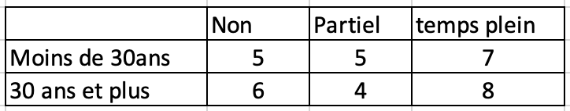
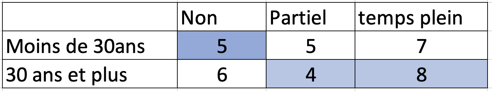
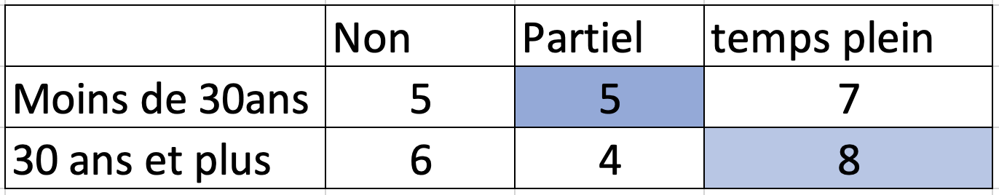
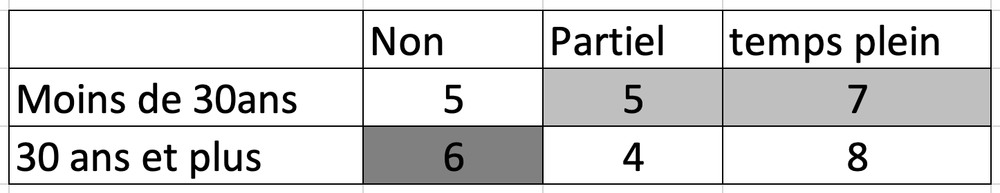
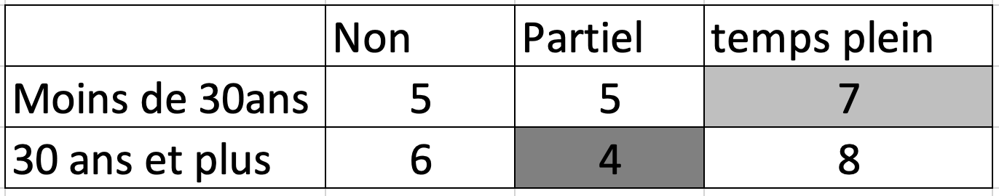
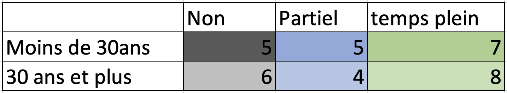
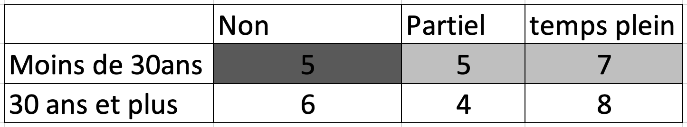
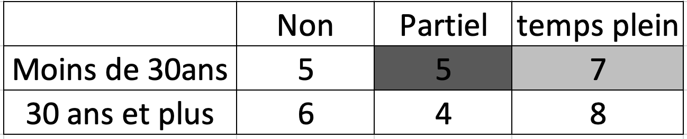
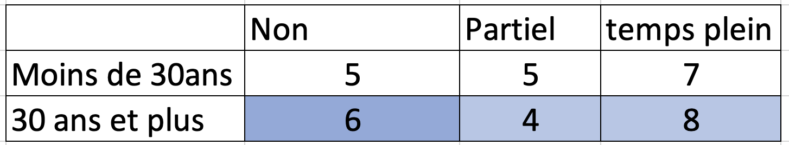
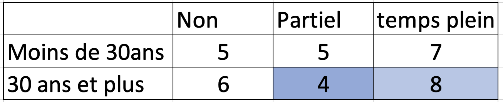

## 1. Tableau croisé et Chi-deux

A partir des données du tableau suivant:

id     Sexe         Emploi              Age
------ ------------ ------------------- ----------------
1      Masculin     Temps plein         27
2      Féminin      Non                 34
3      F            Partiel             22
4      F            Non                 38
5      M            Partiel             30
6      F            Temps plein         27 
7      M            Temps plein         33
8      M            Temps plein         39
9      F            Temps plein         36
10     F            Non                 25
11     M            Partiel             31
12     M            Partiel             28 
13     M            Non                 26 
14     F            Partiel             21
15     F            Temps plein         29
16     F            Temps plein         34
17     F            Non                 20
18     F            Non                 32
19     M            -                   27
20     F            Partiel             33
21     M            Temps plein         22
22     M            Non                 38
23     F            Non                 35
24     M            Temps plein         35
25     F            Temps plein         27
26     M            Temps plein         24
27     F            Temps plein         37
28     F            Non                 38
29     F            Temps plein         29
30     F            Temps plein         32
31     F            Non                 20
32     M            Partiel             24
33     M            Non                 26
34     M            Partiel             31
35     M            Temps plein         32 
36     F            Partiel             24


1. Dire quel est le type de chaque variable

2. Conjecturer sur la question de recherche qui a poussé à la collecte de ces données

3. Dresser un tableau croisé liant les deux variablesde sex et d'emploi, préciser les informations importantes du tableau (nom des colonnes et des lignes, effectifs, et effectifs marginaux)

4. Quelle conclusion tirez-vous sur ces deux variables? Quel est le problème avec cette conclusion?

5. Présenter un tableau de pourcentage marginal et commentez à nouveau.

6. Quel est le type de relation que vous observez entre ces deux variables?

7. Diriez-vous que cette relation est forte, modérée, faible ou nulle?

8. Calculer le Chi-deux

9. Déterminer le degré de liberté

10. Quelle conclusion tirez-vous sur votre confiance au résultat?

11. Si vous devez étudier la relation entre l'âge et l'emploi, comment procédériez-vous?


## 2. Test de chi-deux avec R

1. Entrer les données précédentes dans R

```{r}


sexe <- c("M", "F", "F", "F", "M", "F", "M", "M", "F", "F", "M", "M", "M", "F", "F", "F", "F", "F", "M", "F", "M", "M", "F", "M", "F", "M", "F", "F", "F", "F", "F", "M", "M", "M", "M", "F")

emploi <- c("Temps plein", "Non", "Partiel", "Non", "Partiel", "Temps plein", "Temps plein", "Temps plein", "Temps plein", "Non", "Partiel", "Partiel", "Non", "Partiel", "Temps plein", "Temps plein", "Non", "Non", "-", "Partiel", "Temps plein", "Non", "Non", "Temps plein", "Temps plein", "Temps plein", "Temps plein", "Non", "Temps plein", "Temps plein", "Non", "Partiel", "Non", "Partiel", "Temps plein", "Partiel")

age <- c(27, 34, 22, 38, 30, 27, 33, 39, 36, 25, 31, 28, 26, 21, 29, 34, 20, 32, 27, 33, 22, 38, 35, 35, 27, 24, 37, 38, 29, 32, 20, 24, 26, 31, 32, 24)


base_donnee <- data.frame(sexe, emploi, age)

```

2. Présenter le tableau de fréquence de la variable sexe, et commentez

- Sexe

```{r}

library(summarytools)

freq(base_donnee$sexe)

```

- Emploi

```{r}

table(base_donnee$sexe)

freq(base_donnee$emploi)

```

- Age

```{r}

freq(base_donnee$age)

```

Comme l'âge est une variable quantitative, on doit calculer les paramètres de positions et de dispersion. POur cela, on peut utiliser la fonction summarise de tidyverse

```{r}

mean(base_donnee$age)
median(base_donnee$age)


library(tidyverse)

parametre <-
  base_donnee %>% 
 # na.exclude(TRUE) %>% 
  summarize(age_moyen = mean(age, na.rm = TRUE),
            age_median = median(age, na.rm = TRUE),
            age_var = var(age),
            age_et = sd(age)
            )

parametre

```


3. Présenter le tableau de fréquence de la variable emploi, et commentez

```{r}

ctable(base_donnee$sexe, base_donnee$emploi, "no")

```


Que faisons-nous de cette valeur -. Il faut bien sûr l'enlever de la base de données.

```{r}

base_donnee <-
  base_donnee %>% 
  filter(emploi != "-")

```


4. Quelle est la relation entre le sexe et l'emploi?


```{r}

ctable(base_donnee$sexe, base_donnee$emploi, "r")

```

5. Cette relation est-elle statistiquement significative?

On a deux manières de faire cela, avec base R et avec ctable de summarytools

- Avec base R

```{r}

chisq.test(base_donnee$sexe, base_donnee$emploi)

```


- Avec ctable

```{r}

ctable(base_donnee$sexe, base_donnee$emploi, "r", chisq = TRUE)


```

Même si on a supprimé la valeur, son label demeure. Il faut aussi enlever le label.

```{r}

base_donnee <- droplevels(base_donnee)

ctable(base_donnee$sexe, base_donnee$emploi, "r", chisq = TRUE)

```


6. Créer une nouvelle variable d'emploi que vous notez **emploi2** qui prend les valeurs suivantes:
  - Si emploi prend les valeurs  "non"" ou "temps partiel"", emploi2 prend la valeur "ne travaille pas"
  - Si emploi prend la valeur "Temps plein", emploi2 prend la valeur "Travaille" 
  
- Avec base R
  
```{r}

base_donnee$emploi2[base_donnee$emploi == "Non"] <- "Ne travaille pas" 
base_donnee$emploi2[base_donnee$emploi == "Partiel"] <- "Ne travaille pas"
base_donnee$emploi2[base_donnee$emploi == "Temps plein"] <- "Travaille"
```

- Avec tidyverse

```{r}

base_donnee <-
  base_donnee %>% 
  mutate(emploi2_t = case_when(
    emploi == "Non" | emploi == "Partiel" ~ "Ne travaille pas",
    emploi == "Temps plein" ~ "Travaille"
  ))


```

  
7. Créer aussi la nouvelle variable **groupe_age** qui prends deux valeurs:
  - Moins de 30 ans
  - 30 ans et plus

```{r}

base_donnee <-
  base_donnee %>% 
  mutate(groupe_age = case_when(
    age < 30  ~ "Moins de 30 ans",
    age >= 30 ~ "30 ans et plus"
  ))

```

  
8. Étudiez à nouveau la relation entre le sexe et l'emploi, cette fois-ci séparément pour les moins de 30 ans et les 30 ans et plus.

On aurait pu créer deux bases de données, une base pour les moins de 30 ans et une base pour les 30 ans et plus. Mais, cette approche est trop longue. On peut utiliser la fonction **stby** de summarytools pour faire cela.
Vous devez indiquer dans **list** votre variable indépendante dans le x et votre variable dépendante dans le y. Vous indiquez dans **INDICES** la variable de stratification. Finalement, vous indiquez ce que vous voulez faire, ici un tableau croisé que vous mettez dans la fonction **FUN**

Comment utiliserez-vous la fonction **stby** pour avoir la moyenne et la médiane de la variable age selon le sexe?

```{r}

stby(list(x = base_donnee$sexe, y = base_donnee$emploi2), 
     INDICES = base_donnee$groupe_age, FUN = ctable)

```

  
## 3. Labo 10


9. A partir de la réponse 1.8 ou 2.5, calculer les mesures d'intensité suivantes **à la main**:

Le coefficient de contingence de Pearson, le V de Cramer et le phi sont basés sur le chi-carré. La valeur du chi-carré que nous avons calculée est la suivante:


```{r}

base_donnee <- droplevels(base_donnee)

ctable(base_donnee$sexe, base_donnee$emploi, "r", chisq = TRUE)

```

- le coefficient de contingence de Pearson

Le coefficient de contingence de Pearson est de :

$$C = \sqrt{{\frac{\chi^2}{\chi^2 + N}}}$$


```{r}
chi_deux <- 1.772
N <- 35

C_pearson <-sqrt(chi_deux/(chi_deux + N))
C_pearson 

```


- le V de Cramer

La formule du V de Cramer est:

$$V = \sqrt{{\frac{\chi^2}{N*Min(r-1)(c-1)}}}$$


```{r}
chi_deux <- 1.772
N <- 35
r <- 2
c <- 3

minrc <- 1

V_Cramer <-sqrt(chi_deux/(N*minrc))
V_Cramer  

```


- le phi

**On ne peut pas le calculer, car la tableau n'est pas 2 par 2**
Correction ici: Non, on peut bien calculer le phi chaque fois qu'un tableau à deux colonnes **OU** deux rangées. 

- le coefficient de prédiction de Guttman

Le coefficient de prédiction de Guttman ou le lambda est une mesure basée sur une idée simple, la réduction des erreurs qu'on commet sur la prédiction d'une variable (dépendante) si on a une information additionnelle.

Supposons que vous voulez prédire les résultats d'un événement, et que sur 154 prédictions, vous faites 100 erreurs. Supposer maintenant que quelqu'un vous donne une information additionnelle qui vous permet à partir de 154 prédictions de faire maintenant 50 erreurs. L'information additionnelle est importante car elle permet de réduire de moitié l'erreur initiale. 

Ainsi, plus la réduction est importante, plus la relation entre les deux variables est intense.

Maintenant, appliquons cela à nos données

```{r}

ctable(base_donnee$sexe, base_donnee$emploi, "no")

```

- erreur si VI inconnu : 35-15 = 20
- erreur si VI est inconnu : (20 - 8) + (15 - 7) = 20
  - Erreur si VI est Femme : 20 - 8 = 12
  - Erreur si VI est Homme : 15 - 7 = 8

```{r}

Lambda <- (20 - 20 / 20) = 0

```

cet exemple montre les cas où malgré le fait qu'il semble exister une relation entre les deux variables, le Lambda indique 0. C'est que la valeur modale de la variable dépendante est dans la même catégorie pour la variable indépendante: la distribution est suffisamment asymétrique.    

- Gamma de Goodman et de Kruskal
**On ne peut pas le calculer car les deux variables ne sont pas ordinales**

- le Dyx de Somers
**On ne peut pas le calculer car les deux variables ne sont pas ordinales**

- le tau-b et 
**On ne peut pas le calculer car les deux variables ne sont pas ordinales**

- le tau-c
**On ne peut pas le calculer car les deux variables ne sont pas ordinales**

**On ne peut pas le calculer car les deux variables ne sont pas ordinales**

10. Refaites les mêmes calculs avec R

http://rcompanion.org/handbook/H_10.html

```{r}

chisq.test(base_donnee$sexe, base_donnee$emploi)
#cramersV(base_donnee$sexe, base_donnee$emploi)

```


11. Maintenant, analyser l'association entre la variable groupe_age créée au 2.7 et l'employabilité.
- Présenter le tableau qui montre cette association

```{r}

ctable(base_donnee$groupe_age, base_donnee$emploi)


```


- Quel est le degré de liberté de ce tableau?

(2 - 1)*(3 - 1) = 2

- Est-ce que cette association est significative au seuil de 1%?

t lu = 9.21

- Calculer les mesures d'intensité suivantes à la main:

```{r}


chisq.test(base_donnee$groupe_age, base_donnee$emploi)

```

  - le coefficient de contingence de Pearson

Même approche que précédemment

  - le V de Cramer

Même approche que précédemment

  - le phi

```{r}

table(base_donnee$groupe_age, base_donnee$emploi2)

#freq(base_donnee$groupe_age, base_donnee$emploi2)

```
  
**On ne peut pas calculer le phi. Le tableau n'est pas carré.**
Correction ici: Non, on peut bien calculer le phi chaque fois qu'un tableau à deux colonnes **OU** deux rangées. 

  - le coefficient de prédiction de Guttman

Même approche que précédemment


  
  
  - Gamma de Goodman et de Kruskal

Gamma est basé sur la notion de **paires semblables**. C'est une mesure de l'association dans le cadre où les deux variables sont **ordinales**.

Avec les données ordinales, on peut appliquer le concept de direction de la relation (ce qui n'est pas le cas dans les situations où une des variables est nominale). Si vous êtes intéressés à analyser la relation entre l'éducation et le revenu et que vous avez le revenu ordonné selon les quintiles de revenu et l'éducation selon les niveaux, vous faites l'hypothèse que plus le niveau d'éducation est élevé, plus le revenu va l'être. 

Le concept de paires semblables fournit un moyen d'évaluer dans quelle mesure les cas s'alignent sur nos prédictions

Dans notre exercice ici, nous faisons l'hypothèse que les gens âgés vont vraisemblablement avoir un emploi à temps plein.

Voici les résultats de notre croisement




- Paires semblables




La paire **moins de 30 ans/Non** est similaire à la paire 30 ans et plus/temps plein car elles sont conformes à notre hypothèse. Il en va de même avec les paires **moins de 30 ans/Non** et **30 ans et plus/partiel**.

Il existe aussi une paire semblable déterminée par:



On peut alors dénombrer tous les paires semblables ou concordantes:

```{r}

Semblables <- 5*4 + 5*8 + 5*8
Semblables 

```
  

**Paires opposées**

les paires opposées sont présentées dans les tableaux suivants:





Ainsi, nous avons au total :

```{r}

opposees <- 6*5 + 6*7 + 4*7
opposees

```


Au final, le Gamma nous donne:


```{r}

int_gamma <- (Semblables - opposees)/(Semblables + opposees)
int_gamma


```

Cette valeur indique que nous pouvons prédire les valeurs de la variable dépendante avec 0% de précision en connaissant les valeurs de la variable dépendante. C'est le signe qu'il n'y a pas d'association entre les deux variables. 

Donc une valeur de Gamma de disons 0.80 indiquerait que nous pouvons prédire les valeurs de la variable dépendante avec 80% de précision.

Rappelons que Gamma est une **mesure symétrique** d'association, car il ne tient pas compte du fait qu'une variable est dépendante et l'autre indépendante. En clair, on peut interchanger la place des deux variables et on obtiendrait toujours la même valeur. 
  
  
**- le Dxy de Somers**

Le Dxy de Somers est une mesure d'association basée sur la réduction proportionnelle de l'erreur (RPE) qui est calculé sur deux variables ordinales mais aussi avec l'hypothèse qu'une variable est indépendante et l'autre dépendante.

C'est donc une mesure **asymétrique**, si on change les places des deux variables on obtient une autre valeur.

Il s'agit d'une extension de Gamma qui tient en plus compte des paires liées.

Dxy = (S - O)/(S + O + Ey)

Ey indique les pairs liées sur l'axe de la variable dépendante. 

Voici ce que cela donne avec notre précédent exemple:



ce décompte des paires liées donne:

```{r}
liees <- 5*6 + 5*4 + 5*7
liees

```


Ainsi, Somer Dxy donne:

```{r}

somer_xy <- (Semblables - opposees)/(Semblables + opposees + liees)
somer_xy


```

Normal que nous trouvions 0.

Maintenant, si nous avions intervertis l'ordre des deux variables, en utilisant la variable indépandante comme variable dépendante et vice versa, les paires paires semblables et opposées seraient les mêmes. cependant, les paires liées seraient maintenant ceux indiquées dans les tableaux ci-dessous:










Ainsi, le Ex devient:

```{r}

Ex <- 5*5 + 5*7 + 5*7 + 6*4 + 6*8 + 4*8
Ex

```

Ainsi, 

```{r}

somer_yx <- (Semblables - opposees)/(Semblables + opposees + Ex)
somer_yx

```

Je vous donnerai 


- le tau-b et 

Le tau-b est une mesure symétrique d'association et a une interprétation de réduction proportionnelle de l'erreur. C'est comme une moyenne de Dxy et Dyx

$$tau-b = \sqrt(D_{xy}*D_{yx})$$
Elle est aussi équivalente à 

$$tau-b = \frac{(Semblables - Opposees)}{\sqrt(Semblables + Opposees + Ey)(Semblables + Opposees + Ex)}$$
Il ne peut jamais atteindre la valeur 1 si le tableau n'est pas carré.
Donc approprié pour les tableaux carrés
Son interprétation est difficile.

- le tau-c

La tau-c résout ce problème. Il peut atteindre la valeur 1 peut importe la forme du tableau.


$$tau-c = \frac{2Min(r, c)*(Semblables - Opposées)}{N^2Min(r-1, c-1)}$$
**Remarques: Si votre tableau est carré, utiliser tau-b, sinon, utiliser tau-c**


Voir l'excellent résumé qui est fait dans votre livre de cours à la page 194.


- Refaites les mêmes calculs cette fois-ci en utilisant R.