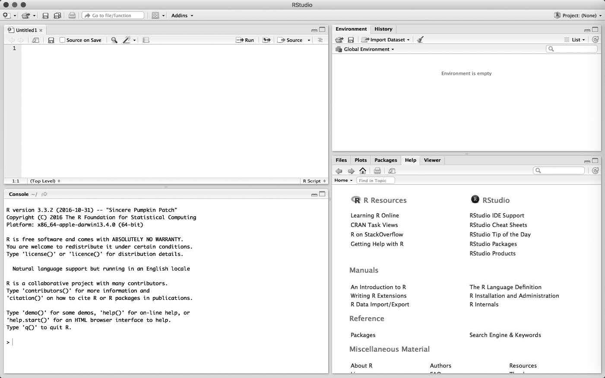
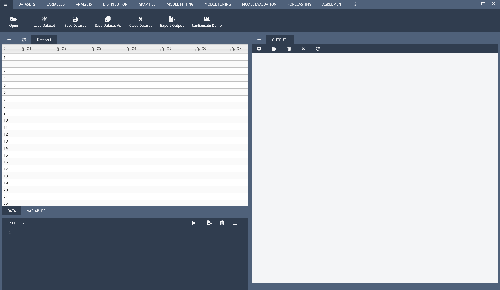

## Plan de présentation 

1. Processus d'analyse des données
2. Introduction à R
3. IDE versus GUI
4. Présentation de BlueSky Statistics 


Processus d'analyse des données
==========================================================

## Processus d'analyse des données

Résumons ce processus:

  1. Où sont les données? Vous devez les importer (**read**) pour les analyser. La manière dont vous allez les importer dépend du type de fichier.
  2. Est-ce que vous avez besoin de l'ensemble des variables du fichier de données? pas nécessairement. Vous devez sélectionner (**select**) celles qui vous intéresse
  3. Est-ce que vous travaillez sur l'ensemble de l'échantillon ou uniquement sur les femmes? Vous devez les filtrer (**filter**)
  4. Devez-vous utiliser les groupes d'âges ou les âges réels? Vous devez créer de nouvelles variables (**mutate**)
  5. Que faites-vous des individus qui n'ont pas répondu à certaines questions? leur attribuer une valeur (**impute**) ou les enlever (**na.rm pour remove na**)
  6. Que savons-nous sur les variables? Vous devez produire des statistiques descriptives (**summarize**)


## Processus d'analyse des données  

- Les gras dans le diapositif précédent indique le langage que le logiciel comprend pour faire les étapes décrites plus haut
- Il comprend que l'Anglais. 

    - Chaque fois que vous voulez faire quelque chose, chercher le mot en anglais

- Il respecte une certaine manière de **parler**. 

    - Il va utiliser des symboles pour se simplifier la vie comme celui-ci par exemple **%>%**

## Packages de Tidyverse

```{r}
#install.packages("tidyverse")
library(tidyverse)

```


## Processus d'analyse des données

- Comme dit plus haut, Tidyverse va nous servir à faire tout ce travail.
- Comme toujours, imitez au maximum ce que je fais


## Processus d'analyse des données

Chaque élément est associé à un `package` donné.

1. Importer                                         (**readr**)
2. Préparation des données (data wrangling)
    - Arranger                                        (**tidyr**) 
    - Transformer                                     (**dplyr**)
3. Analyse des donnés
    - Visualisation                                   (**ggplot2**)
    - Modélisation
4. Communication                                    (**rmarkdown**: ceci n'est pas un package de tidyverse)


PS. Intéressant sur data wrangling
https://www.lemagit.fr/conseil/Quest-ce-que-le-Data-Wrangling

## Processus d'analyse des données

- Les autres packages de tidyverse
    - **sringr** : pour travailler avec les données caractères
    - **forcat** : pour travailler avec les facteurs : http://perso.ens-lyon.fr/lise.vaudor/manipulation-de-facteurs-avec-forcats/
    - **purrr** : pour travailler avec les fonctions
    - **tibble** : transformer les données en tribble.
  
La documentation est éparse sur chacun de ces packages.


## Informations sur les packages

- Les packages R sont une collection de fonctions R, de code conforme et d'exemples de données. 
- Par défaut, R installe un ensemble de packages lors de l'installation. 
- D'autres packages sont ajoutés plus tard, lorsqu'ils sont nécessaires à des fins spécifiques: c'est le cas de Tidyverse et de Summarytools
- Il existe un package pour presque tout
- Une manière de commencer par travailler facilement avec les nouveaux packages, c'est d'utiliser leur feuille de résumé s'il en existe.

- Ce lien vous renvoie à ces résumés : https://rstudio.com/resources/cheatsheets/


Introduction à R
=============================================

## Pourquoi R?

- Logiciel supportant l'enseignement des méthodes quantitatives: c'est un moyen, pas le but du cours
   ==> Mettez surtout l'accent sur la compréhension des matériaux et des concepts

- Toutefois, votre objectif devrait être d'utiliser ce logiciel pour l'analyse des données.

- R est une implémentation populaire de S et S-PLUS (commercial) utilisés depuis des décennies

- Le système de base est disponible sur le Comprehensive R Archive Network (CRAN): http://cran.r-project.org  


## Pourquoi R?

- R est gratuit
- R est un logiciel de très grande qualité
- R est très bien conçu, tant du point de vue de l'analyste de données que de celui de l'informaticien
- Le système de base de R (R base) est complété par plusieurs "packages":
  - "Packages recommandés" qui font partie de la distribution de R standard/base
  - Plus de 400 "packages contribués" sont disponibles gratuitement
  - Ce système (R) est sans doute la ressource la plus complète actuellement disponible pour l'analyse statistique


## Pourquoi R?

- R s'exécute sur toutes les plates-formes informatiques couramment utilisées - y compris les systèmes Windows, Unix / Linux et Macintoshes - et s'installe normalement sur chaque plate-forme.
  - (S-PLUS, en revanche, n'a pas de version Macintosh.)

- Contrairement aux progiciels statistiques tels que SPSS, qui fournissent des interfaces utilisateur graphiques point-à-clic à la plupart de leurs capacités statistiques, R est orienté commande.


## Avantages du logiciel orienté commande

>- Il est plus facile de corriger, de modifier et de répliquer des analyses dans un système piloté par des commandes. 
>- Il est plus simple et naturel de créer un dossier permanent sur son travail, y compris les entrées et les sorties.
>- Les interfaces graphiques vers des systèmes statistiques complexes sont incomplètes (nécessitant l'utilisation de commandes pour des analyses plus avancées ou non standard) ou byzantines (obligeant l'utilisateur à parcourir un labyrinthe complexe de menus, de boîtes de dialogue et de contrôles graphiques) - ou les deux.


## Avantages du logiciel orienté commande

"Apprendre à utiliser R, par conséquent, est du temps bien dépensé par le sérieux spécialiste des sciences sociales quantitatives"


"Learning to use R, therefore, is time well spent by the serious quantitative social scientist."


(Fox J. & Andersen, R. 2005. Using the R statistical computing environment to teach Social Statistics Courses)


IDE versus GUI
===========================================

## IDE versus GUI

- IDE (integrated development environment), en français, **environnement de développement intégré** est essentiellement un éditeur de langage de programmation.
    - Exemple: RStudio

- Avantages 
    - Replicabilité
    
- Inconvénients
    - Écrire les codes
    


## RStudio

RStudio offre aux utilisateurs :

1. Un éditeur de texte pour écrire des programmes
  
  - Console  --> Calcul interactif, vérification rapide de commandes
  - Script --> Écrire de programme à éxécuter
  - RMarkDown --> Écriture de programme + Texte, moyen de replicabilité
2. Un visualiseur de graphiques qui affiche les graphiques que nous créons, 
3. La console R où les programmes sont exécutés, 
4. Une aide section, et 
5. De nombreuses autres fonctionnalités. 

## RStudio

La figure 1.1 montre une capture d'écran de RStudio.




    
## IDE versus GUI

- GUI (graphical user interface) ou en français, **interface utilisateur graphique** est une interface de logiciel qui prend en charge les graphiques pour interagir facilement avec les utilisateurs.

    - Exemple: SPSS, BlueSky Statistics

- Avantages 
    - Facile d'utilisation
    
- Inconvénients
    - Difficile à corriger
    - Difficile pour la replicabilité


Présentation de BlueSky Statistics (BSS)
================================================

## Présentation



## Principaux menus et leur utilisation

1. Menu d'ouverture de base de données 
2. "Datasets": Traitement sur les bases de données
3. "Variables": traitement sur les variables
  - Créer et recoder des variables 
  - Traiter les données manquantes ...
4. "Analysis": 
  - *Summary* pour les fréquences, les paramètres de tendance centrale et de dispersion
  - Statistiques bivariées
5. "Graphics": pour faire les visualisations
6. "Model Fitting" pour les analyses de régression

## Ressources

https://r4stats.com/articles/software-reviews/bluesky/
- Extensions
  - https://www.blueskystatistics.com/category-s/122.htm
- Installer des packages
  - https://www.blueskystatistics.com/v/vspfiles/downloadables/Installing%20R%20packages%20in%20BlueSky%20Statistics.pdf
  
## Labo

1. Démonstration rapide avec RStudio
2. Démonstration avec BlueSky Statistics
