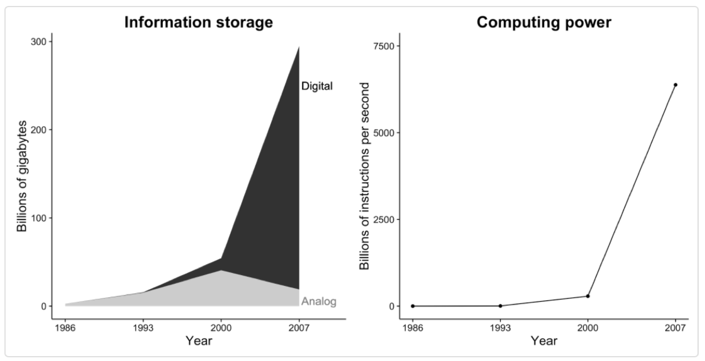

## Plan de la séance

1. Introduction du cours: importance des méthodes quantitatives (30 minutes)
2. Présentation du cours (30 minutes)
3. Pause : 10 minutes
4. Vue d'ensemble: organisation de la classe (60 minutes)
5. Signature entente (20 minutes)
6. Labo (30 minutes)

## Plan de présentation (30 minutes)

- Qui suis-je?
- Intérêts de recherche
- Changements en cours dans l'utilisation des méthodes statistiques
- Exemple
- Questions

Qui suis-je?
========================================================

## Formations

- Doctorat en Démographie, Université de Montréal
- Maîtrise en Économie du développement, Centre d’Études et de Recherche sur le Développement International (CERDI), France
- Ingénieur des Travaux Statistiques, Ecole Nationale de Statistiques et d’Économie Appliquées (ENSEA), Côte d'Ivoire
- Diplôme de mathématiques, Université de Lomé (Togo)

## Expériences professionnelles

- University of Cape Town (2013 - 2018)
- Université du Québec à Montréal (UQAM) depuis juillet 2018

Intérêts de recherche 
========================================================

## Intérêts de recherche (1/3)

1. Démographie / Sociologie
    - Dynamiques familiales en Afrique subsaharienne (ASS)
    - Dynamiques familiales chez les immigrant.es
    - Intégration et participation des immigrant.es
    - Emploi des femmes et fécondités (ASS)
    - Transition démographique

## Intérêts de recherche (2/3)

2. Santé publique
    - Recours aux soins de santé (ASS)
    - Mortalité infantile et maternelle (ASS)
    - Santé de la reproduction

## Intérêts de recherche (3/3)

3. Méthodes quantitatives et computationnelles
    - Causalité et ses biais
    - Régression
    - Analyse quantitative de texte
    - Grands intérêts pour les Big data
    - Vos projets m'intéressent :)

## Intérêts centrés sur les objectifs de développement durable

## Comment est-ce que les progrès sont évalués?

> 1. Etat civil

> 2. Recensements

> 3. Enquête

>- Dans les pays en développements
>- Enquête Démographiques et de Santé (EDS, USAID)
>- Observatoire longitudinale de populations
>- Enquêtes à indicateurs multiples (MICS, UNICEF)

>- Au Canada
>- Enquête Sociale Générale (ESG)

> 4. Quelles autres sources connaissez-vous?      

## Problèmes

>- Lacunes importantes dans les données et délais de transmission des résultats;
>- Données insuffisantes pour un suivi en temps réel des progrès ou comme outil de gestion;
>- Faibles participations aux enquêtes (surtout en Occident)
>- Exemples de lacunes graves dans les données
  >- 2013: 21 pays africains n'avaient pas mené d'enquête sur la pauvreté au cours des 7 dernières années.
  >- 2005: seulement 11 pays africains avaient des estimations de la pauvreté comparables.
  >- CRVS: moins de 6% en Afrique subsaharienne ont des systèmes à peine acceptables.

## Conclusion

- C'est dans cet environnement dans lequel les sciences sociales ont évolués depuis plusieurs années.
- Mais, cet environnement est en train de changer très très vite.
- Et donc, l'enseignement des méthodes quantitatives doit aussi suivre.
- Ce cours est une tentative d'adaptation à ces changements.

Changements en cours  
========================================================

## Révolution des données (1/3)

- La révolution des données est une expansion rapide des données en termes de:

  - Volume
  - Vitesse
  - Variété

## Révolution des données (2/3)

>- Une grande partie de ces nouvelles données sont des textes, des images et de la voix. Ce ne sont plus nécessairement des chiffres. Cela nécessite ainsi de nouvelles méthodes et approches.

>- Ces changements transforment la nature du travail effectué par ceux qui utilisent les données dans les années à venir, y compris vous.

## Révolution des données (2/3)

Exercice 1: Télécharger vos données de Facebook pour le prochain cours.**

## Révolution informatique

- Au cours du dernier demi-siècle:
    - Puissance de calcul des ordinateurs X 2 plus ou moins tous les 2 ans (Moore's Law)
    - Capacité de stockage X 2 plus ou moins tous les 40 mois
    - Progrès très rapides dans l'apprentissage automatique /Intelligence Artificielle.

{width=75%}

    
## Conséquences

- Les chercheurs peuvent maintenant:

  - Observer des comportements,
  - Poser des questions,
  - Conduire des expériences, et
  - Collaborer d'une manière qui était tout simplement impossible dans un passé récent.

- Ils peuvent maintenant faire des recherches différemment
- La recherche en sciences sociales devient de plus en plus passionnante et agréable
- Alors devrait l'être aussi l'enseignement.

Exemples  
========================================================

## Quand vous pensez méthodes quantitatives, vous voyez...

## Mobilité intergénérationnelle de revenu

Chetty, Raj, al. 2018. Race and Economic Opportunity in the United States: An Intergenerational Perspective. NBER.

- Emily Badger et al, Income Mobility Charts for Girls, Asian-Americans and
Other Groups. Or Make Your Own., N.Y. Times, Mar. 27, 2018
  - https://bit.ly/2FUfBPE
  - https://www.nytimes.com/interactive/2018/03/27/upshot/make-your-own-mobility-animation.html

## Conclusion

- Le futur de la recherche en science sociale va ressembler de plus en plus à cette intégration de plusieurs sources de données, mais aussi et surtout à l'utilisation des données numériques; 
- Il devient donc important de préparer les étudiants que vous êtes à cette nouvelle donne en statistique
- Ceci commence maintenant!

Questions?  
========================================================

