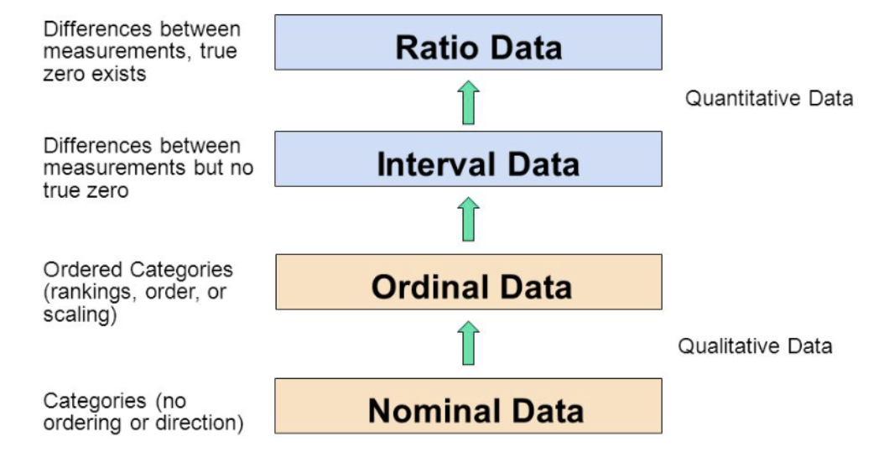
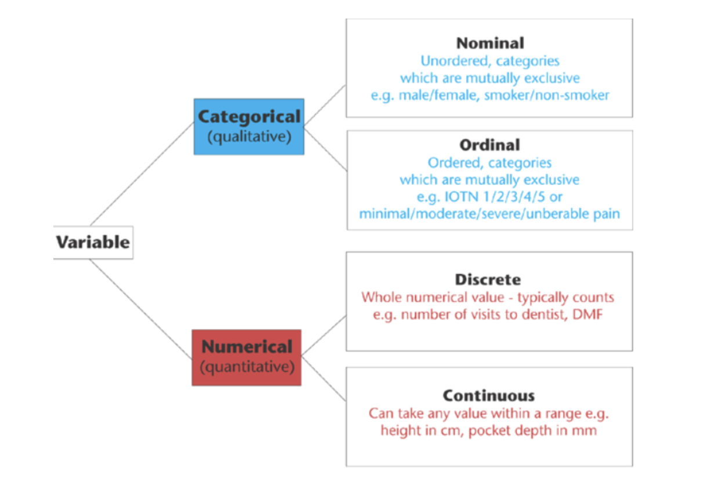

## Lectures

- Fox: chapitre 1, pp.3-31
- Salganik: https://www.bitbybitbook.com/fr/1st-ed/introduction/
- Jean-Guy Prévost: Statistiques linguistiques, rhétorique quantitative et effets de perspective : https://id-erudit-org.proxy.bibliotheques.uqam.ca/iderudit/1008237ar

## Statistiques

1. Statistiques en tant que nombre

> - Le revenu moyen des habitants de Wakanda est de 1200w
 
> - La température à Montréal aujourd'hui est de 15 dégrés Celcuis
 
> 2. Statistiques en tant que méthodes de calcul

>  - Les statistiques sont des méthodes résumant quantitativement et généralisant des informations

## Données

1. $\color{red}{\text{Données}}$: Information non résumée, brute que les statistiques rendent plus aisément manipulables.

  - Différentes types:
    - Images
    - Vidéo
    - Textes
    - Chiffres ...

> 2. $\color{red}{\text{Banque de données}}$ : Organisation systématique des données  

> 3. $\color{red}{\text{Fichiers de données}}$ : Quand les banques de données peuvent être lues par les ordinateurs

> 4. $\color{red}{\text{Unités d'analyse}}$ : est la personne, l'objet ou l'événement que le chercheur étudie.

  
## Survol des statistiques

Deux branches des statistiques:

1. $\color{red}{\text{Statistiques descriptives}}$ : méthodes résumant l'information afin de la rendre plus intelligible, plus utile ou plus aisément communicable. 

    - Exemple: Age moyen des étudiants de ma classe.

  - Cependant, il y a perte d'information.

>  - Choix judicieux du type de statistiques à utiliser 

## Survol des statistiques
  
> 2. $\color{red}{\text{Statistiques inférentielles}}$  renvoient aux procédures par lesquelles nous généralisons l'information concernant un échantillon à la population de laquelle fut tiré l'echantillon en question.

>  - Marge d'erreur; p value ou p <0,05; test de chi-carré, chi 2 ...

> 3. Le cours concerne à la fois les statistiques descriptives et les statistiques inférentielles

## Les échantillons et les populations

1. $\color{red}{\text{Données de population}}$ : proviennent de tous les cas auxquels un chercheur veut appliquer ses conclusions: on dit dans ce cas qu'on fait un **recensement** de la population.

  - Données parfois introuvables
  - Onéreuses
  - Longues à collecter
  
> 2. $\color{red}{\text{Données d'échantillon}}$ : provient d'une partie de la population.

> 3. $\color{red}{\text{Paramètre}}$ : résumé basé sur une population

> 4. $\color{red}{\text{Statistique}}$ : caractéristique d'un échantillon

>  - Exemple : âge moyen (paramètre si calculé sur toute la population et statistique si calculé à partir d'un échantillon)

Variables
==================================

## Définitions conceptuelles des variables

- Une grande partie de l'analyse statistique consiste à 

  1. décrire comment les cas sont distribués, 
  2. décrire comment les variables interagissent et 
  3. faire des prédictions.

- Pour la plupart, il existe très peu de constantes dans les sciences, et vraiment aucune constante n'existe dans les sciences sociales. 

- Selon le fil Twitter de l'astrophysicien Neil DeGrasse Tyson (5 février 2016):

"En science, lorsque le comportement humain entre dans l'équation, les choses deviennent non linéaires. C'est pourquoi la physique est facile et la sociologie est difficile." 

## Définitions conceptuelles des variables

- Tout varie d'un cas à l'autre. 

- À mesure que nous passons d'une personne à l'autre, le sexe, l'âge, la couleur des cheveux, l'éducation et les préférences alimentaires varient. 

- Cela est vrai lorsque nous comparons des individus, et c'est vrai lorsque nous comparons des familles, des communautés, des cultures et toute autre unité d'analyse. 

- Deux façons de penser les variables sont 

    - les choses qui varient d'un cas à l'autre et 
    - le regroupement logique des attributs.

## Les variables 

- Une $\color{red}{\text{variable}}$ est une caracteristique ou une propriété quelconque dont la valeur diffère d'un cas à l'autre.

- Elles se retrouvent souvent en colonnes dans les fichiers de données
- $\color{red}{\text{Echelle}}$ : série des valeurs possibles d'une variable.
- $\color{red}{\text{Scores}}$ : valeur possible d'une variable

## Unité d'analyse / attributs

- Unité d'analyse: C'est celui ou la chose qui est étudié.

- Les attributs sont définis comme un ensemble de caractéristiques logiques pour une variable
  - Exemple: Les attributs homme et femme constituent la variable sexe.
  
## Variable en sciences sociales

- Les variables peuvent mesurer :

    - des **attributs physiques** : âge, sexe, résultat scolaire
    - des **idées**: haine. On peut voir des exemples de haines, mais il est difficile de mettre la haine dans une échelle de mesure et la mesurer.

- **On doit toujours définir le concept avant de le mesurer, et seulement après décrire ces caractéristiques statistiques**

- Exemple: Dans l'analyse de Durkheim sur le suicide, l'unité d'analyse est la société. 

## Variables indépendantes et variables dépendantes

- l'idée derrière l'association statistique est la covariation, où l'idée que les changements dans une variable sont accompagnés par les changements dans une autre variable.

- l'une est appelée la variable dépendante (celle qu'on veut expliquer)

- l'autre est la variable indépendante (celle qui explique l'autre)

- Exemple: On peut dire qu'un changement dans le niveau d'éducation est associé à un changement dans le niveau de revenu.

   - Quelle est la variable dépendante?
   - Laquelle est la variable indépendante?

## Conceptualisation et opérationnalisation

- En pensant aux concepts et aux variables, il est utile de penser chronologiquement. 
- Définir ce que nous entendons par une idée doit précéder la conception des moyens de mesurer notre idée. 
- Décrire ou définir une idée qui, selon nous, représente quelque chose dans le monde réel est un processus appelé **conceptualisation**. 
- Concevoir des moyens de mesurer les idées que nous avons conceptualisées s’appelle **opérationnalisation**.

## Conceptualisation et opérationnalisation

1.	      Conceptualisation

 	Idée =======================> Définition

2.	          Opérationnalisation

 	Définition ====================> Mesures 

## Conceptualisation et opérationnalisation

- Exemple: Aliénation (chez Marx)

    - Conceptualisation (définition): condition dans laquelle les gens souffrent d’une «déconnexion» entre eux-mêmes et de leur travail et d’une déconnexion les uns des autres

    - Opérationalisation (mesures): Seriez-vous prêt à accepter une réduction de salaire pour avoir un emploi qui vous plaît plus que votre emploi actuel? - Oui - Non

    - Nous pourrions affirmer que ceux qui répondent «non» connaissent des niveaux d’aliénation plus importants de leur travail que ceux qui répondent «oui»

    
## Catégories mutuelllement exclusives et collectivement exhaustives

Les valeurs des variables que vous définissez doivent être :

  - **Mutuellement exclusives** : pas de chevauchement
  - **Collectivement exhaustives** : comprend l'ensemble des catégories

## Catégories mutuelllement exclusives et collectivement exhaustives
  
- Exemple : groupe d'âges
    - Enfants: Age <=15
    - Adolescents: Age >15 & Age < 18
    - Adultes: Age > 18 & Age < 65
    - Séniors : Age >= 65

Est-ce que le critère est respecté?

Remarque: Quand vous créez de nouvelles variables, vous devez toujours tenir compte de cela.

Mesures
======================================

## Les niveaux de mesures

Quatre catégories de variables selon la façon dont elles sont mesurées:

1. $\color{red}{\text{Variables nominales}}$ : se mesure de telle façon que ses valeurs ou ses attributs diffèrent les uns des autres. Les valeurs ne peuvent pas être disposées selon un ordre logique ou naturel. 
  - Variable nominale dichotomique: prend deux valeurs. ex, sexe
  - Variable nominale non dichotomique: ex. religion

## Les niveaux de mesures

2. $\color{red}{\text{Variable ordinale}}$ : variables dont les valeurs peuvent être ordonnées.

  - Classe sociale
  - Quintile de revenu

Remarques: 

  - Variable nominale + variable ordinale = $\color{red}{\text{variable qualitative}}$, ou $\color{red}{\text{catégorielle}}$, ou $\color{red}{\text{factorielle}}$ ou simplement des $\color{red}{\text{facteurs}}$
  - Variables ordinales plus informatives que les variables nominales (pourquoi?)
  
## Les niveaux de mesures

<!--Quatre catégories de variables selon la façon dont elles sont mésurées:-->

3. $\color{red}{\text{Variable d'intervalle}}$ a non seulement des valeurs qui peuvent être ordonnées, mais elle se mesure également à l'aune d'une unité de mesure fixe ou standard.
- Température

## Les niveaux de mesures

4. $\color{red}{\text{Variable de ratio}}$ : est semblable à une variable d'intervalle. Mais, en plus, elle a un zéro non arbitraire. 

Remarques:

  - Variable de ratio car permettent de calculer des ratios
  - Variable d'intervalle + variable de ratio = $\color{red}{\text{variable quantitative}}$
  - Peuvent être $\color{red}{\text{continue}}$ quand elles peuvent prendre une infinité de valeurs ou $\color{red}{\text{discret}}$ quand elles prennent un nombre fini de valeurs. 
      - Age (discret)
      - Taille (continue)

## Résumé
<!--
https://www.graphpad.com/support/faq/what-is-the-difference-between-ordinal-interval-and-ratio-variables-why-should-i-care/
-->

{width='80%'}

## Résumé

{width='80%'}

## Les niveaux de mesures

- Il est capital de distinguer le type de variable que vous utilisez pour être en mesure d'utiliser la bonne statistique.
- On vera l'application dans R.
- Tout exercice de collecte de données (en sciences naturelles ou sociales) risque d'introduire des erreurs dans les données collectées

- Peut avoir de sérieuses implications pour les inférences faites ou les conclusions tirées ("validité")
  - Besoin de s'assurer que les données ne sont pas compromises par une erreur

Validité et fiabilité (validity and reliability)
=======================================================

## Une classification des erreurs

Des erreurs peuvent provenir de :

> 1. mesure (c'est-à-dire comment les données ont été recueillies)

> - "erreur de mesure" ou parce que 

> 2. le choix des objets sélectionnés pour la mesure ne reflète pas fidèlement l'univers de ces objets

> - "erreur d'échantillonnage"

> - Une matrice d'erreurs 2x2

## Une classification des erreurs

                       Erreur aléatoire      Erreur systématique  Conséq
---------------------- --------------------- -------------------- ------------------
Erreur de mesure       (Manque) de fiabilité Biais de mesure      Validité 
                                             (de déclaration)     de construit
                                             Biais de séléction
Erreur                 Erreur statistique                         Validité 
d'échantillonnage                                                 externe
**Conséquences**       Précision             Exactitude           Validité 
                       (Precision)           (Accuracy)           totale

## Validité / fiabilité

- $\color{red}{\text{Validité}}$ : Le degré auquel une variable mesure ce que nous pensons qu'elle mesure. Est-ce que la variable reflète le concept ?

- $\color{red}{\text{Fiabilité}}$: Le degré auquel une variable donne des résultats cohérents. D'autres chercheurs doivent être en mesure d'effectuer exactement la même expérience dans les mêmes conditions en obtenant les mêmes résultats. 

## Validité / fiabilité

- Exemple : Supposons que nous voulons mesurer la position sociale d'un groupe d'étudiants. Quelles questions pouvons nous poser pour la mesurer?

> - Lorsque vous essayez de mesurer des concepts difficiles comme le statut social, il est souvent préférable 

  > - d'utiliser une variété de mesures qui peuvent être analysées indépendamment ou 
  > - combinées en une seule mesure globale (ou composite). 

> - Par exemple, de nombreux sociologues utilisent une combinaison de revenu, d'éducation et de profession pour déterminer le statut socioéconomique global du répondant. 

## Validité / fiabilité

- Il est important de se rappeler que les mesures peuvent être valables/valides sans être fiables, de même, les mesures peuvent être fiables sans être valides. 

- Le but est de viser des niveaux élevés de validité et de fiabilité pour éviter le problème du "garbage in, garbage out".

## Validité / fiabilité

- Exemple : Supposons que nous voulons mesurer la position sociale d'un groupe d'étudiants. Quelles questions pouvons nous poser pour la mesurer?

> - Quel est ton revenu l'année passée?
> - Quel est ton revenu la semaine passée? 

> - Les questions ne sont pas valides: Qu'en est-il des revenus des parents

## Validité / fiabilité

- Exemple : Supposons que nous voulons mesurer la position sociale d'un groupe d'étudiants. Quelles questions pouvons nous poser pour la mesurer?

> - Diras-tu que tu fais partie de la classe ouvrière, classe moyenne, ou de la classe supérieure?

> - Majorité vont dire classe moyenne
 
> - Es-tu financièrement en sécurité? très subjective donc pas fiable

Type de données
===================================

## Les données individuelles et les données agrégées

- Dans la plupart des cas, nous travaillons avec des données individuelles.
- Dans certains cas, nos données sont agrégées (PIB par pays par exemple)

> - Données écologiques si l'unité d'agrégation est l'espace

> - Donnent lieu à des $\color{red}{\text{erreurs écologiques}}$: inférer sur les individus les résultats agrégés

> - $\color{red}{\text{Erreurs individualistes ou atomistes}}$: attribuer les caractéristiques d'un individu à son groupe ethnique ou social

## Erreurs écologiques

- Durkheim constatant que les régions de Prusse les plus peuplées par des protestants étaient celles ou les suicides étaient les plus nombreux établissait un lien entre protestantisme et suicide qui le conduisait à penser que les protestants avaient un plus grand risque de se suicider que les catholiques.

> - En réalité Durkheim pouvait seulement dire : «Un fort pourcentage de protestants dans une population conduit à un plus fort taux de suicides» qui peuvent concerner des catholiques comme des protestants.

## Erreurs écologiques

> - Les informations populationnelles recueillies par Durkheim conduisaient à un rapport du taux de suicide chez les protestants sur le taux de suicide des catholiques de 7.6, mais calculé sur les données individuelles ce rapport tombait à 2. L’écart entre 2 et 7.6 donne la mesure de l’erreur écologique.

> - Autre exemples: https://fr.wikipedia.org/wiki/Erreur_%C3%A9cologique

Conclusion
===============================

## Les idées et la réflexion

- L'analyse statistique commence avec vous et finit avec vous, jamais avec l'outil statistique.

<!--
## Jouer avec les données

  - Vous devez jouer avec les données, pas dans le but de découvrir des choses, mais pour affiner ce que vous faites

  - Pour chaque commande, vous devez savoir la partie fixe, et la partie changeable.
-->

## Pour la semaine prochaine

**Séance 3 : Les distributions de fréquences et de pourcentages**

1. Lectures

- Fox: chapitre 2, pp.33-68

2. Labo 3 - voir Moodle

