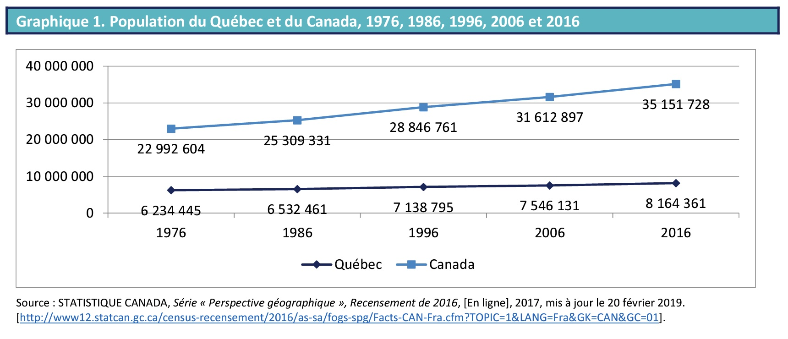
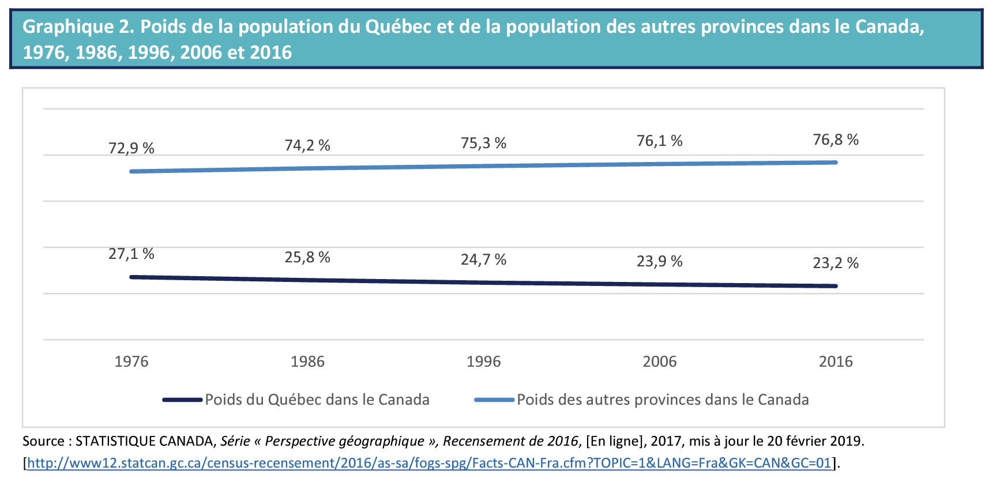
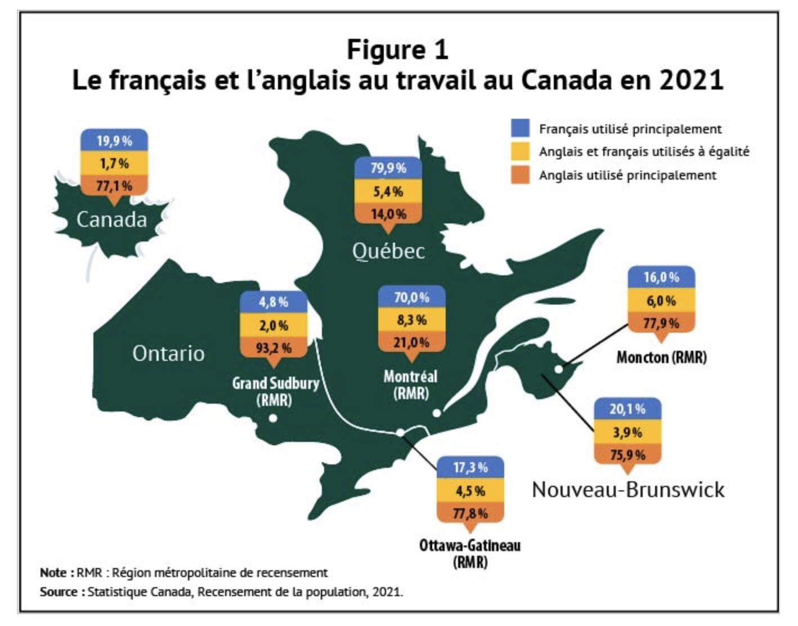
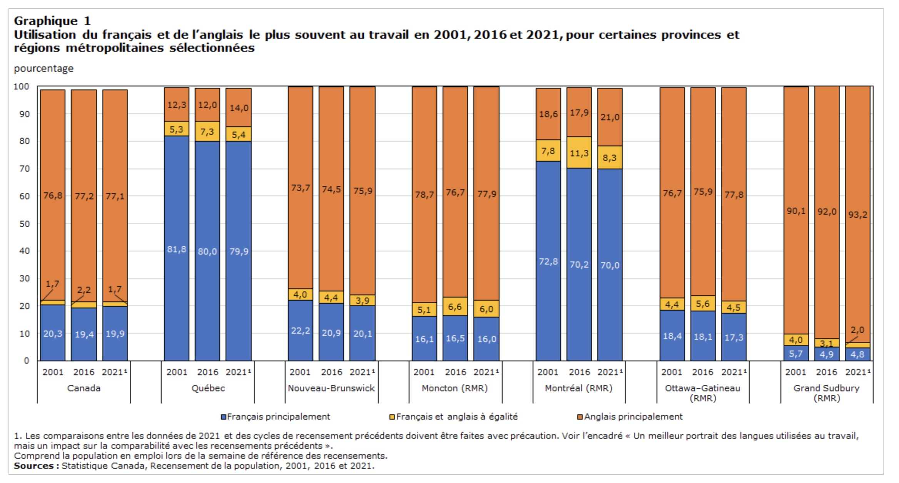
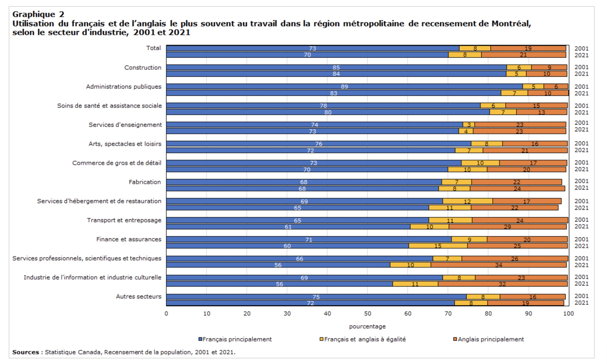
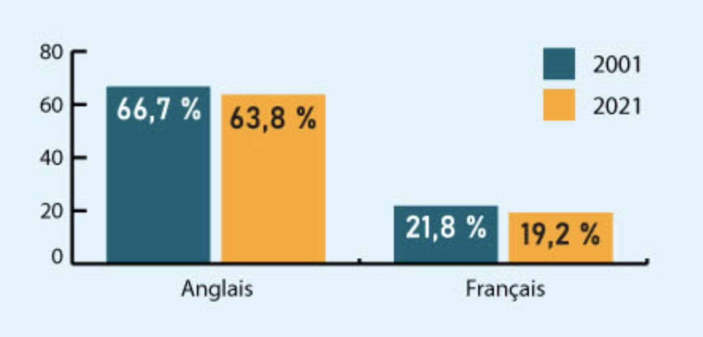
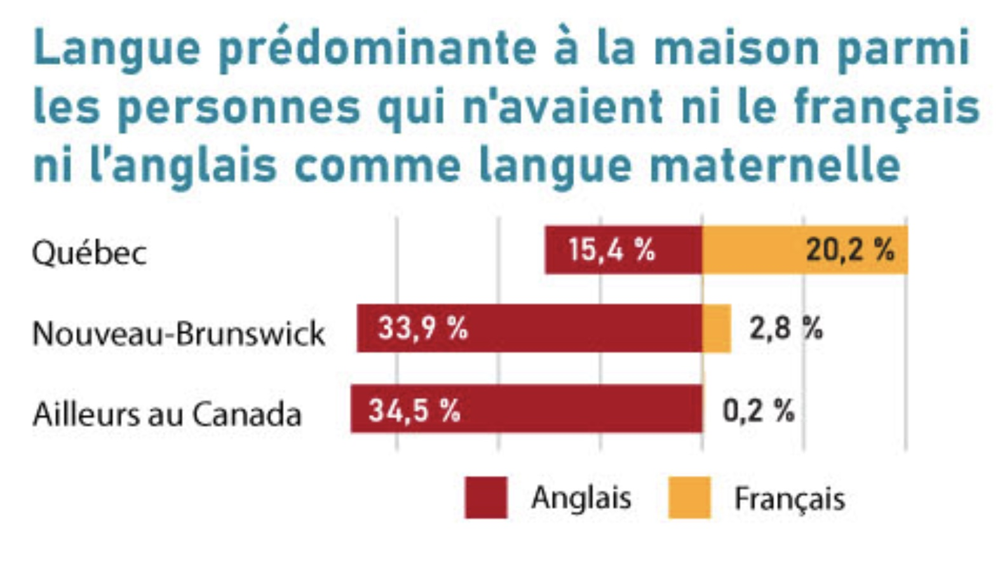
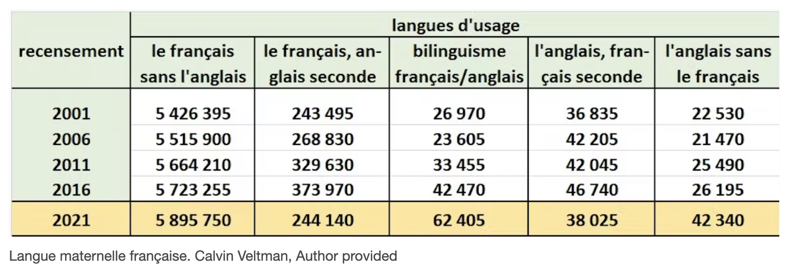

## Résumé du cours

Termes                   Définition                            
------------------------ ----------------------------------------------------------------------
Variable                 Tout ce qui varie d'un cas à l'autre ou 
                         un ensemble logique d'attributs
Modalités / attribut     Une caractéristique d'une variable    
Variable dépendante      Une variable dépendante dans un problème 
                         est la donnée 
Variable indépendante    du problème qui varie sous l'influence de 
                         la variable indépendante 
Conceptualisation        Le processus de définition de ce que l'on 
                         entend par une variable
Opérationnalisation      Le processus de création d'une mesure réelle 
                         pour une variable

## Résumé des informations

Termes                   Définition                             
------------------------ -----------------------------------------------------------------------
Niveaux de mesure        Nominale, Ordinale, Intervalle, Ratio
Variable nominale        Une variable pour laquelle les attributs ne peuvent 
                         pas être classés du plus grand au plus petit
Variable ordinale        Une variable pour laquelle les attributs peuvent 
                         être classés de haut en bas, mais ne prennent pas 
                         la forme numérique
Variable intervalle      Une variable pour laquelle les attributs peuvent 
                         être classés de haut en bas parce qu'ils prennent 
                         une forme numérique.
Variable ratio           Une variable pour laquelle les attributs peuvent 
                         être classés de haut en bas parce qu'ils prennent 
                         une forme numérique.

## Résumé des informations

Termes                      Définition                             
--------------------------- -----------------------------------------------------------------------
Mutuellement exclusive      une condition qui existe lorsqu'un cas 
                            correspond à un et un seul attribut 
                            d'une variable
Collectivement exhaustive   Une condition qui existe lorsque 
                            les attributs d'une variable épuisent 
                            toutes les valeurs possibles que les 
                            cas peuvent avoir
Validité                    Le degré auquel une mesure reflète 
                            l'idée qu'elle était censée mesurer
Fiabilité                   La mesure dans laquelle une mesure donne 
                            des résultats cohérents entre les échantillons.

Étude de cas, la question linguistique au Québec
====================================================

## Étude de cas 1: La question linguistique au Québec

La langue n'est pas seulement un moyen de communication entre les individus, elle comporte aussi une dimension politique très forte, notamment dans des contextes où coéxistent plusieurs langues. Elle permet de mesurer "des groupes culturels au sein d’États culturellement diversifiés"

- Quelle est la situation du Français au Québec? 
- Est-ce que la part du Français diminue au profit d'autres langues et principalement de l'Anglais?
- Quelle est la situation dans les régions métropolitaine du Québec?

## Concept mobilisé

- Pour faire l'état du français qu Québec, il faut d'abord savoir ce qu'on veut mesurer. L'utilisation du français est un concept qu'il faut d'abord définir avant de le mesurer: ce processus s'appelle la conceptualisation. 

- Nous pouvons ainsi définir l'utilisation du Francais comme le fait de parler ou de comprendre le Francais dans un espace donné. 

## Concept mobilisé

- En passant de cette définition pour la mesure, nous disons que nous opérationnalisons le concept. 

- Plusieurs opérationnalisations ont été proposées dans la litérature pour cerner les différentes dimensions de ce concept:

    - **Langue maternelle**, 
    - **Langue parlée usuelle**
    - **Connaissance de certaines langues**

## Mesures

**1. Langue maternelle**

>Q1. Première langue **apprise à la maison** dans l’enfance **encore comprise**

## Mesures

**2. Langue parlée usuelle**

*- Langue d'usage au foyer*

Q2. "Quelle est la langue la plus souvent parlée à la maison par cette personne?"

R2. Français, Anglais, Autre langue – précisez

Q3. "Les langues parlées régulièrement à la maison" (Cette personne parle-t-elle régulièrement d’autres langues à la maison?)
R3. Non; Oui, français; Oui, anglais; Oui, autre langue – précisez

## Mesures

**2. Langue parlée usuelle**: changement apporté en 2021

Q2_nouveau: Quelle(s) langue(s) cette personne parle-t-elle régulièrement à la maison ?

R2_Nouveau : Français, Anglais, Autre(s) langue(s) – précisez

Remarque: Si cette personne indique une seule langue à la question, passez à la question 10.

Q3_nouveau: Parmi ces langues, laquelle cette personne parle-t-elle le plus souvent à la maison?
Remarque: Indiquez plus d’une langue seulement si elles sont parlées aussi souvent l’une que l’autre à la maison.

R3_nouveau. Français, Anglais, Autre langue – précisez

## Mesures

**Questions**: 

Quelles sont les conséquences de ces changements dans les questions?

## Mesures

*- Langue de travail*

Q4. "les langues parlées régulièrement dans son emploi"

## Mesures

**3. Connaissances de certaines langues**

*- Connaissance des langues officielles*

Q5. "La personne connaît-elle suffisamment l’anglais ou le français pour soutenir une conversation?"

R5. Anglais seulement, français seulement, anglais et français, ni anglais ni français.

*- Connaissance des langues non-officielles*

Q6. "Quelle(s) langue(s), autre(s) que le français ou l’anglais, cette personne connaît-elle assez bien pour soutenir une conversation? " 

*- Première langue officielle parlée*

## Mesures

**3. Connaissances de certaines langues**

Q7. Une population de langue officielle en situation minoritaire "tient compte de la connaissance des langues officielles, de la langue maternelle et de la langue parlée à la maison".

Sources de données
=============================================

## Provenance des données

- Recensement: 

    - Tous les recensements décennaux canadiens depuis 1901 ont posé au moins une question sur la langue (Lauriault, 2012, voir tableau 14 en particulier, p. 386). 

    - Le Canada est l’un des rares pays, sinon le seul, où le recensement mesure, depuis 1971, les trois dimensions linguistiques recommandées par les Nations unies

## Provenance des données

- Enquêtes: 

    - Enquête sur la population de langue officielle en situation minoritaire (EPLOSM2022):
    
    - Trajectoires individuelles et dynamiques de participation des femmes et hommes à la société québécoise (TrajIPaQ) - Lardoux, Adjiwanou, al. 2021
    

Indicateurs
============================================    

## Poids du Québec au Canada

    - Population du Canada (discuter effet de perspective, jeu à somme nulle)
    
 

## Poids démographique du Québec

 

## Langue parlée au travail 

## Évolution de la langue parlée au travail (discuter des données agrégées)

## Utilisation selon le secteur d'industrie

## Langue parlée de façon prédominante à la maison
    
 

## Langues prédominante à la maison chez les Allophones
    

## Questions  

1. Comment mesure-t-on la langue prédominante?
2. Est-ce que le fait que la langue maternelle ne soit pas le francais est un problème pour le Québec?

Validité et fiabilité
================================

## Limites des données

- Changement des questions entre 2016 et 2021

## Effet de perspective: Jean-Guy Prévost (2011): Statistiques linguistiques, rhétorique quantitative et effets de perspective

i. l’effet de réalisme, voire d’hyper-réalisme, associé à l’existence de catégories pourtant explicitement « bricolées » 

    - **Les allophones**: On parle maintenant souvent des allophones comme s’ils constituaient un groupe de la population doté de caractéristiques sociales propres, alors que les personnes ainsi désignées n’ont en commun, au départ, qu’une caractéristique négative, comme l’indique la définition du terme. 
    
## Effet de perspective: Jean-Guy Prévost (2011): Statistiques linguistiques, rhétorique quantitative et effets de perspective

ii. l’image d’un jeu à somme nulle qui résulte de la manière dont on représente une distribution sous forme de pourcentages ;

    - Les pourcentages sont un outil très pratique pour décrire des quantités. Ils ramènent les chiffres bruts à une base commune (100) et ont l’avantage de nous parler un langage familier : longtemps, dans bien des pays, l’école a noté la performance des élèves au moyen de pourcentages ; les taxes à la consommation, les rabais dans les magasins, les taux d’intérêt nous parlent dans ce langage. La vertu simplificatrice des pourcentages est incontestable.

## Effet de perspective: Jean-Guy Prévost (2011): Statistiques linguistiques, rhétorique quantitative et effets de perspective

iii. l’effet qui, indépendamment de tout raisonnement causal ou modèle théorique, conduit à prêter du sens au rang qu’occupe une catégorie dans un ordonnancement ;

    - Pourcentage ligne et pourcentage colonne ne donnent pas les mêmes explications
    
## Effet de perspective: Jean-Guy Prévost (2011): Statistiques linguistiques, rhétorique quantitative et effets de perspective

iv. l’apparition de « seuils critiques » ou « psychologiques » ou encore de « points de bascule », également associée à la représentation d’une distribution sous forme de pourcentages, mais résultant d’une comparaison implicite entre situations incommensurables.

    - Seuils critiques et points de bascule: À ce que l’on sache, aucune conséquence d’ordre pratique n’est directement attachée au fait que la proportion des personnes de langue maternelle française dans la division de recensement de Montréal tombe sous la barre des 50 % ou que celle des personnes de langue maternelle française au Québec passe sous le seuil des 80 %
    
## Ressources    

- https://www.uottawa.ca/calc/demolinguistic-statistics/census-demolinguistic-questions
- https://www-erudit-org.proxy.bibliotheques.uqam.ca/fr/revues/cqd/2015-v44-n2-cqd02448/1035957ar.pdf
- https://ici.radio-canada.ca/ohdio/premiere/emissions/le-15-18/segments/entrevue/394448/francophonie-observatoire-langue-francaise-richard-marcoux
- https://www-erudit-org.proxy.bibliotheques.uqam.ca/fr/revues/rs/2018-v59-n3-rs04512/1058722ar/
- https://www.ledevoir.com/opinion/idees/722493/langue-dans-une-galaxie-francophone-pres-de-chez-vous
- https://onfr.tfo.org/recensement-le-canada-seul-pays-au-monde-qui-pose-autant-de-questions-sur-la-langue-selon-un-statisticien/
- https://theconversation.com/en-modifiant-la-question-sur-les-langues-dusage-statcan-a-compromis-les-resultats-du-recensement-de-2021-189192
- https://www.oqlf.gouv.qc.ca/ressources/sociolinguistique/2019/rapport-evolution-situation-linguistique.pdf
- https://www12.statcan.gc.ca/census-recensement/2021/as-sa/98-200-X/2021010/98-200-X2021010-fra.cfm
- https://www150.statcan.gc.ca/n1/pub/11-627-m/11-627-m2022051-fra.htm
