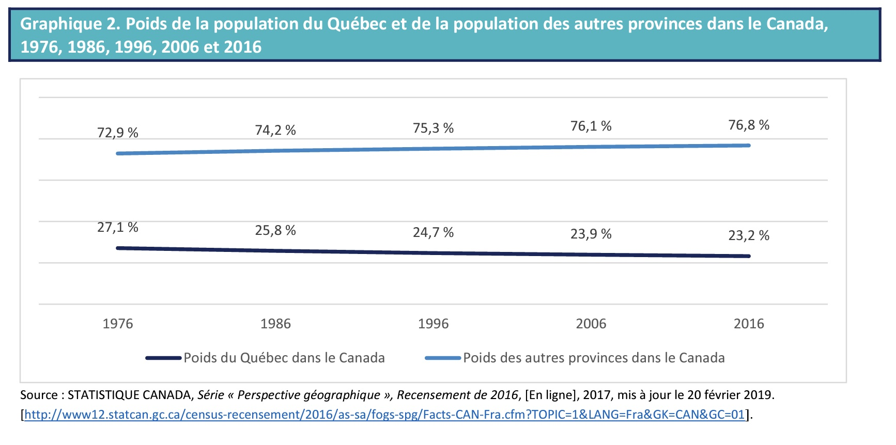
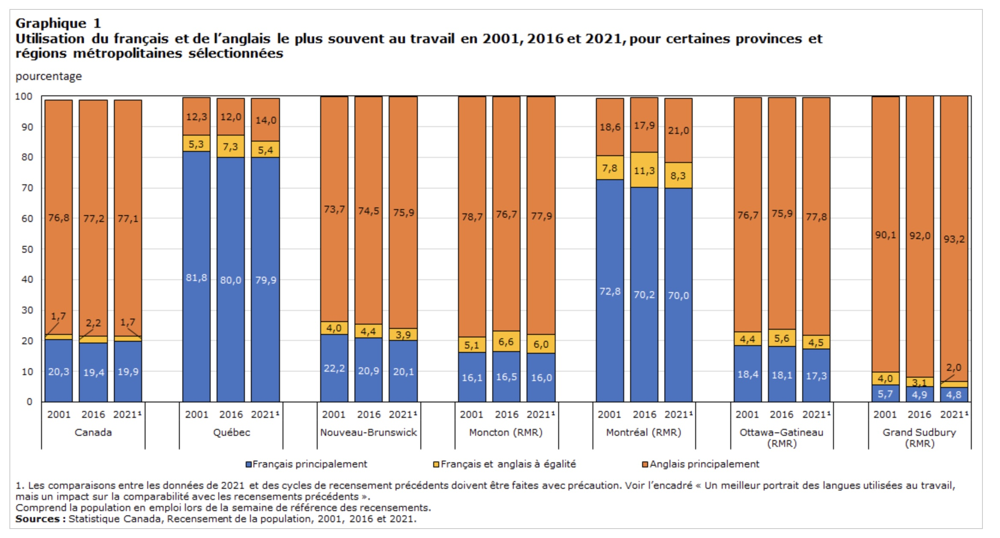
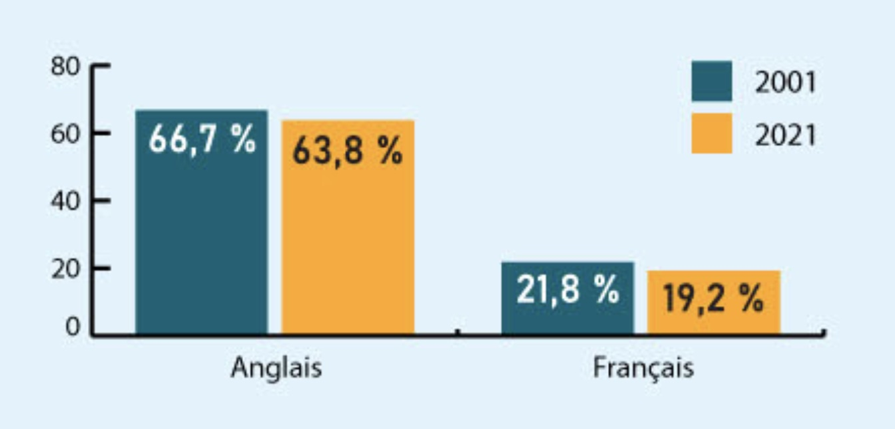

## Étude de cas 1: La question linguistique au Québec

La langue n'est pas seulement un moyen de communication entre les individus, elle comporte aussi une dimension politique très forte, notamment dans des contextes où coéxistent plusieurs langues. Elle permet de mesurer "des groupes culturels au sein d’États culturellement diversifiés" (https://www.uottawa.ca/calc/demolinguistic-statistics/census-demolinguistic-questions). C'est le cas du Québec dans une Amérique du Nord largement Anglophone. Même si le Canada est bilingue par sa constitution, le fait est que le Québec demeure la seul province où le Français est la langue officielle. Il se pose alors des questions sur les ménaces qui se posent à cette langue? Des plus persimistes qui se demandent si le Québec ne court pas vers la "Louisianisation" aux moins qui pensent que le Québec ne fait pas exception à une tendance globale de l'importance de l'Anglais partout dans le monde et qu'il ne faut pas s'en faire outre mesure. Dans cette étude de cas, nous allons décortiquer à travers des chiffres l'état de la situation. 

- Quelle est la situation du Français au Québec? 
- Est-ce que la part du Français diminue au profit d'autres langues et principalement de l'Anglais?
- Quelle est la situation dans les régions métropolitaine du Québec? et particulièrement à Montréal?

Nous procéderons en discutant :
- des concepts mobilisés
- de la provenance des données et 
- des indicateurs utilisés

Nous mettrons un accent particulier à discuter des questions de validités et de fiabilité qui se posent à ces données.

## Concept mobilisé

Pour faire l'état du français que Québec, il faut d'abord savoir ce qu'on veut mesurer. L'utilisation du français est un concept qu'il faut d'abord définir avant de le mesurer: ce processus s'appelle la conceptualisation. Nous pouvons ainsi définir l'utilisation du Francais comme le fait de parler ou de comprendre le Francais dans un espace donné. En passant de cette définition pour la mesure, nous disons que nous opérationnalisons le concept. Plusieurs opérationnalisations ont été proposées dans la litérature pour cerner les différentes dimensions de ce concept. D'après Houle, Le canada est l'un des rares pays sinon le seul où les trois dimensions linguistiques recommandées par les Nations unies, soit la **langue maternelle**, la **langue parlée usuelle** (opérationnalisée au Canada comme la langue parlée le plus souvent à la maison) et la **connaissance de certaines langues** sont mesurées (Arel, 2002 ; deVries, 1990).

Plusieurs questions sont posées pour mesurer ces dimensions:

**1. Langue maternelle**

Q1. Première langue **apprise à la maison** dans l’enfance **encore comprise**

<!-- Cependant, la conception de la question et le choix des mots employés ont changé avec le temps. Par exemple, de 1901 à 1931, on demandait aux répondants d’indiquer leur langue maternelle directement, mais seulement s’ils la parlaient encore. En 1921 et en 1931, on demandait aux répondants d’indiquer spécifiquement les langues parlées autres que l’anglais et le français. En 1941, une formule à deux conditions a été utilisée pour connaître la langue maternelle de l’individu. Cette formule à deux conditions définit la langue maternelle comme la « première langue apprise dans l’enfance et encore comprise par la personne ». On ne sait pas pourquoi la condition « encore comprise » a été ajoutée (Lachapelle & Lepage, 2010 : 6). De plus, pour les années 1951, 1971 et 1976, la variable « première langue parlée » était utilisée à la place de « première langue apprise ».

Toutefois, ce qui est clair est que durant la période allant de 1901 à 1931, selon la définition donnée dans ces recensements, parler la langue était requis pour qu’elle soit considérée comme la langue maternelle. Par opposition, à partir de 1941, seules des compétences réceptives (c.-à-d. la compréhension) de la langue étaient incluses. Une liste de toutes les questions sur la langue maternelle de 1901 à 2016 se trouve ci-dessous. (https://www.uottawa.ca/calc/demolinguistic-statistics/census-demolinguistic-questions) -->

**2. Langue parlée usuelle**

*- Langue d'usage au foyer*

Q2. "Quelle est la langue la plus souvent parlée à la maison par cette personne?"
R2. Français, Anglais, Autre langue – précisez

En 2021:

Q2_nouveau: Quelle(s) langue(s) cette personne parle-t-elle régulièrement à la maison ?
R2_Nouveau : Français, Anglais, Autre(s) langue(s) – précisez

Remarque: Si cette personne indique une seule langue à la question, passez à la question 10.

<!-- Toutefois, ne mesurer qu’une seule langue est contraignant puisque cela ne reflète que partiellement les comportements linguistiques qui ont cours à la maison (Lachapelle & Lepage, 2010 : 47). C’est particulièrement vrai dans le cas des foyers exogames où au moins deux langues sont parlées. De plus, indiquer qu’une langue n’est pas la langue principalement utilisée à la maison n’implique pas nécessairement qu’elle n’est pas parlée du tout. C’est en raison de ces limitations qu’une question sur les langues parlées régulièrement à la maison a été ajoutée en 2001. Le libellé des deux questions n’a pas changé depuis leur instauration. --> 

Q3. "Les langues parlées régulièrement à la maison" (Cette personne parle-t-elle régulièrement d’autres langues à la maison?)
R3. Non; Oui, français; Oui, anglais; Oui, autre langue – précisez

Q3_nouveau: Parmi ces langues, laquelle cette personne parle-t-elle le plus souvent à la maison?
Remarque: Indiquez plus d’une langue seulement si elles sont parlées aussi souvent l’une que l’autre à la maison.

R3_nouveau. Français, Anglais, Autre langue – précisez

**Questions**: 

Quelles sont les conséquences de ces changements dans les questions?

<!-- 
Positive: améliore la qualité de la question et des réponses
Négative: Brise la comparabilité avec les données précédentes
-->

*- Langue de travail*

Q4. "les langues parlées régulièrement dans son emploi"

**3. Connaissances de certaines langues**

*- Connaissance des langues officielles*

<!-- Comme pour la question sur la langue maternelle, l’ajout de cette question était aussi lié à la double préoccupation du Canada quant à l’intégration des immigrants et au bilinguisme officiel.-->

Q5. "La personne connaît-elle suffisamment l’anglais ou le français pour soutenir une conversation?"
R5. Anglais seulement, français seulement, anglais et français, ni anglais ni français.

*- Connaissance des langues non-officielles*

<!-- En 1982, le concept de multiculturalisme est inséré dans la Charte canadienne des droits et libertés. Six ans plus tard, la Loi sur le multiculturalisme canadien (1988) et la politique de multiculturalisme sont officialisées.-->

Q6. "Quelle(s) langue(s), autre(s) que le français ou l’anglais, cette personne connaît-elle assez bien pour soutenir une conversation? " 

<!--Contrairement à la langue maternelle, cette question ne touchait pas le développement et de la compétence linguistique d’une personne durant l’enfance, mais bien ses aptitudes à s’exprimer au moment du recensement. Le libellé est demeuré le même depuis son instauration en 1991. -->

*- Première langue officielle parlée*

Q7. Une population de langue officielle en situation minoritaire "tient compte de la connaissance des langues officielles, de la langue maternelle et de la langue parlée à la maison".

<!-- Cet intérêt s’expliquait par le fait que les individus parlant une langue issue de l’immigration ne pouvaient pas être désignés anglophones ou francophones en utilisant le critère de la langue maternelle. Il fallait tout de même connaître le nombre total de personnes qui pourraient demander des services dans l’une ou l’autre des deux langues officielles afin de mieux les planifier (Corbeil, 2010 : 7). Pour cette raison, à la demande particulière du Conseil du Trésor, le concept de première langue officielle parlée a été introduit.

-->

Définition des concepts (chrome-extension://efaidnbmnnnibpcajpcglclefindmkaj/https://www.oqlf.gouv.qc.ca/ressources/sociolinguistique/2019/rapport-evolution-situation-linguistique.pdf) 

-**Francophone, anglophone, allophone** : Les personnes ayant le français, l’anglais ou une langue autre comme langue parlée le plus souvent à la maison sont respectivement nommées francophones, anglophones et allophones dans le texte. 

-**Langue maternelle** : Langue qu’une personne a apprise en premier lieu à la maison dans son enfance et qu’elle comprend encore. 

-**Langue d’usage public** : Langue parlée le plus souvent à l’extérieur de la maison avec des personnes autres que les parents ou les amis.  

-**Langue de travail** : La définition de la langue de travail varie selon les études. Dans certaines études, il s’agit de la langue utilisée le plus souvent au travail. Dans d’autres, la définition inclut la langue utilisée le plus souvent et la langue utilisée régulièrement au travail (usage secondaire en plus de l’usage le plus fréquent). Dans certaines études, la langue du travail est établie en fonction de la proportion du temps de travail en français.  

-**Langue parlée le plus souvent à la maison** : Langue qu’une personne utilise le plus souvent pour communiquer à l’intérieur de son domicile. Il peut y avoir une seule langue comme il peut y en avoir plusieurs. Dans certaines études, les personnes sont identifiées comme francophones, anglophones ou allophones à partir de cet indicateur. 

-**Langue parlée régulièrement à la maison** : Autre langue utilisée régulièrement par la personne pour communiquer à l’intérieur de son domicile que la langue parlée le plus souvent à la maison. Il peut y avoir une seule langue parlée régulièrement comme il peut y en avoir plusieurs. 

-**Langue autre** : Autre langue que le français et l’anglais. 

## Provenance des données

- Recensement: 

    - Tous les recensements décennaux canadiens depuis 1901 ont posé au moins une question sur la langue (Lauriault, 2012, voir tableau 14 en particulier, p. 386). 

    - Le Canada est l’un des rares pays, sinon le seul, où le recensement mesure, depuis 1971, les trois dimensions linguistiques recommandées par les Nations unies, soit la langue maternelle, la langue parlée usuelle (opérationnalisée au Canada comme la langue parlée le plus souvent à la maison) et la connaissance de certaines langues (Arel, 2002 ; deVries, 1990). (https://www-erudit-org.proxy.bibliotheques.uqam.ca/fr/revues/cqd/2015-v44-n2-cqd02448/1035957ar.pdf)

- Enquêtes: 

    - Enquête sur la population de langue officielle en situation minoritaire (EPLOSM2022): L'Enquête sur la population de langue officielle en situation minoritaire (EPLOSM) est une enquête postcensitaire menée auprès de la population de langue anglaise au Québec et de la population de langue française ailleurs au Canada. Les données permettront de mieux comprendre la situation actuelle des personnes de langue officielle en situation minoritaire sur des enjeux actuels tels que l'éducation et l'accès à divers services dans la langue de la minorité (https://www23.statcan.gc.ca/imdb/p2SV_f.pl?Function=getSurvey&SDDS=5355).

    - Trajectoires individuelles et dynamiques de participation des femmes et hommes à la société québécoise (TrajIPaQ) - Lardoux, Adjiwanou, al. 2021
    

## Indicateurs

- Poids du Québec au Canada

    - Population du Canada (discuter effet de perspective, jeu à somme nulle)
    
    

    - Poids démographique du Québec

 

- Indicateurs sur la langue

    - Langue parlée au travail (parler de la représentation en carte des données)

Au Québec, 79,9 % des travailleurs utilisaient principalement le français au travail, 14,0 % utilisaient principalement l’anglais, et 5,4 % utilisaient le français et l’anglais à égalité. La proportion de travailleurs utilisant principalement le français au travail a diminué légèrement depuis 2016.

    - Évolution de la langue parlée au travail (discuter des données agrégées)

    - Utilisation selon le secteur d'industrie

    - Langue parlée de façon prédominante à la maison
    
    

    - Langues prédominante à la maison chez les Allophones
    
 

Questions : 

1. Comment mesure-t-on la langue prédominante?
2. Est-ce que le fait que la langue maternelle ne soit pas le francais est un problème pour le Québec?

Oui: Guillaume Marois

Non: Richard Marcoux "2. Il apparaît clair que la langue maternelle est un indicateur que l’on doit continuer à recueillir dans les enquêtes et les recensements, mais cette information est nettement insuffisante pour définir qui est francophone."

"Au début des années 1960, la population francophone est bien campée au Nord — à plus de 90 % — et elle se compose alors essentiellement de gens dont le français est la langue maternelle. Ce n’est plus le cas en 2022 : près de 60 % des 321 millions des francophones se trouvent au Sud, où très peu ont le français comme langue maternelle. Comme je l’ai souligné à plusieurs occasions : on naît de moins en moins francophone, mais on le devient de plus en plus."

- Changement des questions entre 2016 et 2021

## Limites des données

1. Changement dans les questions

2. Effet de perspective: Jean-Guy Prévost (2011): Statistiques linguistiques, rhétorique quantitative et effets de perspective

i. l’effet de réalisme, voire d’hyper-réalisme, associé à l’existence de catégories pourtant explicitement « bricolées » 

    - **Les allophones**: On parle maintenant souvent des allophones comme s’ils constituaient un groupe de la population doté de caractéristiques sociales propres, alors que les personnes ainsi désignées n’ont en commun, au départ, qu’une caractéristique négative, comme l’indique la définition du terme. 
    
        - L’effet de perspective induit ici peut être décrit comme suit : les allophones, qui constituent par définition une catégorie très hétérogène sur le plan linguistique (la réponse la plus fréquente, l’italien, ne correspond qu’à 14 % du nombre des allophones), se voient dotés, par la mise en équivalence des trois grandes catégories linguistiques dans divers tableaux et graphiques, d’une partie au moins de la densité (au sens de thickness) et de l’homogénéité culturelle et historique qui pouvaient être associées aux deux autres catégories, lesquelles se confondent, dans notre topographie symbolique, avec l’image fortement chargée des « peuples fondateurs ».
        - francophones et les anglophones tels que définis par les variables du recensement ne constituent pas eux non plus des groupes homogènes (que l’on songe à la variété des lieux de naissance ou des origines ethniques chez les uns comme chez les autres)
        - La une du journal La Presse du 3 septembre 2009, « Les allophones majoritaires », s’appuie sur des données fournies par le Comité de gestion de la taxe scolaire de l’île de Montréal et suivant lesquelles, parmi les enfants fréquentant l’école publique, les allophones avaient surpassé, pour la première fois, les francophones (Comité de gestion de la taxe scolaire de l’île de Montréal, 2009).

ii. l’image d’un jeu à somme nulle qui résulte de la manière dont on représente une distribution sous forme de pourcentages ;

    - Les pourcentages sont un outil très pratique pour décrire des quantités. Ils ramènent les chiffres bruts à une base commune (100) et ont l’avantage de nous parler un langage familier : longtemps, dans bien des pays, l’école a noté la performance des élèves au moyen de pourcentages ; les taxes à la consommation, les rabais dans les magasins, les taux d’intérêt nous parlent dans ce langage. La vertu simplificatrice des pourcentages est incontestable.

iii. l’effet qui, indépendamment de tout raisonnement causal ou modèle théorique, conduit à prêter du sens au rang qu’occupe une catégorie dans un ordonnancement ;

    - Pourcentage ligne et pourcentage colonne ne donnent pas les mêmes explications

    
iv. l’apparition de « seuils critiques » ou « psychologiques » ou encore de « points de bascule », également associée à la représentation d’une distribution sous forme de pourcentages, mais résultant d’une comparaison implicite entre situations incommensurables.

    - Seuils critiques et points de bascule: À ce que l’on sache, aucune conséquence d’ordre pratique n’est directement attachée au fait que la proportion des personnes de langue maternelle française dans la division de recensement de Montréal tombe sous la barre des 50 % ou que celle des personnes de langue maternelle française au Québec passe sous le seuil des 80 %. Bien sûr, la présence dans les écoles publiques francophones de Montréal d’un grand nombre d’élèves dont la langue maternelle n’est pas le français pose sans doute des défis pédagogiques immenses, mais il n’existe pas de « seuil critique » que l’on pourrait décréter à cet égard, pas plus qu’il n’existe de « seuil de tolérance » de la majorité née au pays quant à la proportion de la population issue de l’immigration.

## Labo : 

Labo: Produire les statistiques sur la langue à partir des données de l'enquête trajipaq

## Ressources

https://www.uottawa.ca/calc/demolinguistic-statistics/census-demolinguistic-questions
chrome-extension://efaidnbmnnnibpcajpcglclefindmkaj/https://www-erudit-org.proxy.bibliotheques.uqam.ca/fr/revues/cqd/2015-v44-n2-cqd02448/1035957ar.pdf
https://ici.radio-canada.ca/ohdio/premiere/emissions/le-15-18/segments/entrevue/394448/francophonie-observatoire-langue-francaise-richard-marcoux
https://www-erudit-org.proxy.bibliotheques.uqam.ca/fr/revues/rs/2018-v59-n3-rs04512/1058722ar/
https://www.ledevoir.com/opinion/idees/722493/langue-dans-une-galaxie-francophone-pres-de-chez-vous

https://onfr.tfo.org/recensement-le-canada-seul-pays-au-monde-qui-pose-autant-de-questions-sur-la-langue-selon-un-statisticien/

Changement de questions et conséquences; https://theconversation.com/en-modifiant-la-question-sur-les-langues-dusage-statcan-a-compromis-les-resultats-du-recensement-de-2021-189192

Statistiques : 

- chrome-extension://efaidnbmnnnibpcajpcglclefindmkaj/https://www.oqlf.gouv.qc.ca/ressources/sociolinguistique/2019/rapport-evolution-situation-linguistique.pdf

- https://www12.statcan.gc.ca/census-recensement/2021/as-sa/98-200-X/2021010/98-200-X2021010-fra.cfm

- https://www150.statcan.gc.ca/n1/pub/11-627-m/11-627-m2022051-fra.htm

