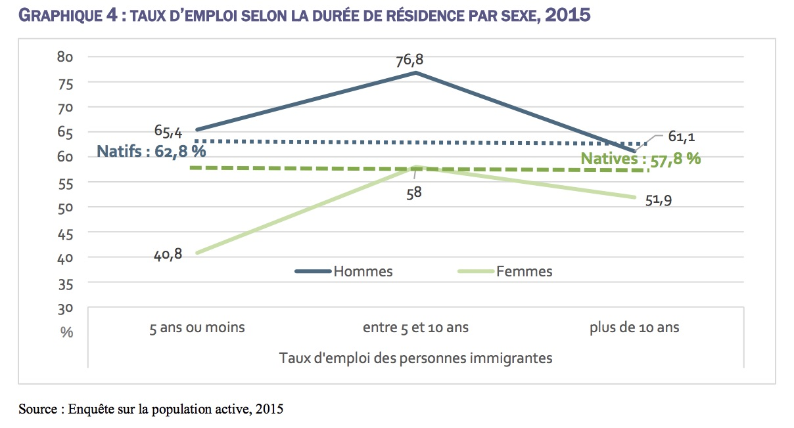

## Plan de présentation

1. Revenir sur les notions de niveau de mesure des variables (30 minutes)
2. Discussion sur les fréquences et les pourcentages (1 heure 10)
3. Pause (10 minutes)
3. Labo classe (1h)

## Information: Organisation des fichiers sur Moodle

- Vous avez plusieurs fichiers sur Moodle qui peuvent vous mélanger. 

- Tous les fichiers sont nommés: Il y a trois fichiers qui sont nommées:

    >- Séance_chapitre.1: 1 à ma présentation de ce qui est dans le livre de Fox
    
    >- Séance_chapitre.2: 2 fait référence à la discussion qu'on va avoir en classe. Tout ce qu'il y a dans le livre ne sera pas forcément couvert, mais l'essentiel et les plus importants. Cela viendra compléter vos lectures
    
    >- Séance_livre.3: 3 fait référence à quelque chose qui est en développement. Il s'agit du chapitre du livre que je suis en train d'écrire
    

## Résumé des notions

Symboles  Signification                                  Formules
--------- ---------------------------------------------- ---------------------------
N         Nombre total de cas / taille de l'échantillon           
f         Fréquence = nombre de cas pour un attribut
F         Fréquence cumulative = somme des fréquences    $\sum f$
          inférieures ou égales à une valeur donnée
P         Proportion de l'échantillon                    $\frac{f}{N}$
%         Pourcentage                                    $\frac{f}{N}*100$
pc        Pourcentage cumulatif                          $\frac{F}{N}*100$
Ratio     La fréquence relative de cas dans différentes  $Ratio  \frac{f_1}{f_2}$
          population
          

## Résumé des notions

- Fréquences
    - Tous les niveaux de mesure (nominale, ordinale, intervalle/ratio)

- Fréquence cumulative
    - Normalement variable ordinale, intervalle/ratio
    

## Résumé des notions

- Données manquantes

    >- Non applicable, ne sait pas, Sans opinion, Incapable de choisir, Pas de réponse, Refus de répondre, Incertain
    
    >- Le cas aussi dès fois de "autres"

    >- Exception: Quand "NSP" et "Sans opinion" ont une signification conceptuelle ou théorique, on ne devrait pas les exclure de l'analyse
        - Exemple:

    >- Non applicable n'est pas forcément donnée manquante, on peut le recoder
        - Exemple

>- Cas déviants: le cas où les score peuvent biaiser l'analyse statistique

## Résumé des notions

- Représentations graphiques

    >- diagrammes circulaires (à privilégier quand le nombre de modalités est peu nombreux, cas des variables nominales)
    >- diagrammes en bâtons
    >- Cartographie (variable écologiques)

Exemple numérique
=================================

## Distribution de fréquences

Question 1: Est-ce que les gens devraient obéir aux lois sans exception ou suivre leur conscience même si cela demandait de violer la loi?

Question 2: Quel est ton sexe?

Question 3: Quel est ton niveau d'éducation?

Question 4: Quel est ton âge?
          
## Distribution de fréquences

Sexe : Nominale

  - Homme = 12 (f1)
  - Femme = 13 (f2)
  - Autre = 2  (f3)

N = 12 + 13 + 2 = 27

## Distribution de fréquences

Niveau de scolarité: Ordinale

  - Sans instruction = 6
  - Secondaire = 7
  - Collégial = 9
  - Université ou plus = 5

## Distribution de fréquences

Age: ratio

  - 25 = 2
  - 26 = 3
  - 27 = 4
  - 28 = 2
  - 29 = 1
  - 30 = 5
  - 31 = 3
  - 32 = 4
  - 33 = 2
  - 34 = 1

## Distribution de fréquences

Désobéissance : Nominale

  - Suivre sa conscience = 21
  - Obéir aux lois = 3
  - NSP = 3

## Proportion 

                     proportion                            
-------------------- ---------------                        
Suivre sa conscience 21/27 = 0.78       
Obéir aux lois       3/27  = 0.11      
NSP                  3/27  = 0.11                     

## Pourcentage

                     proportion     pourcentage                      
-------------------- -------------  ----------------                      
Suivre sa conscience 21/27 = 0.78   0.78*100 = 77.8%      
Obéir aux lois       3/27  = 0.11   0.11*100 = 11.1%   
NSP                  3/27  = 0.11   0.11*100 = 11.1%

## Pourcentage valide

                     pourcentage       Pourcentage valide               
-------------------- ----------------- ------------------------                      
Suivre sa conscience 0.78\*100 = 77.8%   21/24*100 = 87.5%  
Obéir aux lois       0.11\*100 = 11.1%   3/24*100  = 12.5%  
NSP                  0.11\*100 = 11.1%                   

Échantillon valide = 27 - 3 = 24

## Distribution de la variable niveau de scolarité

                    f   proportion    pourcentage       
----------------- ----- ------------ ------------------                      
Université        5     5/27 = 0.19   5/27*100 = 18.51     
Collège           9     9/27 = 0.33   9/27*100 = 33.33  
Secondaire        7     7/27 = 0.26   7/27*100 = 25.93  
Sans éducation    6     6/27 = 0.22   6/27*100 = 22.22   

## Distribution de la variable niveau de scolarité

                 pourcentage       Pourcentage cumulatif
---------------- ----------------- --------------------------------------                     
Université       5/27*100 = 18.51  18.51 + 33.33 + 25.93 + 22.22 = 100   
Collège          9/27*100 = 33.33  33.33 + 25.93 + 22.22 = 81.48
Secondaire       7/27*100 = 25.93  25.93 + 22.22 = 48.15
Sans éducation   6/27*100 = 22.22  22.22 

## Distribution de la variable niveau de scolarité

- Il est fréquent que les modalités de la variables soient ordonnées en sens inverse: du plus petit au plus grand, du moins important au plus important...

- Cela ne change rien à l'interprétation des résultats.

                 pourcentage       Pourcentage cumulatif
---------------- ----------------- --------------------------------------                     
Sans éducation   6/27*100 = 22.22  22.22 
Secondaire       7/27*100 = 25.93  25.93 + 22.22 = 48.15
Collège          9/27*100 = 33.33  33.33 + 25.93 + 22.22 = 81.48
Université       5/27*100 = 18.51  18.51 + 33.33 + 25.93 + 22.22 = 100   

## Distribution de la variable niveau de scolarité

**Interprétation**

>- 100% de l'échantillon ont le niveau universitaire ou moins (ou 100% de l'échantillon ont au plus le niveau universitaire)

>- 81.48% de l'échantillon ont le niveau collège ou moins

>- 48.15% de l'échantillon ont le niveau secondaire ou moins

>- Quelle est la proportion des gens qui ont le niveau collège et plus? 

>- Peut-on calculer le pourcentage cumulatif pour les variables nominales? 
<!-- Oui pour la variable comme état matrimonial:marié, veuf, divorcé, jamais marié -->

## Distribution de la variable Age

- Dresser le tableau de distribution de la variable âge.

## De la mauvaise utilisation des statistiques (tiré de Krieg)

- **Pourcentage sur de petits échantillons**:  Méfiez-vous des statistiques "époustouflantes" ! Les journaux, les magazines et autres médias font souvent état de changements rapides dans la société. Par exemple, nous pouvons lire dans le journal local que le taux d'homicide de notre communauté a augmenté de 50 % par rapport à l'année précédente. Cela peut être une source d'inquiétude ou non. Si le nombre de meurtres à la même époque l'année dernière était de deux, une augmentation de 50 % signifie que notre communauté a connu trois meurtres cette année. Passer de deux à trois n'est pas une grande augmentation (du moins dans la plupart des villes), et faire état d'une augmentation de 50 %, bien que statistiquement vrai, revient à tromper les consommateurs de ces statistiques en leur faisant croire que le problème est plus important qu'il ne l'est réellement.

## De la mauvaise utilisation des statistiques (tiré de Krieg)

- **Spécificité sociale et géographique des statistiques**. Souvent, les statistiques qui sont censées représenter une société entière ne représentent qu'une partie de la population. 

    - Par exemple, nous pouvons lire que le nombre de meurtres commis depuis le début de l'année est le double de celui de l'année dernière à la même époque. 
    - Cela ne signifie pas pour autant que tout le monde court deux fois plus de risques d'être assassiné. Il se peut que la majorité des meurtres aient lieu dans des villes de 250 000 habitants ou plus. 
    - Il est donc possible que l'augmentation globale du nombre de meurtres dans ces zones urbaines soit à l'origine de la hausse du taux de meurtres à l'échelle nationale, alors que d'autres types de communautés pourraient voir leur taux de meurtres diminuer.

## De la mauvaise utilisation des statistiques (tiré de Krieg)

- **Autres exemple**: Il pourrait en être de même pour tout type de phénomène social - enlèvements d'enfants, fugues, viols, etc. 

- Voir statistiques sur els homicides au Canada: https://www150.statcan.gc.ca/t1/tbl1/fr/tv.action?pid=3510007101

- Soyez vigilant.es: Il est important de savoir quels types de questions poser lorsque nous entendons ces statistiques "époustouflantes". 

    - Quelles sont les fréquences sur lesquelles ces statistiques sont basées ? 
    - À quelles populations ces statistiques peuvent-elles être généralisées ? 
    - Et, ce qui est peut-être le plus important, qui a intérêt à communiquer ce type de statistiques ?

<!-- Krieg, page 67
beware of "mind-blowing" statistics! Newspapers, magazines, and other media outlets often report on rapid change in society. for example, we may read in the local newspaper that our community's murder rate has jumped by 50% relative t a year ago. This may or may not be cause for concern. If the number of murders at this time last year was two, then a 50% increase means that our community has had three murders this year. An increase from two to three is not much of an increase (at least in most cities), and to report that as a 50% increase, while statistically true, is to mislead the consumers of these statistics by making them think the problem is bigger than it really is.
Another problem that can arise with percentages is related to the social and geographic specificity of statistics. Often statistics that are intended to represent an entire society represent only a portion of the population. For example, we may read that the number of murders so far this year is double the number of murders from this time last year. This does not, however, mean that everyone is at twice the risk of being murdered. It may be that the majority of all murders take place in cities with populations of 250,000 or more. Therefore, it is possible that the overall increase in murders in these urban areas is rising and causing the nationwide murder rate to rise, while other types of communities could be seeing declines in their murder rates.
The same could be true with any kind of social phenomena-child abductions, runaways, rapes, and so on. It is important to know what kinds of questions to ask when we hear these "mind-blowing" statistics. What are the frequencies on which these statistics are based? To what populations can these statistics be generalized? And maybe most important, who has an interest in reporting these kinds of statistics?

Méfiez-vous des statistiques "époustouflantes" ! Les journaux, les magazines et autres médias font souvent état de changements rapides dans la société. Par exemple, nous pouvons lire dans le journal local que le taux d'homicide de notre communauté a augmenté de 50 % par rapport à l'année précédente. Cela peut être une source d'inquiétude ou non. Si le nombre de meurtres à la même époque l'année dernière était de deux, une augmentation de 50 % signifie que notre communauté a connu trois meurtres cette année. Passer de deux à trois n'est pas une grande augmentation (du moins dans la plupart des villes), et faire état d'une augmentation de 50 %, bien que statistiquement vrai, revient à tromper les consommateurs de ces statistiques en leur faisant croire que le problème est plus important qu'il ne l'est réellement.
Un autre problème qui peut se poser avec les pourcentages est lié à la spécificité sociale et géographique des statistiques. Souvent, les statistiques qui sont censées représenter une société entière ne représentent qu'une partie de la population. Par exemple, nous pouvons lire que le nombre de meurtres commis depuis le début de l'année est le double de celui de l'année dernière à la même époque. Cela ne signifie pas pour autant que tout le monde court deux fois plus de risques d'être assassiné. Il se peut que la majorité des meurtres aient lieu dans des villes de 250 000 habitants ou plus. Il est donc possible que l'augmentation globale du nombre de meurtres dans ces zones urbaines soit à l'origine de la hausse du taux de meurtres à l'échelle nationale, alors que d'autres types de communautés pourraient voir leur taux de meurtres diminuer.
Il pourrait en être de même pour tout type de phénomène social - enlèvements d'enfants, fugues, viols, etc. Il est important de savoir quels types de questions poser lorsque nous entendons ces statistiques "époustouflantes". Quelles sont les fréquences sur lesquelles ces statistiques sont basées ? À quelles populations ces statistiques peuvent-elles être généralisées ? Et, ce qui est peut-être le plus important, qui a intérêt à communiquer ce type de statistiques ?
-->

Étude de cas: Participation à la société québécoise
========================================

## Exemple 1: Mesurer la participation des Québécoises et Québécois des minorités ethnoculturelles

**Objectifs de l'étude:**

1. Décrire la participation des minorités ethnoculturelles dans 7 dimensions
  
  - Dimension 1: Économique
  - Dimension 2: Communautaire
  - Dimension 3: Culturelle
  - Dimension 4: Linguistique
  - Dimension 5: Citoyenne
  - Dimension 6: Identitaire

> 2. Comparer la participation des minorités ethnoculturelles avec celle de la population majoritaire
  

## Exemple 1: Mesurer la participation des Québécoises et Québécois des minorités ethnoculturelles

- Décrivez ce graphique

## Exemple 1: Mesurer la participation des Québécoises et Québécois des minorités ethnoculturelles

"Les immigrants masculins participent au marché du travail avec un taux d’emploi dépassant celui des hommes natifs. Pour les femmes immigrantes, le taux d’emploi dépasse très légèrement celui des femmes natives chez celles résidant depuis 5 à 10 ans au Québec, mais demeure inférieur avant et après." Laur, P. 19)

- http://www.midi.gouv.qc.ca/publications/fr/recherches-statistiques/RAP_Mesure_participation_2016.pdf
 

## Pour la semaine prochaine

**Séance 4 : Les mesures de tendance centrale**

1. Lectures

- Fox: chapitre 3, pp.69-90

2. Labo 4 - voir Moodle

