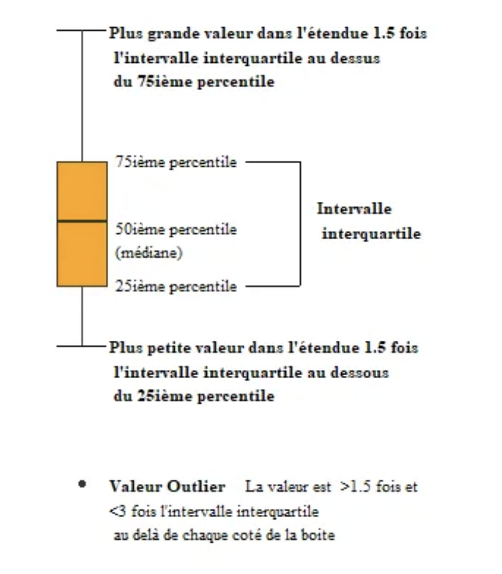
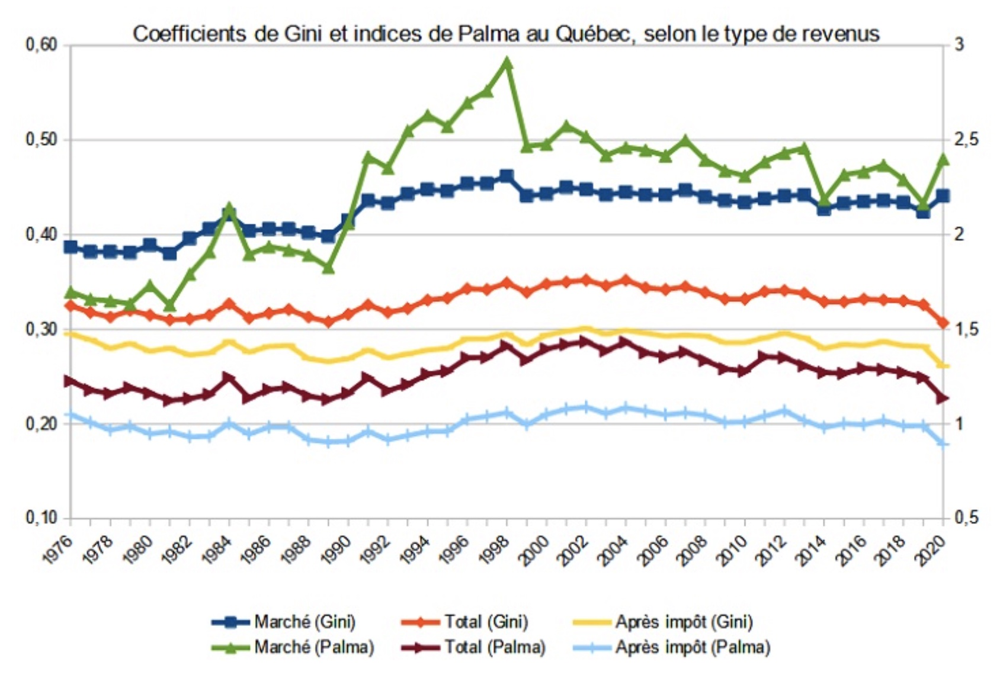

## A quoi ça sert?

- Une mesure de tendance centrale est une valeur **typique** ou **représentative** d'un ensemble de scores

## Résumé : Mesure de tendance centrale (paramètres de position)

Symbole            Définition                           Formules
------------------ ------------------------------------ ------------------------
Moyenne            Somme des valeurs divisée par        $\bar{X} = \frac{1}{n} \sum_{i=1}^n X_i$
                   l'effectif de la série
Médiane            Valeur qui divise la distribution
                   en deux parties égales
Mode               Valeur observée de fréquence maximum                    
Percentile         Valeurs qui divisent la distribution
                   en 100 parties égales

## Résumé : Mesure de dispersion

Symbole     Définition                       Formules
----------- -------------------------------- -----------------------------------------
Étendue     Différence entre la plus grande  G - P
            et la plus petite valeur de la 
            variable
EIQ         3ème quartile - 1er quartile     Q3 - Q1
Déviation   La distance d'une valeur à       $X - \bar{X}$
            la moyenne
Sommes      Somme des carrés des déviations  SC = $\sum_{i=1}^n(X_i-\bar{X})^2$
des carrés
Variance    Moyenne des carrés des déviances $s^2=\frac{1}{n-1}\sum_{i=1}^n(X_i-\bar{X})^2$
Écart-type  Racine carrée de la variance     $s = \sqrt{\frac{1}{n-1} \sum_{i=1}^n(X_i-\bar{X})^2}$     

## Résumé : Quel type de résumé pour quel type de variable?

Type de variable     Fréquence       Pourcentage      Commentaire
-------------------- --------------- ---------------- ----------------------
Nominale             Oui             Oui              Toujours
Ordinale             Oui             Oui              Toujours
Ratio/Intervalle     Pas souhaité    Pas souhaité     Oui si peu de modalités
Ratio/Intervalle     Oui             Oui              Toujours
(données groupées)

## Résumé : Quel type de résumé pour quel type de variable?

Type de variable     Moyenne   Mode      Médiane     Variance    Écart-type   
-------------------- --------- --------- ----------- ----------- ------------ 
Nominale             Non       Oui       Non         Non         Non
Ordinale             Possible  Oui       Oui         Possible    Possible
Ratio/Intervalle     Oui       Oui       Oui         Oui         Oui
Ratio/Intervalle     Oui       Oui       Oui         Oui         Oui
(données groupées)

Exemple de calcul
==========================

## Distribution de revenu

Voici les revenus (en millier) d'un échantillon de 15 hommes et de 16 femmes

ind   Revenus   ind   Revenus  ind   Revenus   ind   Revenus    
----- --------- ----- -------- ----- --------- ----- --------
1     2         9     3.1      1     3.1       9     0.5
2     2.5       10    1.4      2     2.7       10    1.3
3     1.7       11    7.1      3     1.2       11    2.9
4     3         12    6.0      4     4.2       12    2.7
5     5         13    3.3      5     5.5       13    5.1
6     4.1       14    4.3      6     4.3       14    3.0
7     8.1       15    6.1      7     2.0       15    6.3
8     5.2                      8     1.5       16    4.2

## Distribution du revenu des hommes

## Moyenne

  - Revenu moyen des hommes 
  
    - = (2 + 2.5 + 1.7 + 3 + 5 + 4.1 + 8.1 + 5.2 + 3.1 + 1.4 + 7.1 + 6.0 + 3.3 + 4.3 + 6.1) / 15
    - revenu moyen des hommes = 4.19

  - Revenu moyen des femmes 
  
    = (3.1 + 2.7 + 1.2 + 4.2 + 5.5 + 4.3 + 2.0 + 1.5 + 0.5 + 1.3 + 2.9 + 2.7 + 5.1 + 3.0 + 6.3 + 4.2)/16
    - Revenu moyen des femmes = 3.16

## Médiane du revenu des hommes

- **La Médiane** = valeur telle que la moitié des observations lui sont inférieures et donc la moitié lui sont supérieures.

- C'est donc assez facile à calculer, il suffit juste d'ordonner les cas.

- Milieu de la distribution = (15 + 1)/2 = 8

## Médiane du revenu des hommes

## Médiane du revenu des hommes

- **Utilisation des pourcentages cumulés**

- 46.67% des participants ont un revenu de 3.3 ou moins et

- 53.33% des participants ont un revenu de 4.1 ou moins

- donc la médiane vaut 4.1

- Médiane Homme = 4.1

## Médiane des femmes

- Milieu de la distribution : (16 +1)/2 = 8.5 entre la 8 et la 9e valeur

## Médiane des femmes

- Médiane se situe entre la 8e et la 9e valeur 

- Médiane = (2.9 + 3)/2 = 2.95

## Mode

- Homme = il n'y a pas de mode
- Femme = deux modes, 2.7 et 4.2

## Premier quartile

Quelle est la localisation du premier quartile?

1    2    3  4    5  6    7    8    9    10   11    12  13   14   15
---- ---- -- ---- -- ---- ---- ---- ---- ---- ----- --- ---- ---- ---- 
1.4  1.7  2  2.5  3  3.1  3.3  4.1  4.3  5    5.2   6   6.1  7.1  8.1

## Premier quartile

Quelle est la localisation du premier quartile?

$L_k = k/100*(n + 1)$

k = 25 si premier quartile
n = 15

donc l_25 = 25/100*(15+1) = 4
Le premier quartile se trouve donc à la 4e position

premier quartile (Q1) = 2.5

## Troisième quartile

l_75 = 75/100*(15+1) = 12

donc Q3 = 6

## Et pour les femmes?

Q1 = ? 
Q3 = ?

## Et pour les femmes
 
 1   2    3    4   |  5  6    7    8   |  9   10   11   12   |  13   14  15  16 
 ---- --- ---- --- -- -- ---- ---- --- -- --- ---- ---- ---- -- ---- --- --- ---- 
 .5  1.2  1.3  1.5 |  2  2.7  2.7  2.9 |  3.  3.1  4.2  4.2  |  4.3  5.1 5.5 6.3

## Et pour les femmes?

>- L_25 = 25/100*(16+1) = 4.25 (entre 4 et 5)

>- L_75 = 75/100*(16+1) = 12.75 (entre 12 et 13)

>- Q1 = (1.5 + 2)/2 = 1.75

>- Q3 = (4.2 + 4.3)/2 = 4.25
 

>- Une difficulté arrive avec les variables ordinales

## Représentation

- Boxplot

## Représentation

## Médiane des variables ordinales

Exemple: Attitude envers les immigrants et les emplois

- Q1: Sur une échelle de 1 (totalement en désaccord) à 5 (totalement d'accord), que pensez-vous de l'affirmation suivante: "Les immigrants volent nos emplois"

## Médiane des variables ordinales

Valeur Fréquence  Fréq. cumulée  Pourcentage    Pourc. cumulé
------ ---------- -------------- ------------ -----------------
1      170         170
2      446         616
3      299         915
4      301        1216
5       65        1281
N      1281     

>- Médiane va diviser la distribution en deux partie égale

>- (1281 + 1)/2 = 641

>- la médiane est la valeur du 641e score, c'est-à-dire quelque part parmi les 299 scores 3

>- La médiane est donc 3. Cependant il faut affiner cela.

## Médiane des variables ordinales

> - Convention: on va supposer que derrière les réponses à cette question, il y a une échelle (ratio) allant de 0.5 à 5.5. 

>- Autrement dit, ceux qui ont répondu 1, aurait répondu en réalité entre 0.5 et 1.5. On les ramène donc à la moyenne de l'intervalle qui vaut (0.5 + 1.5)/2 = 1 

>- Ainsi, les 299 personnes qui ont répondu 3 ont en fait répondu entre 2.5 et 3.5

>- Nous allons donc interpoler pour trouver à quel endroit se situe la médiane

## Médiane des variables ordinales

617 ---------641-------------------------------------617+299 = 916

2.5 ----------M--------------------------------------3.5

## Médiane des variables ordinales

- Interpolation

- Application de la règle de trois

- Si 3 pains coûtent 55$, combien coûte 2 pains?

## Médiane des variables ordinales

617 ---------641-------------------------------------617+299 = 916

2.5 ----------M--------------------------------------3.5

(M - 3.5)/(2.5 - 3.5) = (641 - 916)/(617 - 916)

M = [(641 - 916)/(617 - 916)]/(2.5 - 3.5) + 3.5

M = 2.6

## Vous pouvez préféré utiliser la formule du livre

$$Md = L + (\frac{N/2 - F}{f})(i)$$

- L = la limite inférieure de l'intervalle contenant la médiane (2.5)

- N = le nombre de cas (1281)

- F = la fréquence cumulative des scores inférieurs à l'intervalle contenant la médiane (616)

- f = le nombre de scores que comprend l'intervalle contenant la médiane (299)

- i = la largeur de l'intervalle contenant la médiane (1)

>- Md = 2.5 +(1281/2 - 616)/299*1 = 2.6

Exemple d'application : mesurer l'inégalité
=================================

## Mesure de l'inégalité

- Moyenne
- Médiane
- Coefficient de Gini
- Indice de Palma

## Coefficient de Gini

- Le coefficient de Gini sert à mesurer le niveau d’inégalité de la répartition du revenu au sein de diverses populations ou au sein de la même population au fil du temps. 
- Il peut être calculé pour d'autres indicateurs autre que le revenu. 
- La courbe de Lorenz (figure) présente le rapport entre la proportion cumulée de la population, ordonnée selon le niveau de revenu, et la proportion cumulée du revenu total lui revenant. 
- Le coefficient de Gini provient du calcul de l’aire entre la courbe de Lorenz et la droite de l’égalité parfaite. 

## Coefficient de Gini

## Coefficient de Gini

- Plus cette aire est grande, plus l’inégalité est marquée. Les valeurs du coefficient de Gini varient entre 0 et 1. 

>- Une valeur de 0 indique que le revenu est également divisé entre tous les membres de la population, ceux-ci recevant exactement la même somme de revenu. 

>- Par contre, une valeur de 1 dénote une distribution parfaitement inégale au sein de laquelle une seule unité possède l’ensemble du revenu de l’économie. 

>- Une diminution de la valeur du coefficient de Gini peut être interprétée comme une diminution de l’inégalité, et vice versa.

## Indice de Palma

https://jeanneemard.wordpress.com/2022/05/19/les-inegalites-au-quebec-de-1976-a-2020-selon-lindice-de-palma-et-le-coefficient-de-gini/

## Indice de Palma

- IP est obtenu en divisant le revenu total des membres du 10e décile par le revenu total des membres des quatre premiers déciles (les plus pauvres)
- Un IP égal à 1 signifie que les ménages du décile le plus riche gagnent en moyenne quatre fois plus que ceux des quatre déciles les plus pauvres, 
- Un IP égal à 2 équivaut à huit fois plus et ainsi de suite.

## Quel revenu utilisé?

- Le **revenu ajusté** est obtenu en divisant le revenu total de tous les membres d’un ménage par la racine carrée de la taille de ce ménage. 
- Par exemple, le revenu ajusté des membres d’un ménage de quatre personnes qui a un revenu total de 100 000\$ sera de 50 000 \$ (100 000 \$ / $\sqrt4$, soit 2, = 50 000 \$) et ce revenu sera accordé aux quatre membres de ce ménage.

## Quel revenu utilisé?

- Le CG et l’IP peuvent être présentés en fonction de trois types de revenus :

  >- selon le **revenu du marché** : somme des revenus d’emploi (travail salarié ou montant net de travail autonome), de placements, de retraite (régime privé de pension) et autres;
  
  >- selon le **revenu total** : revenu du marché plus les transferts gouvernementaux (aide sociale, assurance-emploi, pensions de la sécurité de la vieillesse, supplément de revenu garanti, prestations du Régime des rentes du Québec, etc.), avant impôt;
  
  >- selon le **revenu après impôt** : revenu total moins l’impôt sur le revenu.

## Quel revenu utilisé?

  - Le CG et l’IP selon le revenu après impôt sont les plus couramment utilisés, car ils représentent les inégalités après intervention gouvernementale (transferts et impôt) et donc selon le revenu disponible sur lequel se manifestent les inégalités de revenu auxquelles font face les ménages

## Évolution de l'inégalité au Québec

## Pour la semaine prochaine

1. Lecture 
- Paramètres de variation (ou de dispersion) - Fox : chapitre 4, pp.91-103
- Distribution d’échantillonnage - Fox : Chapitre 4, pp.103-120

2. Application
- https://juba.github.io/tidyverse/01-presentation.html
- https://juba.github.io/tidyverse/02-prise_en_main.html
- https://juba.github.io/tidyverse/03-premier_travail.html

## Annexe 

- Voir le fichier Seance4_Annexe pour voir comment les données sont entrées et analysées avec RStudio.
  

