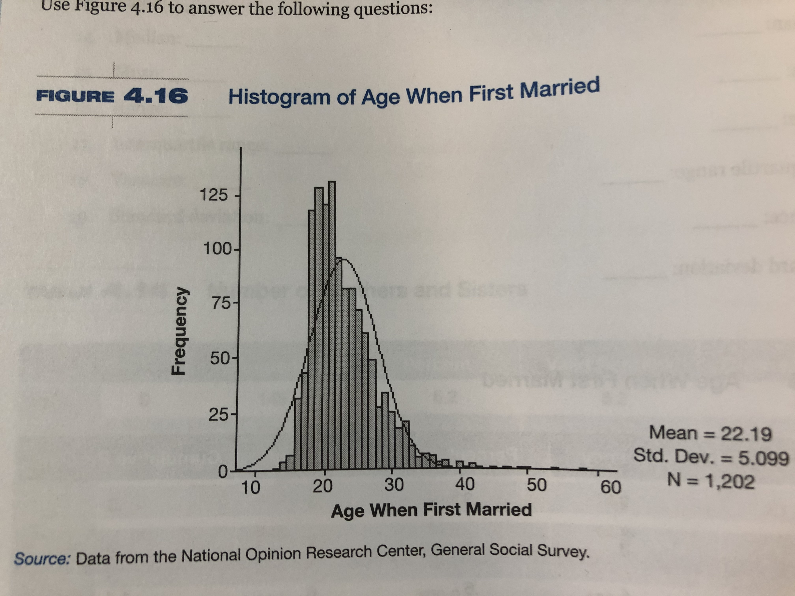

# PARTIE A

## Question 1: (tiré de Krieg)

A partir des données du tableau suivant, calculer :

- le mode
- la médiane
- la moyenne
- l'étendue
- l'écart inter-quartile
- la variance et l'écart-type

NE     Fréquence  Pourcentage    Pourcentage valide  Pourcentage cumulé
------ ---------- -------------  ------------------  -------------------
0      414        28.1           28.1                 28.1
1      242        16.4           16.4                 44.5
2      398        27.0           27.0                 71.4
3      226        15.3           15.3                 86.8
4      115        7.8             7.8                 94.6
5       58        3.9             3.9                 98.6
6       14         .9              .9                 99.5
7        7         .5              .5                100.0

## Question 2: (tiré de Krieg)

Le graphique suivant présente l'histogramme de l'âge au premier mariage. 

A partir de ce graphique, répondez aux questions suivantes:

1. Quel est l'âge moyen des répondant.es à leur premier mariage?
2. Combien de répondant.es ont été enquêté.es?
3. Quelle est la valeur de la variance?
4. En se basant sur les propriétés de la courbe normale, nous pouvons dire que 68% des répondant.es se sont marié.es entre les âges --- et ---
5. En se basant sur les propriétés de la courbe normale, nous pouvons dire que 95% des répondant.es se sont marié.es entre les âges --- et --- 

## Question 3: Vrai ou faux, justifier (ou donner un exemple selon les cas)

1. Les scores-Z sont particulièrement utiles lorsque l'on compare des scores provenant de distributions dont les moyennes et les écart-types sont différents (Vrai ou Faux)

2. La moyenne d'une variable standardisée vaut 1 (Vrai ou Faux)

3. On peut calculer les scores-Z pour les variables ordinales (Vrai ou Faux)

4. Si vous prenez deux distributions normales A et B avec A plus aplatie (signifie quoi) que l'autre, alors la proportion des scores qui se trouve à 1,5 écart-type de la moyenne de A est plus grande que la proportion des scores qui se trouve à 1,5 écart-type de la moyenne de B (Vrai ou Faux)

5. La distribution d'échantillonnage n'est rien d'autre que la distribution d'un échantillon (Vrai ou Faux)

6. Énoncez et expliquer le théorème de la **limite centrale**

7. Il n'y a pas de différence entre l'**écart-type** et l'**erreur-type**

8. Si la moyenne d'heure d'écoute de la télé est de 2,90 et l'écart-type est de 2,14, alors l'intervalle de confiance à 95% est de 2,77 à 3,03 (Vrai ou Faux)

## Question 4 - Représentation graphique

Quelles sont les types de représentation graphique que l'on peut faire avec une variable quantitative (ratio ou intervalle) ?

# PARTIE B

# La solution technologique au changement climatique, suite et fin (exemple tiré de Krieg)

À partir de la base d données que vous avez crées et utilisées à partir des données sur les voitures, répondez aux questions suivantes en utilisant R:

1. Recalculer les paramètres de position sur les variables suivantes:
  - la vitesse en ville en 1994
  - la vitesse sur autoroute en 1994
  - la vitesse en ville en 2009
  - la vitesse sur autoroute en 2009

2. Calculer la variance et l'écart-type des quatre variables précédentes.

3. Comment ces résultats permettent-ils d'infirmer ou de renforcer la conclusion que vous avez tiré sur la solution technologique au changement climatique tiré au 1.
