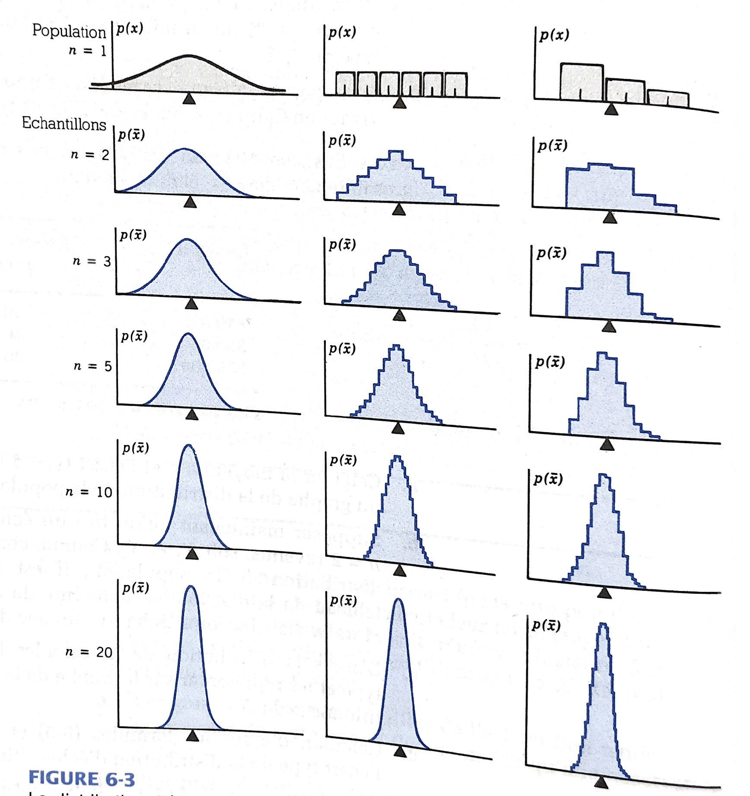
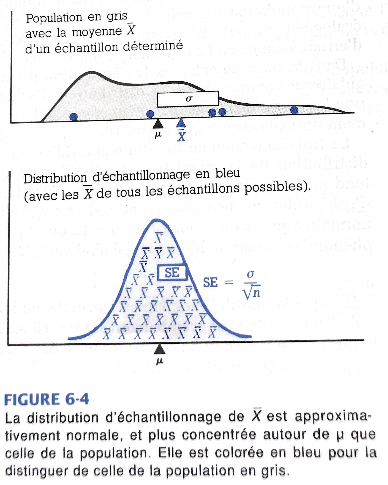

## Plan de présentation

- Calcule de la variance et de l'écart-type
- Histogramme
- Théorème central limite
- Distribution d'échantillonnage
- Intervalles de confiances
- Application


## Z-score


## Loi normale


## Loi normale (centré réduite)


```{r}

library(tidyverse)

courbe_normale <- 
  ggplot(data = data.frame(x = c(-4, 4)), aes(x)) +
  stat_function(fun = dnorm, args = list(mean = 0, sd = 1), color = "blue") 

courbe_normale
?dnorm

```

Propriété:

1. 
  - L'intervalle d'un écart-type de part et d'autre de la moyenne contient 68% de la distribution
  - L'intervalle de deux écart-types de part et d'autre de la moyenne contient 95% de la distribution 
  - L'intervalle de trois écart-types de part et d'autre de la moyenne contient 99,7% de la distribution 
  
Aussi, nous avons trouvé qu'étant donné une valeur, nous trouvons la proportion sous la courbe:

P(X < 2)
P(x < 2) - P(X < -2) donne le pourcentage de la distribution comprise entre -2 et 2.
  
```{r}
ggplot(data = data.frame(x = c(-4, 4)), aes(x)) +
  stat_function(fun = dnorm, args = list(mean = 0, sd = 1), color = "red") +
  stat_function(fun = dnorm, args = list(mean = 0, sd = 1), color = "blue",
                geom = "area", fill = "lightblue", xlim = c(-1, 1)) +
    stat_function(fun = dnorm, args = list(mean = 0, sd = 1), color = "green",
                geom = "area", fill = "green", xlim = c(-2, 2), alpha = 0.2)  

```
  
Il est préférable de partir de l'intervalle et de déterminer plus précisément le nombre d'écart-type qui délimite l'intervalle.

Ainsi, quel intervalle contient 60% de la distribution. Autrement dit, comme la courbe est symétrique, on dira que 30% de la distribution se trouve entre la moyenne et la valeur recherchée. Donc que 20% se trouve au-delà.
Autrement dit, pour trouver cet intervalle, il suffit de trouver 


```{r}

ggplot(data = data.frame(x = c(-4, 4)), aes(x)) +
  stat_function(fun = dnorm, args = list(mean = 0, sd = 1), color = "red") +
  stat_function(fun = dnorm, args = list(mean = 0, sd = 1),
                geom = "area", fill = "lightblue", xlim = c(-4, -2, alpha = 0.2)) +
    stat_function(fun = dnorm, args = list(mean = 0, sd = 1),
                geom = "area", fill = "green", xlim = c(-4, 2), alpha = 0.2)  
```


Prob(distribution < v1) = 0.2 nous donne tout simplement la valeur de 20 ième percentile de la distribution

Prob(distribution < v2) = 0.8 dit que 80% de la distribution est supérieure à cette valeur. Or, ces valeurs ont été calculées pour nous par les statisticiens. 

On peut le calculer assez facilement avec la fonction qnorm.


```{r}

v1 <- qnorm(0.2, mean = 0, sd = 1)
v1

v2 <- qnorm(0.8, mean = 0, sd = 1)
v2

```

Ainsi, on trouve que l'intervalle en question est [-0,84; 0,84].

A +- 0,84 écart-type de la moyenne, environ 60% de la distribution s'y trouve.


Théorème central limite - Règle de l'Approximation Normale
========================================================

## Dégré de fiabilité de l'échantillon

- Le but de l'échantillonnage aléatoire est d'éffectuer une inférence relative à la population sous-jacente.
- On souhaite que la moyenne de l'échantillon - $\bar{X}$ soit une estimation proche de la moyenne de la population - $\mu$.
- But: comprendre que les grands échantillons sont plus fiables que les petits échantillons
- Deux façons d'étudier le degré d'approximation de $\mu$ par $\bar{X}$.

  1. A partir de formules mathématiques
  2. A partir de la distribution d'échantillonnage

https://www.tqmp.org/Vignettes/vol16-2/v004/v004.pdf


## Moments de la moyenne de l'échantillon

- On démontre que :
- $E(\bar{X}) = \mu$ : la moyenne de l'échantillonnage $\bar{X}$ coïncidera en moyenne avec l'objectif, ie. $\bar{X}$ égalisera $\mu$
- Erreur-type d'échantillon (standard error) = $SE = \sigma_{\bar{X}} = \frac{\sigma}{\sqrt{n}}$, où $\sigma$ est l'écart-type (standard deviation) dans la population
- L'erreur-type de $\bar{X}$ diminue quand la taille de l'échantillon aléatoire augmente.
- Plus l'échantillon est grand, plus $\bar{X}$ donne une estimation exacte de la moyenne de la population.
  
- **NB**: Ne pas confondre:
- écart-type (en anglais, standard deviation) et
- erreur-type ou écart type d'échantillon (en anglais, standard error)


## Forme de la distribution d'échantillonnage

```{r distr, echo=FALSE,  out.width = '70%'}



```


## Théorème central limite (Règle de l'Approximation Normale)


Dans les échantillons aléatoires de taille n, la moyenne de l'échantillon $\bar{X}$ varie autour de la moyenne de la population $\mu$ avec une erreur-type égale à $\frac{\sigma}{\sqrt{n}}$ (ou $\sigma$ est l'écart type de la population). 
Donc, quand n s'accroît, la distribution d'échantillonnage de $\bar{X}$ est de plus en plus concentrée autour de son objectif $\mu$. Elle devient de plus en plus proche de la distribution normale (forme de cloche).


## Théorème central limite (Règle de l'Approximation Normale)

```{r distr1, echo=FALSE,  out.width = '70%'}



```

## Théorème central limite (Règle de l'Approximation Normale)

- Dire que la moyenne de l'échantillon $\bar{X}$ varie autour de la moyenne de la population $\mu$ avec une erreur type $\sigma_{\bar{X}}$ égale à $\frac{\sigma}{\sqrt{n}}$ revient à dire que la distribution $\bar{X}$ suit une loi normale de moyenne $\mu$ et d'écart type $\frac{\sigma}{\sqrt{n}}$
- $\bar{X}$ suit N($\mu$, $\frac{\sigma}{\sqrt{n}}$)
- Ou que ($\frac{(\bar{X}-\mu)}{\frac{\sigma}{\sqrt{n}}}$) suit une loi **normale dite centrée réduite** N(0,1)


## Théorème central limite (Règle de l'Approximation Normale) - Exemple

Une population d'étudiants d'un grand campus du Middle-West a une taille moyenne de $\mu$ = 69 inches et un écart type $\sigma$ = 3.22 inches. Si un échantillon aléatoire de n = 10 individus est prélevé, quelle est la probabilité pour que la moyenne de l'échantillon $\bar{X}$ s'écarte de 2 inches de la moyenne de la population?


```{r}

erreur_type <- 3.22/sqrt(10)
erreur_type
dis <- 

distribution <-
  ggplot(data = data.frame(x = c(64, 74)), aes(x)) +
  stat_function(fun = dnorm, args = list(mean = 69, sd = erreur_type), color = "blue") +
  geom_vline(aes(xintercept = 71, color = "red")) +
  geom_vline(aes(xintercept = 67, color = "green")) +
  theme(legend.position = "none")
distribution


```

## Théorème central limite (Règle de l'Approximation Normale) - Exemple

- **Réponse**:
- Selon la Règle de l'Approximation Normale, $\bar{X}$ est normalement distribuée avec:
- Espérance = $\mu$ = 69 et
- Écart type d'échantillon = $\sigma_{\bar{X}}$ = $\frac{\sigma}{\sqrt{n}}$ = $\frac{3.22}{\sqrt{10}}$ = 1.02

- On cherche à déterminer la probabilité que $\bar{X}$ s'écarte de 2 inches de $\mu$, c'est à dire qu'elle se trouve entre 67 et 71.
- Aussi, calcule-t-on, d'abord la probabilité que $\bar{X}$ soit supérieur à 71, en commençant par centrer et réduire: $$\text{Z = } \frac{\bar{X}-\mu}{\sigma_{\bar{X}}} = \frac{71 - 69}{1.02} = 1.96$$
- Cela signifie que la valeur critique de 71 pour que la moyenne de l'échantillon est environ de 2 écarts-type au dessus de son espérance 69.


## Théorème central limite (Règle de l'Approximation Normale) - Exemple

- D'après le tableau de la loi normale centrée réduite, on trouve que la probabilité que Z excède 1.96 est seulement de 0.025. C'est ce que montre la partie droite hachurée sur la figure (montrer la figure en classe).
- En raison de la symétrie de la distribution normale, l'extrémité gauche a la même probabilité 0.025.
- Ainsi, on peut déterminer la probabilité cherchée de la partie centrale : $$ Probabilité = 1.000 - 0.025 - 0.025 = 0.95$$
- On conclut donc qu'il y a 95% de chance pour que la moyenne de l'échantillon s'écarte de 2 inches de la moyenne de la population


## Théorème central limite (Règle de l'Approximation Normale) - Question

1. Quelle est la probabilité que cette moyenne s'écarte de 1 inche de la moyenne de la population? Est-ce que cette probabilité va être plus grande ou plus pétite que la première? 
2. Quelle est la probabilité que cette moyenne s'écarte de 3 inches de la moyenne de la population? Est-ce que cette probabilité va être plus grande ou plus pétite que la première?


Application
============================================================

## Introduction

Nous allons travailler avec les données `bm_results2012.txt` du marathon de Boston de 2012. Le tableau ci-dessous présente les informations contenues dans cette base de données.

Variables    Description
-----------  -----------------------
V1           Nom 
V2           Sexe
V3           Age
V4           Division
V5           Pays
V6           Temps mis


## Chargement de la base de données

```{r, out.width= '70%', out.height='70%', message=FALSE, warning=FALSE, error=FALSE}
rm(list = ls())
marathon <- read.csv("bm_results2012.txt", header = FALSE, quote = "")

```


## Distribution de la variable V6

- variable continue, on peut calculer les paramètres de tendance centrales et de dispersion

- Position

```{r}
# Moyenne
mean(marathon$V6)

# Mediane
median(marathon$V6)

# Mode

```

On voit que le marathon de Boston est couru en moyenne à 263 minutes. La moitié des coureurs sont arrivés avant 255.8 minutes alors que l'autre moitié est arrivé après. 

- Dispersion

```{r}
# variance
var(marathon$V6)

# Écart-type
sd(marathon$V6)
```

La variance égale 2502 minutes au carré alors que l'écrat-type vaut 50 minutes. On sait que la variance n'est pas de la même unité de mesure que la variable. C'est pourquoi on prend justement l'écart-type. En soit, ces mesures ne nous apportent pas beaucoup d'information. C'est en les comparant à une autre distribution qu'on peut tirer des conclusions. 

On peut mieux présenter ces résultats en utilisant tydyverse

```{r}

caract <- 
  marathon %>% 
  summarise(moyenne = mean(V6, na.rm = TRUE),
            ecarttype = sd(V6, na.rm = TRUE),
            mediane = median(V6, na.rm = TRUE),
            Q1 = quantile(V6, prob = 0.25),
            Q3 = quantile(V6, prob = 0.75),
            variance = var(V6, na.rm = TRUE))%>% 
  mutate(echantillon = factor("Echantillon S1"))

caract
```


## Représentation graphique

Il y a deux représentations qu'on fait d'une variable quantitative:
- l'histogramme
- la boite à moustache

1. Histogramme


```{r, out.width= '50%', message=FALSE, warning=FALSE, error=FALSE}

library(tidyverse)

fig1 <- 
  ggplot(marathon) +
  geom_histogram(aes(x = V6), color="black", fill="white") +
  geom_freqpoly(aes(x = V6), colour = "blue") +
  stat_function(fun = dnorm, args = list(mean = mean(marathon$V6), sd = sd(marathon$V6)), colour = "green") +
  geom_vline(aes(xintercept = mean(V6)), color = "red", linetype = "dashed") +
  labs(title = "Histogramme du Marathon de 2002",
       x = "Temps pour compléter le marathon",
       y = "Nombre de coureurs")


```


## Distribution de la variable V6

```{r, out.width= '90%', message=FALSE, warning=FALSE, error=FALSE}

fig1

```

## Boite à moustache

```{r}
class(marathon$V6)
fig2 <- 
  ggplot(marathon) +
  geom_boxplot(aes(y = V6)) +
  labs(title = "Diagramme de quartile",
       x = "",
       y = "Temps mis")

```


```{r}
fig2
```

Dans la plupart des cas, nous ne disposons pas de l'information de la population. Par exemple, pour estimer le revenu moyen de la population, nous devons disposer d'un échantillon. 

Échantillonnage aléatoire simple 
========================================================

## Échantillonnage aléatoire simple

On appelle échantillonnage aléatoire simple celui où chaque individu de la population **a la même chance d'être choisi** chaque fois que l'on tire une observation.

- Maintenant, prenons un échantillon de cette population et analysons ses caractéristiques

<div align="center">
```{r, out.width= '60%', out.height='70%', message=FALSE, warning=FALSE, error=FALSE}

set.seed(430)
marathon_S1 <- sample_n(marathon, 40, replace = FALSE)

head(marathon_S1)

``` 
</div>


## Échantillonnage aléatoire simple

```{r, out.width= '60%', out.height='70%', message=FALSE, warning=FALSE, error=FALSE}

ggplot(marathon_S1) +
  geom_histogram(aes(x = V6)) +
  labs(title = "Histogramme du Marathon de 2012",
       x = "Temps pour compléter le marathon",
       y = "Nombre de coureurs")

```


## Échantillonnage aléatoire simple

```{r, out.width= '70%', out.height='70%', message=FALSE, warning=FALSE, error=FALSE}

caract_S1 <- 
  marathon_S1 %>% 
  summarise(moyenne = mean(V6, na.rm = TRUE),
            ecarttype = sd(V6, na.rm = TRUE),
            mediane = median(V6, na.rm = TRUE),
            Q1 = quantile(V6, prob = 0.25),
            Q3 = quantile(V6, prob = 0.75),
            variance = var(V6, na.rm = TRUE))%>% 
  mutate(echantillon = factor("Echantillon S1"))

caract_S1

```


## Échantillonnage aléatoire simple - Comparaison de la moyenne d'échantillon et la moyenne de population

```{r, out.width= '70%', out.height='70%', message=FALSE, warning=FALSE, error=FALSE}

# Comparaison
caract_c <- bind_rows(caract, caract_S1)
caract_c

```


## Est-ce que cet échantillon est représentatif?

```{r, out.width= '50%', out.height='70%', message=FALSE, warning=FALSE, error=FALSE}

library(summarytools)

freq(marathon$V2)
freq(marathon_S1$V2)

```


Échantillonnage aléatoire simple - distribution d'échantillonnage
========================================================

## 100 échantillons de taille 10

```{r}

library(tidyverse)

```

- Ressource: https://stackoverflow.com/questions/42676348/multiple-random-sampling-in-r

```{r, out.width= '60%', out.height='70%', message=FALSE, warning=FALSE, error=FALSE}

set.seed(123432)
marat_T10_R100 <- bind_rows(replicate(100, marathon %>% sample_n(10, replace = FALSE), simplify = F), .id = "Obs")

glimpse(marat_T10_R100)

```


## 100 échantillons de taille 10 

```{r}

caract_marat_T10_R100 <-
  marat_T10_R100 %>% 
  group_by(Obs) %>% 
  summarise(moyenne = mean(V6, na.rm = TRUE),
            ecarttype = sd(V6, na.rm = TRUE)) %>% 
  mutate(Taille = factor("10"))

glimpse(caract_marat_T10_R100)

```


## 100 échantillons de taille 10 : Vérification du théorème central limite

```{r, out.width= '50%', out.height='70%', message=FALSE, warning=FALSE, error=FALSE}

esperance_moyenne <- mean(caract_marat_T10_R100$moyenne)
erreurtype <- sd(caract_marat_T10_R100$moyenne)

population_moyenne <- mean(marathon$V6)
erreurtype_calcule <- sd(marathon$V6)/sqrt(10)

tcl_T10 <- bind_cols(e_m = esperance_moyenne, mu = population_moyenne, et = erreurtype, etc = erreurtype_calcule) 

tcl_T10

```


## 100 échantillons de taille 10 - Représentation graphique

```{r, out.width= '40%', out.height='70%', message=FALSE, warning=FALSE, error=FALSE}

obslevel <- c(seq(1:100))

fig_T10_1 <-
  ggplot(caract_marat_T10_R100) +
  geom_point(aes(x = Obs, y = moyenne)) +
  geom_hline(aes(yintercept = mean(moyenne)), colour = "red") +
  geom_hline(data = marathon, aes(yintercept = mean(V6)), colour = "green") +
  scale_x_discrete(limits = obslevel) +
  theme(axis.text.x = element_text(angle = -60, hjust = 1, size = 6))

```


## 100 Échantillons de taille 10 - Représentation graphique

```{r, out.width= '50%', out.height='70%', message=FALSE, warning=FALSE, error=FALSE}

fig_T10_2 <- 
  ggplot(caract_marat_T10_R100) +
  geom_histogram(aes(x = moyenne)) +
  geom_vline(aes(xintercept = mean(moyenne)), colour = "red") +
  geom_vline(data = marathon, aes(xintercept = mean(V6)), color = "green")

```


## 100 Échantillons de taille 10 - Représentation graphique

```{r, out.width= '90%', out.height='70%', message=FALSE, warning=FALSE, error=FALSE}

library(ggpubr)

ggarrange(fig_T10_1, fig_T10_2, ncol = 2)

```


## 100 échantillons de taille 30


```{r, out.width= '50%', out.height='70%', message=FALSE, warning=FALSE, error=FALSE}

set.seed(1234)
marat_T30_R100 <- bind_rows(replicate(100, marathon %>% sample_n(30, replace = FALSE), simplify = F), .id = "Obs")

caract_marat_T30_R100 <-
  marat_T30_R100 %>% 
  group_by(Obs) %>% 
  summarise(moyenne = mean(V6, na.rm = TRUE),
            ecarttype = sd(V6, na.rm = TRUE)) %>% 
  mutate(Taille = factor("30"))

head(caract_marat_T30_R100)

```


## 100 échantillons de taille 30 : Vérification du théorème central limite

```{r, out.width= '60%', out.height='70%', message=FALSE, warning=FALSE, error=FALSE}

esperance_moyenne <- mean(caract_marat_T30_R100$moyenne)
erreurtype <- sd(caract_marat_T30_R100$moyenne)

population_moyenne <- mean(marathon$V6)
erreurtype_calcule <- sd(marathon$V6)/sqrt(30)

tcl_T30 <- bind_cols(e_m = esperance_moyenne, mu = population_moyenne, et = erreurtype, etc = erreurtype_calcule) 

tcl_T30

```

## 100 échantillons de taille 30

```{r, out.width= '60%', out.height='70%', message=FALSE, warning=FALSE, error=FALSE}

#obslevel <- c(seq(1:100))

fig_T30_1 <- 
  ggplot(caract_marat_T30_R100) +
  geom_point(aes(x = Obs, y = moyenne)) +
  geom_hline(aes(yintercept = mean(moyenne)), colour = "red") +
  geom_hline(data = marathon, aes(yintercept = mean(V6)), colour = "green") +
  scale_x_discrete(limits = obslevel) +
  theme(axis.text.x = element_text(angle = -60, hjust = 1, size = 6))

```


## 100 Échantillons de taille 30 - Représentation graphique

```{r, out.width= '60%', out.height='70%', message=FALSE, warning=FALSE, error=FALSE}

fig_T30_2 <- 
  ggplot(caract_marat_T30_R100) +
  geom_histogram(aes(x = moyenne)) +
  geom_vline(aes(xintercept = mean(moyenne)), colour = "red") +
  geom_vline(data = marathon, aes(xintercept = mean(V6)), color = "green")

```


## 100 Échantillons de taille 30 - Représentation graphique

```{r, out.width= '90%', out.height='70%', message=FALSE, warning=FALSE, error=FALSE}

ggarrange(fig_T30_1, fig_T30_2, ncol = 2)

```


## 100 échantillons de tailles 50

```{r, out.width= '60%', out.height='70%', message=FALSE, warning=FALSE, error=FALSE}

set.seed(12302)
marat_T50_R100 <- bind_rows(replicate(100, marathon %>% sample_n(50, replace = FALSE), simplify = F), .id = "Obs")

caract_marat_T50_R100 <-
  marat_T50_R100 %>% 
  group_by(Obs) %>% 
  summarise(moyenne = mean(V6, na.rm = TRUE),
            ecarttype = sd(V6, na.rm = TRUE))%>% 
  mutate(Taille = factor("50")) 

glimpse(caract_marat_T50_R100)

```

## 100 échantillons de taille 50 : Vérification du théorème central limite

```{r, out.width= '60%', out.height='70%', message=FALSE, warning=FALSE, error=FALSE}

esperance_moyenne <- mean(caract_marat_T50_R100$moyenne)
erreurtype <- sd(caract_marat_T50_R100$moyenne)

population_moyenne <- mean(marathon$V6)
erreurtype_calcule <- sd(marathon$V6)/sqrt(50)

tcl_T50 <- bind_cols(e_m = esperance_moyenne, mu = population_moyenne, et = erreurtype, etc = erreurtype_calcule) 

tcl_T50

```


## 100 échantillons de taille 50

```{r, out.width= '50%', out.height='70%', message=FALSE, warning=FALSE, error=FALSE}

ggplot(caract_marat_T50_R100) +
  geom_histogram(aes(x = moyenne)) +
  geom_point(aes(x = moyenne, y = Obs)) +
  geom_vline(aes(xintercept = mean(moyenne)), color = "red", size = 0.1) +
  geom_vline(data = marathon, aes(xintercept = mean(V6)), color = "green", size = 0.1)

```


## Comparaison de plusieurs distributions d'échantillonnage

```{r, out.width= '50%', out.height='70%', message=FALSE, warning=FALSE, error=FALSE}

fig_comp <- 
  ggplot() +
  geom_density(data = caract_marat_T10_R100, aes(x = moyenne), colour = "yellow", fill = "yellow") +
  geom_density(data = caract_marat_T30_R100, aes(x = moyenne), colour = "green") +
  geom_density(data = caract_marat_T50_R100, aes(x = moyenne), colour = "purple") +
  geom_density(data = marathon, aes(x = V6), colour = "red") +
  geom_vline(data = marathon, aes(xintercept = mean(V6)), color = "black")
  
```


## Comparaison de plusieurs distributions d'échantillonnage

```{r}

fig_comp 

```


## Fonction
Nous avons sélectionné plusieurs échantillons en répliquant la meême formule plusieurs fois. Essayons de voir si nous pouvons faire la meême chose en utilisant les fonctions.

```{r}

echantillon <- function(k, donnee, n){
  bind_rows(replicate(k, donnee %>% sample_n(n, replace = FALSE), simplify = F), .id = "Obs")

}

echantillon_t30_i100 <- echantillon(100, marathon, 30)

ech <- c("taille5", "taille6")
samp_k <- vector("list", length  = 2)       
names(samp_k) <- names(ech)
for (i in 5:6) {
 samp_k[[i]] <- echantillon(100, marathon, i)
  }


#samp <- matrix(NA, nrow = length(echantillon), ncol = 7)
#names(samp) <- names(marathon)
#for (i in 5:6) {
# samp[i, ] <- echantillon(100, marathon, i)
#  }

```


Intervalle de confiance
========================================================

## Intervalle de confiance

```{r, out.width= '50%', out.height='70%', message=FALSE, warning=FALSE, error=FALSE}

caract_marat_T30_R100 <-
  caract_marat_T30_R100 %>% 
  mutate(erreurtype = sd(marathon$V6)/sqrt(30),
         c1 = erreurtype*1.96)

head(caract_marat_T30_R100)

```


## Intervalle de confiance

```{r, out.width= '50%', out.height='70%', message=FALSE, warning=FALSE, error=FALSE}

ggplot(caract_marat_T30_R100, aes(x = Obs, y = moyenne, colour = Obs)) +
  geom_errorbar(aes(ymin = moyenne - c1, ymax = moyenne + c1), width=.2)+ 
  geom_point() +
  geom_hline(data = marathon, aes(yintercept = mean(V6)), colour = "black") +
  scale_x_discrete(limits = obslevel) +
  theme(axis.text.x = element_text(angle = -60, hjust = 1, size = 6), legend.position = "none")

```


## Intervalle de confiance

- Dans les faits, on ne connait rien sur la population, donc on va remplacer l'écart type de la population par l'écart type de l'échantillon

```{r, out.width= '50%', out.height='70%', message=FALSE, warning=FALSE, error=FALSE}

caract_marat_T30_R100
caract_marat_T30_R100 <-
  caract_marat_T30_R100 %>% 
  mutate(erreurtype_estime = ecarttype/sqrt(30),
         c1_estime = erreurtype_estime*1.96)

head(caract_marat_T30_R100)

```


## Intervalle de confiance*

```{r, out.width= '60%', out.height='70%', message=FALSE, warning=FALSE, error=FALSE}

ggplot(caract_marat_T30_R100, aes(x = Obs, y = moyenne, colour = Obs)) +
  geom_errorbar(aes(ymin = moyenne - c1_estime, ymax = moyenne + c1_estime), width=.2)+ 
  geom_point() +
  geom_hline(data = marathon, aes(yintercept = mean(V6)), colour = "black") +
  scale_x_discrete(limits = obslevel) +
  theme(axis.text.x = element_text(angle = -60, hjust = 1, size = 6), legend.position = "none")

```


## Quels sont les échantillons qui s'écartent de deux écart types de la moyenne

```{r, out.width= '60%', out.height='70%', message=FALSE, warning=FALSE, error=FALSE}

ggplot(caract_marat_T30_R100, aes(x = Obs, y = moyenne, colour = Obs)) +
  geom_point() +
  geom_hline(data = marathon, aes(yintercept = (mean(V6) - 1.96*sd(V6)/sqrt(30))), colour = "red") +
  geom_hline(data = marathon, aes(yintercept = (mean(V6) + 1.96*sd(V6)/sqrt(30))), colour = "red") +
  geom_hline(data = marathon, aes(yintercept = mean(V6)), colour = "black") +
  scale_x_discrete(limits = obslevel) +
  theme(axis.text.x = element_text(angle = -60, hjust = 1, size = 6), legend.position = "none")

```


## Problèmes avec l'échantillonnage aléatoire

- La base de sondage n'est pas toujours disponible (échantillonnage systématique)
- Très couteux et non éfficient
- Ne permet pas d'estimer les paramètres de petits groupes.
- Aussi dans les faits, cette technique n'est pratiquement jamais utilisée seule. 
- Elle est toujours combinée à plusieurs autres approches
- Par exemple, les données de `dhs_ipv_benin` utilisent une combinaison de plusieurs méthodes
  * Échantillonnage par grappe
  * Échantillonnage stratifié
  * Échantillonnage aléatoire
- Je vais vous présenter rapidement certains de ces techniques:
  - Échantillonnage stratifié
  - Échantillonnage par grappes


Échantillonnage stratifié
========================================================

## Régardons les distributions des femmes et des hommes dans la population des courreurs
- Pour changer la couleur de contenu des graphiques: https://rpubs.com/woobe/ggplot2_ref_part02

```{r, out.width= '60%', out.height='70%', message=FALSE, warning=FALSE, error=FALSE}

fig_s1 <-
  ggplot(marathon) +
  geom_histogram(aes(x = V6, fill = V2)) +
  scale_fill_brewer(palette="Set2")+ 
  labs(title = "Histogramme du Marathon de 2012",
       x = "Temps pour compléter le marathon",
       y = "Nombre de coureurs")

```


## Régardons les distributions des femmes et des hommes dans la population des courreurs

```{r, out.width= '60%', out.height='70%', message=FALSE, warning=FALSE, error=FALSE}

fig_S2 <-
  ggplot(marathon) +
  geom_histogram(aes(x = V6, fill = V2)) +
  scale_fill_brewer(palette="Set2")+ 
  facet_wrap(~V2) +
  geom_vline(aes(xintercept = mean(V6)), col = "red") +
  labs(title = "Histogramme du Marathon de 2012",
       x = "Temps pour compléter le marathon",
       y = "Nombre de coureurs")

```

## Régardons les distributions des femmes et des hommes dans la population des courreurs

```{r, out.width= '90%', out.height='70%', message=FALSE, warning=FALSE, error=FALSE}

ggarrange(fig_s1, fig_S2, ncol = 2)

```


## Combien avons-nous d'hommes et de femmes?

- La distribution des femmes peut eêtre différente de la distribution des hommes, dans ce cas, on va utiliser comme variable de stratification le sexe.

```{r, out.width= '50%', out.height='70%', message=FALSE, warning=FALSE, error=FALSE}

freq(marathon$V2)
#freq(marathon$V5)

```


## Échantillonnage stratifié

Vous pourriez préférer l'échantillonnage stratifié à l'échantillonnage aléatoire simple pour plusieurs raisons.

1. Permet d'augmenter le degré de confiance pour les généralisations à des sous-groupes ou des secteurs particuliers. 
- Cela garantit que vous pourrez représenter non seulement la population totale, mais également des sous-groupes clés de la population, en particulier les groupes minoritaires. 
- Si vous voulez pouvoir parler de sous-groupes, c’est peut-être le seul moyen de s’assurer efficacement de le faire.
- Si le sous-groupe est extrêmement petit, vous pouvez utiliser différentes fractions d'échantillonnage (f) dans les différentes strates pour sur-échantillonner de manière aléatoire le petit groupe.

## Échantillonnage stratifié

2. L'échantillonnage aléatoire stratifié a plus de précision statistique que l'échantillonnage aléatoire simple si les strates ou les groupes sont homogènes. 
- S'ils le sont, vous devez vous attendre à ce que la variabilité au sein des groupes soit inférieure à celle de la population dans son ensemble. L'échantillonnage stratifié profite de ce fait.


## Échantillonnage stratifié : Procédure


- La population est divisée en groupes homogènes et mutuellement exclusifs (strates), tels que des quartiers, puis les observations sont sélectionnées de manière aléatoire au sein de chaque strate.
- **NB:** Contrairement à l'échantillonnage par grappe, où les strates sont presque toujours spatiales, les strates sont généralement choisies pour être les facteurs de confusion de l'analyse démographique (âge, sexe, etc.) mais peuvent aussi être spatiales.
- L'objectif principal de l'échantillonnage stratifié est de réduire l'erreur d'échantillonnage.

