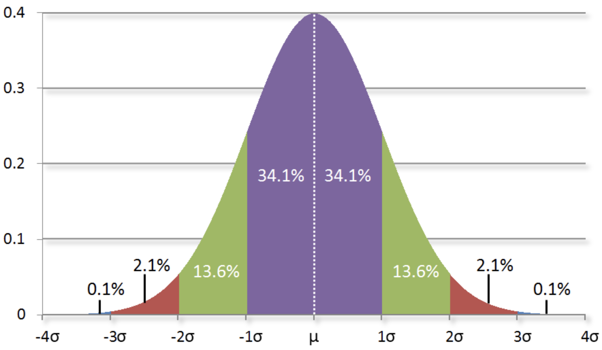
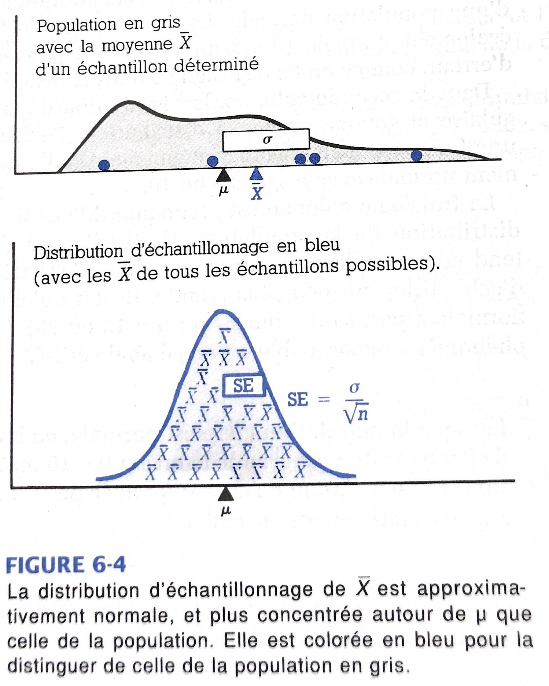

## Plan de présentation

- Mesures 
- Extension

    - Scores standardisés ou scores-Z
    - Loi normale
    - Distribution d'échantillonnage
    - Théorème central limite
    - Intervalles de confiances


## Introduction

- Bien que la moyenne soit la caractéristique la plus importante résumant une distribution à l'aide d'un seul nombre, il est nécessaire aussi d'étudier comment les observations sont dispersées, ou variées. 

>- On donne l'exemple d'homme qui s'est noyé dans un ruisseau qui avait en moyenne 10 centimètres de profondeur

>- De même qu'il existe différentes mesures de valeur centrale, on trouve de nombreuses mesures de la dispersion. 

>- deux d'entre elles sont généralement utilisées:
  >- l'**intervalle interquartile** et 
  >- l'**écart type**

>- Nous en citerons d'autres tout au long de la présentation


## Étendue

- L'**étendue** (ou *range* ou *amplitude*) est simplement la différence entre la plus grande et la plus petite valeur de la variable.

- Étendue = plus grande observation - plus petite observation

  
## Étendue Interquartile (EIQ)

- Au lieu d'utiliser les deux observations extrêmes, prenons les deux quartiles.
- les deux quartiles sont beaucoup plus stables (i.e. stables à l'influence indue d'une seule observation).
- La distance séparant les quartiles mesure la dispersion de la moitié centrale des observations: c'est pourquoi on l'appelle **étendue interquartile (EID)**, ou **dispersion centrale**.

- EIQ = 3ème quartile - 1er quartile
  
- Limite: Elle n'utilise pas l'ensemble des observations de la distribution.  

## Variance

- La **variance** est la moyenne arithmétique des carrés des écarts à la moyenne 
- Elle mesure la dispersion, l'étalement, et la variabilité des valeurs
- Pour une distribution, la variance est:

 $$Variance = s^2 = \frac{1}{n-1} \sum_{i=1}^n (X_i - \bar{X})^2$$
 
 $$s^2 = \frac{1}{n-1} *[(X_1 - \bar{X})^2 + (X_2 - \bar{X})^2 + ... + (X_n - \bar{X})^2]$$
 
 
- $X_1, X_2, ... , X_n$ sont les n valeurs observées et $\bar{X}$ = moyenne de la distribution

## Variance

- Pour les données classées, il faut modifier cette formule, en pondérant chaque écart par sa fréquence.

 $$Variance, s^2 = \frac{1}{n-1} \sum_{i=1}^p f_i(x_i - \bar{x})^2$$
 
- $x_1, x_2, ... , x_p$ étant les p occurrences observées avec $n_1, n_2, ... , n_p$, les effectifs correspondants de ces occurrences. 

- $f_1, f_2, ... , f_p$ sont les fréquences relatives et $\bar{x}$ = moyenne de la distribution groupée (classée)

## Variance

- la variance est elle aussi très sensible aux valeurs extrêmes 
- soit la série de 9 valeurs suivantes : 1, 2, 3, 4, 6, 5, 9, 7, 2.
- on trouve :
 - moyenne = 4,3 et variance = 7
- si la valeur 9 est plutôt 90, alors la moyenne = 14,1 et la variance = 816,1

## Autres exemples

Groupe A:             Groupe B       Groupe C
--------------------- -------------- ---------------------------
Relativement homogène Entre les deux Relativement hétérogènes         
--------------------- -------------- ---------------------------
64                    44             34
68                    63             58
70                    80             90
71                    91             101
69                    74             79
66                    56             46
**68**                **68**         **68**

- En gras, moyenne de chaque groupe

## Écart type

- Pour éliminer le fait d'avoir utilisé le carré des écarts, on calcule finalement la racine carrée de la variance: ceci donne la façon la plus générale de mesurer l'écart par rapport à la moyenne, appelée pour cette raison son écart type **s**

- **écart-type** = racine carrée de la **variance**

## En résumé : Mesure de tendance centrale (paramètres de position)

Symbole            Définition                           Formules
------------------ ------------------------------------ ------------------------
Moyenne            Somme des valeurs divisée par        $\bar{X} = \frac{1}{n} \sum_{i=1}^n X_i$
                   l'effectif de la série
Médiane            Valeur qui divise la distribution
                   en deux parties égales
Mode               Valeur observée de fréquence maximum                    
Percentile         Valeurs qui divisent la distribution
                   en 100 parties égales


## En résumé : Mesure de dispersion

Symbole       Définition                       Formules
------------- -------------------------------- ------------------------------
Étendue       Différence entre la plus grande  G - P
              et la plus petite valeur de la 
              variable
EIQ           3ème quartile - 1er quartile     Q3 - Q1
Déviation     La distance d'une valeur à       $X - \bar{X}$
              la moyenne
Sommes        Somme des carrés des déviations  SC = $\sum_{i=1}^n (X_i - \bar{X})^2$
des carrés
Variance      Moyenne des carrés des déviances $s^2 = \frac{1}{n-1} \sum_{i=1}^n (X_i - \bar{X})^2$
Écart-type    Racine carrée de la variance     $s = \sqrt{\frac{1}{n-1} \sum_{i=1}^n (X_i - \bar{X})^2}$     


## Scores standardisés ou scores-Z

- Un score standardisé mesure à combien d'écarts-types de la moyenne se situe un score donné
- Sa formule est :

$$Z_i = \frac{X_i - \bar{X}}{s}$$

- $Z_i$ = le score standadisé du $i^e$ cas

- $X_i$ = le score du $i^e$ cas

- $\bar{X}$ = la moyenne

- s = l'écart-type

- Ils sont particulièrement utiles lorsque l'on compare des scores provenant de distribution dont les moyennes et les écarts-types sont différentes.


## Scores standardisés ou scores-Z

- Exemple: Qui de Bill avec un revenu de 80000 au Québec et Alice avec un revenu de 110000 à Alberta a le meilleu revenu dans sa province?

- Rappelons que 
  - le revenu moyen à Alberta 103446.28 est et l'ecart-type vaut 92722.25
  - le revenu moyen au Québec 71150.87 est et l'écart-type vaut 46601.69


## Scores standardisés ou scores-Z

- Calculons les scores standardisés de Bill et de Alice


```{r}

# Québec
Score_z_bill <- (80000 - 71150.87)/46601.69
Score_z_bill

# Alberta
Score_z_alice <- (110000 - 103446.28)/92722.25
Score_z_alice


```

- On voit que Bill a un revenu qui se situe à 0.19 écart type de la moyenne des revenus au Québec alors qu'Alice ne se trouve qu'à 0.07 écart-type. Donc, le revenu de Bill est meilleur que le revenu d'Alice.

## Exercice

Voici les scores de 6 individus:

Individu   Score (Xi) 
---------- ---------------
1          64
2          68
3          70
4          71
5          69
6          66

1. Calculer les scores sstandardisés (Zi) de chaque individu
2. Calculer la moyenne des scores (Zi). Quelle conclusions tirez-vous?
3. Calculer l'écart-type des scores (Zi). Quelle conclusion tirez-vous?
4. Pouvez-vous démontrer les résultats obtenus au 2 et 3 à partir de la formule du score standardisé?


## Solution

```{r}

Score <- c(64, 68, 70, 71, 69, 66)
Score

Z_score <- (Score - mean(Score))/sd(Score)
Z_score

# Moyenne
mean(Z_score)

# Écart-type
sd(Z_score)

```

## La distribution normale

- La distribution normale est une distribution particulière, symétrique en forme de cloche
- Ce n'est pas toutes les distributions en forme de cloche qui sont normales
- Une distribution normale doit s'écrire sous la forme:

$$Y = \frac{e^{-(x - \mu)^2/2\sigma^2}}{\sigma\sqrt{2\pi}}$$
- $\mu$ est la moyenne et $\sigma$ l'écart-type

- Elle est notée $N(\mu, \sigma)$


## La distribution normale

Voici deux distributions normales

```{r, echo=F, message=FALSE, warning=FALSE}

library(tidyverse)

donnee <- data.frame(x = c(-5, 25))

courbe_normale <- 
  ggplot(data = donnee, aes(x)) +
  stat_function(fun = dnorm, args = list(mean = 5, sd = 3), color = "blue",
                xlim = c(-5, 15)) +
  stat_function(fun = dnorm, args = list(mean = 15, sd = 2), color = "green",
                xlim = c(5, 25))


courbe_normale

```


## La distribution normale: Propriété



Quelque soit la forme de la loi normale:

1. L'intervalle d'un écart-type de part et d'autre de la moyenne contient 68% de la distribution

2. L'intervalle de deux écart-types de part et d'autre de la moyenne contient 95% de la distribution 

3. L'intervalle de trois écart-types de part et d'autre de la moyenne contient 99,7% de la distribution 
  
## Ecart-type correspondant à x pourcentage de la distribution

- Il est préférable de partir de l'intervalle de déterminer plus précisément le nombre d'écart-type qui délimite l'intervalle.

>- Par exemple, quel intervalle contient 60% de la distribution?

>- Autrement dit, comme la courbe est symétrique, on dira que 30% de la distribution se trouve entre la moyenne et la valeur recherchée. Donc que 20% se trouve au-delà.

>- Prob(distribution < v1) = 0.2 nous donne tout simplement la valeur de 20 ième percentile de la distribution

>- Prob(distribution < v2) = 0.8 dit que 80% de la distribution est inférieure à cette valeur. 

>- Donc l'intervalle [V1, V2] contient 60% (80% - 20%) de la distribution


## Ecart-type correspondant à x pourcentage de la distribution

On peut le calculer assez facilement avec la fonction qnorm.

```{r}

v1 <- qnorm(0.20, mean = 5, sd = 3)
v1

v2 <- qnorm(0.80, mean = 5, sd = 3)
v2

```

>- Ainsi, on trouve que l'intervalle en question est [2,47; 7,52] pour la distribution normale N(5, 3). 

>- Cet intervalle contient 60% de la distribution

## Ecart-type correspondant à x pourcentage de la distribution


```{r}

ggplot(data = data.frame(x = c(-5, 15)), aes(x)) +
  stat_function(fun = dnorm, args = list(mean = 5, sd = 3), color = "red") +
  stat_function(fun = dnorm, args = list(mean = 5, sd = 3),
                geom = "area", fill = "red", xlim = c(v1, v2), alpha = 0.2)

```


## Loi normale (centrée réduite)

- Calculer les quantiles pour différentes distributions normales peut être fastidieux (dans le temps). 
- Alors, les statisticiens ont calculé cela pour la distribution normale centrée réduite
- Lorsque la moyenne vaut 0 et l'écart-type vaut 1, on parle de distribution normale centrée réduite
- Vous comprenez donc que si vous standardisez les scores de votre distribution normale, vous trouvez une distribution normale centrée réduite

## Loi normale (centrée réduite)


```{r}

courbe_normale <- 
  ggplot(data = data.frame(x = c(-4, 4)), aes(x)) +
  stat_function(fun = dnorm, args = list(mean = 0, sd = 1), color = "blue") 

courbe_normale
?dnorm

```


## Loi normale (centrée réduite)


```{r, echo=FALSE}
ggplot(data = data.frame(x = c(-4, 4)), aes(x)) +
  stat_function(fun = dnorm, args = list(mean = 0, sd = 1), color = "red") +
  stat_function(fun = dnorm, args = list(mean = 0, sd = 1), color = "blue",
                geom = "area", fill = "lightblue", xlim = c(-1, 1)) +
    stat_function(fun = dnorm, args = list(mean = 0, sd = 1), color = "green",
                geom = "area", fill = "green", xlim = c(-2, 2), alpha = 0.2)  

```

- On voit que 68% de la distribution est comprise entre -1 et 1 écart-type (vert foncé)
- On voit que 95% de la distribution est comprise entre -2 (-1.96) et 2 (1.96) écarts-types (vert clair) 

## Lecture du tableau de distribution

Voir livre


Distribution d'échantillonnage
=============================================

## Distribution d'échantillonnage

- Il est possible d'utiliser des distributions de données d'échantillon afin de décrire la population de laquelle fut tiré l'échantillon

- Une **distribution d'échantillonnage** (par exemple de la moyenne) est la distribution de l'ensemble des moyennes calculées sur l'ensemble des échantillons possibles de taille N qu'on peut tirer de cet échantillon


## Distribution d'échantillonnage

- Exemple simple

  - Voici les âges de 4 personnes {10, 11, 13, 14}
  - Voici les échantillons possibles de 3 personnes qu'on peut tirer de cette population:
  
>- (10, 11, 13) avec la moyenne de 11,3 ans
>- (10, 11, 14) avec la moyenne de 11,7 ans
>- (11, 13, 14) avec la moyenne de 12,7 ans

>- 11,3; 11,7 et 12,7 est appellé la distribution d'échantillonnage


## Distribution d'échantillonnage

https://www.alloprof.qc.ca/fr/eleves/bv/mathematiques/les-permutations-les-arrangements-et-les-combinai-m1346

- Exemple simple

- Voici les âges de 4 personnes {10, 11, 13, 14}
- Tirage sans remise de 3 personnes parmi 4: 4!/(4-3)!x3! = 4
- Tirage avec remise : (4+3-1)!/(4-3)!x3! = 6!/1!x3! = 120 

## Distribution d'échantillonnage - propriété

- A mesure qu'augmente la taille N de l'échantillon, la distribution d'échantillonnage de la moyenne s'apparente de plus en plus à une distribution normale, dont la moyenne est semblable à celle de la **population** et dont l'écart-type est de $\frac{\sigma}{\sqrt{N}}$

>- On nomme cela le **théorème de limite centrale**

>- L'écart-type de la distribution d'échantillonnage est appelé **erreur-type**

>- Il vaut: $\frac{\sigma}{\sqrt{N}}$

## Exemple

- Supposons que le salaire moyen issu d'un échantillon de 1000 Québécois vaut 65000$ et l'écart-type de 32000.

>- On dira que le salaire moyen des Québécois vaut 65000$. Mais, ce faisant on commet une ereur.

>- Si nous approximons aussi l'écart-type du salaire de la population par l'écart-type du salaire de l'échantillon, on peut alors dire que l'erreur-type vaut: 

>- 32000/racine_carré (1000) = 1012


Intervalle de confiance
======================================================

## Intervalle de confiance

- La meilleure estimation que nous pouvons avoir de la moyenne de la population est la moyenne de l'échantillon

>- Cependant, cette moyenne calculée à partir d'un seul échantillon peut être soit plus élevée, ou plus faible que la vraie moyenne de la population

>- Il parait donc extrêmement utile de déterminer l'intervalle, de part et d'autre de la moyenne, à l'intérieur duquel il est probable de trouver la moyenne de la population

>- L'erreur-type va nous aider à trouver cela

## Intervalle de confiance

Le théorème de la limite centrale nous permet de déterminer cette intervalle. 

>- On sait que plus N est grand, plus la distribution d'échantillonnge va suivre la distribution normale N(moyenne de l'échantillon, $\sigma/\sqrt(N)$)

>- On sait aussi que dans une distribution normale, 95% de la distribution se trouve à plus ou moins 2 écart-types de la moyenne (plus précisément à 1.96 écart-type)

>- Ainsi, l'intervalle de confiance à 95% sera déterminée par:

## Intervalle de confiance

$$ [\bar{X} - 1.96\sigma_{\bar{X}} , \bar{X} + 1.96\sigma_{\bar{X}}]$$

>- Dans l'exemple précédent, on dira que dans 95% des cas, le salaire moyen de la population Québécoise va se trouver dans l'intervalle [65000 - 1.96x1012, 65000 + 1.96x1012], soit [63016, 66983]

>- 1,96 est la valeur du score standardisé correspondant à l'intervalle de 95%


Théorème central limite - Règle de l'Approximation Normale (généralité)
============================================================================

## Dégré de fiabilité de l'échantillon

- Le but de l'échantillonnage aléatoire est d'éffectuer une inférence relative à la population sous-jacente.

- On souhaite que la moyenne de l'échantillon - $\bar{X}$ soit une estimation proche de la moyenne de la population - $\mu$.

- Deux façons d'étudier le degré d'approximation de $\mu$ par $\bar{X}$.

1. A partir de formules mathématiques
2. A partir de la distribution d'échantillonnage


## Moments de la moyenne de l'échantillon

- On démontre que :
- E($\bar{X}$) = $\mu$ : la moyenne de l'échantillonnage $\bar{X}$ coïncidera en moyenne avec l'objectif, ie. $\bar{X}$ égalisera $\mu$

- Erreur type d'échantillon (standard error) = SE = $\sigma_{\bar{X}}$ = $\frac{\sigma}{\sqrt{n}}$, où $\sigma$ est l'écart type dans la population

- L'erreur type de $\bar{X}$ diminue quand la taille de l'échantillon aléatoire augmente.

- Plus l'échantillon est grand, plus $\bar{X}$ donne une estimation exacte de la moyenne de la population.
  
- **NB**: Ne pas confondre:
- écart type (en anglais, standard deviation) et
- erreur type ou écart type d'échantillon (en anglais, standard error)


## Forme de la distribution d'échantillonnage


## Théorème central limite (Règle de l'Approximation Normale)


Dans les échantillons aléatoires de taille n, la moyenne de l'échantillon $\bar{X}$ varie autour de la moyenne de la population $\mu$ avec un écart type égal à $\frac{\sigma}{\sqrt{n}}$ (ou $\sigma$ est l'écart type de la population). 
Donc, quand n s'accroît, la distribution d'échantillonnage de $\bar{X}$ est de plus en plus concentrée autour de son objectif $\mu$. Elle devient de plus en plus proche de la distribution normale (forme de cloche).


## Théorème central limite (Règle de l'Approximation Normale)




## Théorème de la limite centrale (Règle de l'Approximation Normale)

- Dire que la moyenne de l'échantillon $\bar{X}$ varie autour de la moyenne de la population $\mu$ avec une erreur type $\sigma_{\bar{X}}$ égale à $\frac{\sigma}{\sqrt{n}}$ revient à dire que la distribution $\bar{X}$ suit une loi normale de moyenne $\mu$ et d'écart type $\frac{\sigma}{\sqrt{n}}$

- $\bar{X}$ suit $N(\mu, \frac{\sigma}{\sqrt{n}})$

- Ou que ($\frac{(\bar{X}-\mu)}{\frac{\sigma}{\sqrt{n}}}$) suit une loi **normale dite centrée réduite** N(0,1)


## Théorème de la limite centrale (Règle de l'Approximation Normale) - Exemple

Une population d'étudiants d'un grand campus du Middle-West a une taille moyenne de $\mu$ = 175.26 cm (69 inches) et un écart type $\sigma$ = 8.18cm (3.22 inches). Si un échantillon aléatoire de n = 10 individus est prélevé, quelle est la probabilité pour que la moyenne de l'échantillon $\bar{X}$ s'écarte de 5.08 cm (2 inches) de la moyenne de la population?


```{r, echo=FALSE}

erreur_type <- 3.22/sqrt(10)
erreur_type
 

distribution <-
  ggplot(data = data.frame(x = c(64, 74)), aes(x)) +
  stat_function(fun = dnorm, args = list(mean = 69, sd = erreur_type), color = "blue") +
  geom_vline(aes(xintercept = 71, color = "red")) +
  geom_vline(aes(xintercept = 67, color = "green")) +
  theme(legend.position = "none")
distribution


```

## Théorème central limite (Règle de l'Approximation Normale) - Exemple

- **Réponse**:
- Selon la Règle de l'Approximation Normale, $\bar{X}$ est normalement distribuée avec:
- Espérance = $\mu$ = 69 et
- Écart type d'échantillon = $\sigma_{\bar{X}} = \frac{\sigma}{\sqrt{n}} = \frac{3.22}{\sqrt{10}}$ = 1.02

- On cherche à déterminer la probabilité que $\bar{X}$ s'écarte de 2 inches de $\mu$, c'est à dire qu'elle se trouve entre 67 et 71.
- Aussi, calcule-t-on, d'abord la probabilité que $\bar{X}$ soit supérieur à 71, en commençant par centrer et réduire: 

$$\text{Z = } \frac{\bar{X}-\mu}{\sigma_{\bar{X}}} = \frac{71 - 69}{1.02} = 1.96$$

- Cela signifie que la valeur critique de 71 pour que la moyenne de l'échantillon est environ de 2 écarts-type au dessus de son espérance 69.


## Théorème central limite (Règle de l'Approximation Normale) - Exemple

- D'après le tableau de la loi normale centrée réduite, on trouve que la probabilité que Z excède 1.96 est seulement de 0.025. C'est ce que montre la partie droite hachurée sur la figure (montrer la figure en classe).
- En raison de la symétrie de la distribution normale, l'extrémité gauche a la même probabilité 0.025.
- Ainsi, on peut déterminer la probabilité cherchée de la partie centrale : 
$Probabilité = 1.000 - 0.025 - 0.025 = 0.95$
- On conclut donc qu'il y a 95% de chance pour que la moyenne de l'échantillon s'écarte de 2 inches de la moyenne de la population


## Théorème central limite (Règle de l'Approximation Normale) - Question

1. Quelle est la probabilité que cette moyenne s'écarte de 1 inche de la moyenne de la population? Est-ce que cette probabilité va être plus grande ou plus pétite que la première? 
2. Quelle est la probabilité que cette moyenne s'écarte de 3 inches de la moyenne de la population? Est-ce que cette probabilité va être plus grande ou plus pétite que la première?


