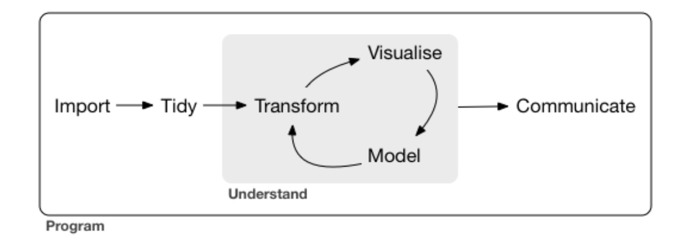

## Plan

1. Comprendre les deux environnements
2. Processus d'analyse des données
3. Base de données
4. Fréquences, pourcentages
5. Mesures des paramètres de tendance centrale
6. Mesure des paramètres de dispersion/variation
7. Visualisation


1. Comprendre les deux environnements
=================================


## 1.1. IDE versus GUI

- IDE (integrated development environment), en français, **environnement de développement intégré** est essentiellement un éditeur de langage de programmation.
    - Exemple: RStudio

- Avantages 
    - Replicabilité
    
- Inconvénients
    - Écrire les codes
    


## 1.2. RStudio

RStudio offre aux utilisateurs :

1. Un éditeur de texte pour écrire des programmes
  
  - Console  --> Calcul interactif, vérification rapide de commandes
  - Script --> Écrire de programme à éxécuter
  - RMarkDown --> Écriture de programme + Texte, moyen de replicabilité
2. Un visualiseur de graphiques qui affiche les graphiques que nous créons, 
3. La console R où les programmes sont exécutés, 
4. Une aide section, et 
5. De nombreuses autres fonctionnalités. 


La figure 1.1 montre une capture d'écran de RStudio.


   

## 1.3.Présentation de BlueSky Statistics (BSS)


Les principaux menus et leur utilisation

1. **Menu d'ouverture de base de données**
2. "Datasets": Traitement sur les bases de données
3. "Variables": traitement sur les variables
    - Créer et recoder des variables 
    - Traiter les données manquantes ...
4. "Analysis": 
    - *Summary* pour les fréquences, les paramètres de tendance centrale et de dispersion
    - Statistiques bivariées
5. "Graphics": pour faire les visualisations
6. "Model Fitting" pour les analyses de régression


2. Processus d'analyse des données
=================================


- Comme dit plus haut, Tidyverse va nous servir à faire tout ce travail.
- Comme toujours, imitez au maximum ce que je fais



## 2.1. Processus d'analyse des données

- Résumons ce processus:
  1. Où sont les données? Vous devez les importer (**read**) pour les analyser. La manière dont vous allez les importer dépend du type de fichier.
  2. Est-ce que vous avez besoin de l'ensemble des variables du fichier de données? pas nécessairement. Vous devez sélectionner (**select**) celles qui vous intéresse
  3. Est-ce que vous travaillez sur l'ensemble de l'échantillon ou uniquement sur les femmes? Vous devez les filtrer (**filter**)
  4. Devez-vous utiliser les groupes d'âges ou les âges réels? Vous devez créer de nouvelles variables (**mutate**)
  5. Que faites-vous des individus qui n'ont pas répondu à certaines questions? leur attribuer une valeur (**impute**) ou les enlever (**na.rm pour remove na**)
  6. Que savons-nous sur les variables? Vous devez produire des statistiques descriptives (**summarize**)

- Les gras dans le diapositif précédent indique le langage que le logiciel comprend pour faire les étapes décrites plus haut
- Il comprend que l'Anglais. Chaque fois que vous voulez faire quelque chose, chercher le mot en anglais
- Il respecte une certaine manière de **parler**. Il va utiliser des symbole pour se simplifier la vie comme celui-ci par exemple **%>%**


## 2.2. Processus d'analyse des données

Chaque élément est associé à un `package` donné.

1. Importer                                         (**readr**)
2. Préparation des données (data wrangling)
    - Arranger                                        (**tidyr**) 
    - Transformer                                     (**dplyr**)
3. Analyse des donnés
    - Visualisation                                   (**ggplot2**)
    - Modélisation
4. Communication                                    (**rmarkdown**: ceci n'est pas un package de tidyverse)


PS. Intéressant sur data wrangling
https://www.lemagit.fr/conseil/Quest-ce-que-le-Data-Wrangling

- Les autres packages de tidyverse
    - **sringr** : pour travailler avec les données caractères
    - **forcat** : pour travailler avec les facteurs : http://perso.ens-lyon.fr/lise.vaudor/manipulation-de-facteurs-avec-forcats/
    - **purrr** : pour travailler avec les fonctions
    - **tibble** : transformer les données en tribble.
  
La documentation est éparse sur chacun de ces packages.


3. Ouverture de la base des données
=================================


## 3.1. Introduction

Utiliser les données de l'enquête canadienne sur le revenu de 2015 pour répondre aux questions suivantes (https://search1.odesi.ca/#/). On se limitera à une base de données réduites de cette base. La base de données se nomme cis_short_5percent.csv est un échantillon de 5% pris dans la base de données originale. 

Les variables retenues dans cette base sont:

- PERSONID: Person identifier (identifiant)
- AGEGP: Person's age group as of December 31 of reference year (groupe d'âge)
- SEX: Sex (Sexe du répondant)
- MARST: Marital status (Statut matrimonial)
- PROV: Province
- CFATINC: CF - After-tax income (Revenu familial après taxe)

Ce sont les variables originales de la base de données. A partir de ces variables, j'en ai créé 5 autres qui sont:
- Province (créé à partir de PROV)
- region (créé à partir de PROV)
- sexe (créé à partir SEX)
- statut_mat (créé à partir de MARST)
- niveau_educ 

Pour comprendre les variables de cette base de données, vous pouvez consulter le fichier pdf **CIS-72M0003-E-2015_F1.pdf**. C'est ce qu'on appelle le dictionnaire de la base de données ou un Codebook. Il décrit l'ensemble des variables et présente les fréquences.

## 3.2. Question centrale de recherche

- Est-ce qu'il existe une inégalité de revenu entre les provinces du Canada?
- Est-ce qu'il existe une inegalité de revenu entre les hommes et les femmes au Canada?
- Quel est l'ampleur du niveau d'inégalité de revenu selon l'éducation?


## 3.3. Ouvrir la base de donnée

- **Avec BlueSky**


Vous devez laisser ces options comme tel.

- **Avec RSudio**

```{r}


rm(list = ls())


library(tidyverse)
library(summarytools)

cis_2015 <- read_csv("cis_short_5percent_2015.csv")


```


4. Fréquences, pourcentages
=================================


On va travailler avec les trois niveaux de mesures des variables.

- Nominale : Sexe (sexe)
- Ordinateur : Niveau d'éducation (niveau_educ)
- Intervalle/Ratio: Revenu (CFATINC)


## 4.1. Tableau de fréquences

- Avec BlueSky 

ANALYSIS --> Summary --> Frequencies


- **Avec RStudio**

```{r}

freq(cis_2015$sexe)

```


```{r}

freq(cis_2015$niveau_educ)

```


```{r}

#freq(cis_2015$CFATINC)

```


5. Mesures des paramètres de tendance centrale
=================================


## 5.1. Moyenne

-**Avec BlueSky**

ANALYSIS --> Summary --> Describe

  - Variable nominale ou ordinale


    - Variables intervalle ou ratio


- **Avec RStudio**

Deux manières de faire:

1. Pas la bonne manière

```{r}

mean(cis_2015$sexe)

```

```{r}

mean(cis_2015$SEX)

```


2. Une manière plus intéressante:

```{r}

moyenne <- 
  cis_2015 %>% 
  summarise(moyenne = mean(CFATINC, na.rm = TRUE))

```


```{r}

mean_income_province <-
  cis_2015 %>% 
  group_by(Province) %>% 
  summarise(mean(CFATINC))

mean_income_province

```

On peut aussi calculer de cette manière les autres paramètres de tendance centrale comme la médiane ...

## 5.2. Revenu médian par province

```{r}

md_income_province <-
  cis_2015 %>% 
  group_by(Province) %>% 
  summarise(median(CFATINC))

md_income_province

```


- A vous: calculer la médiane


6. Mesure des paramètres de dispersion/variation
=================================


## 6.1. Variance

- Avec BlueSky


- Avec RStudio


```{r}

variance <- 
  cis_2015 %>% 
  summarise(variance = var(CFATINC, na.rm = TRUE))

```


```{r}

variation_income <-
  cis_2015 %>% 
  group_by(Province) %>% 
  summarise(var(CFATINC, na.rm = TRUE))

variation_income

```

On voit que de manière générale, la variance des revenus est aussi très grands à Alberta. On voit que les niveaux de la variance sont très grands et ne sont pas de la même unité que le revenu. C'est pourquoi, on va lui préférer l'écart-type.

```{r}

ecart_income <-
  cis_2015 %>% 
  group_by(Province) %>% 
  summarise(sd(CFATINC, na.rm = TRUE))

ecart_income
```

Vous pouvez alors aisément calculer les autres paramètres de variation.

On ne peut pas comparer directement les revenus des gens de Québec avec Ontario, il faut pour cela standardisés les revenus avant de les comparer. Mais, avant de faire cela, visualisons la distribution du revenu. La visualisation est un bon moyen de se faire une première idée de la nature des données. 


7. Visualisation
=================================


## 7.1. Variables nominales et ordinales

### 7.1.1. Diagramme de barre

```{r}

ggplot(cis_2015) +
  geom_bar(aes(x = region)) 

```

## 7.2. Variable de ratio et d'intervalle

### 7.2.1. Histogramme


```{r}

ggplot(cis_2015) +
  geom_histogram(aes(x = CFATINC), binwidth = 5000, color = "gray") 


```


Mais, on peut présenter la distribution pour chaque province. Comment pensez-vous qu'on puisse le faire?


### 7.2.2. Boxplot

https://statistique-et-logiciel-r.com/comment-detecter-les-outliers-avec-r/


```{r}

ggplot(cis_2015) +
  geom_boxplot(aes(y = CFATINC))

```

Ce graphique permet de visualiser les données abberantes ou les outliers. Un **outlier**, ou **donnée aberrante** est “une valeur ou une observation qui est « distante » des autres observations effectuées sur le même phénomène, c’est-à-dire qu’elle contraste grandement avec les valeurs « normalement » mesurées. Une donnée aberrante peut être due à la variabilité inhérente au phénomène observé ou bien elle peut aussi indiquer une erreur expérimentale. Les dernières sont parfois exclues de la série de données”. Mais avant cela, voyons comment se présentent les distributions selon les régions du Canada.

```{r}

ggplot(cis_2015) +
  geom_boxplot(aes(y = CFATINC)) +
  facet_grid(~ region)


```


8 Exercices - Extension
=================================

## Base de données

1. Sélectionner les données de Québec 
2. Sélectionner les données de Ontario
3. Fusionner à nouveau ces deux données pour créer la base quebec_ontario.csv
4. Calculer le revenu moyen par province et mettre le dans la base revenu_moyen_ensemble 

    Datasets ==> Aggregate


## Tableau de fréquence

1. calculer pour chaque province la fréquence des variables 
  - sexe
  - état matrimonial
  - niveau d'éducation
  - revenu (CFATINC)
  
2. Montrer un peu la syntaxe des résultats  

## Graphiques

1. Montrer les graphiques qu'on peut créer avec ces 4 variables

- diagramme de barre
- diagramme circulaire
- carte (revenu moyen)
  - https://www.mapchart.net/

## Paramètres de tendance centrale

1. Calculer pour les variables suivantes si c'est possible les paramètres de tendance centrale (moyenne, mode, médiane, premier quartile, troisimène quartile, les déciles) 
  - sexe
  - état matrimonial
  - niveau d'éducation
  - revenu (CFATINC)

2. Faites les mêmes choses pour chaque province (Québec et Ontario)

3. Calculer l'indice de Palma pour le Québec et l'Ontario

## Graphiques

4. Représenter graphiquement le diagramme de quartile pour la variable revenu selon la province.

5. Interpréter les résultats


Ce que je n'ai pas montré
=======================================


## Créer une variable 


- Avec BlueSky


- Avec RStudio


```{r}

cis_2015 <-
  cis_2015 %>% 
  mutate(Sexe = case_when(
    SEX == 1 ~ "Homme",
    SEX == 2 ~ "Femme"
  ))


```

