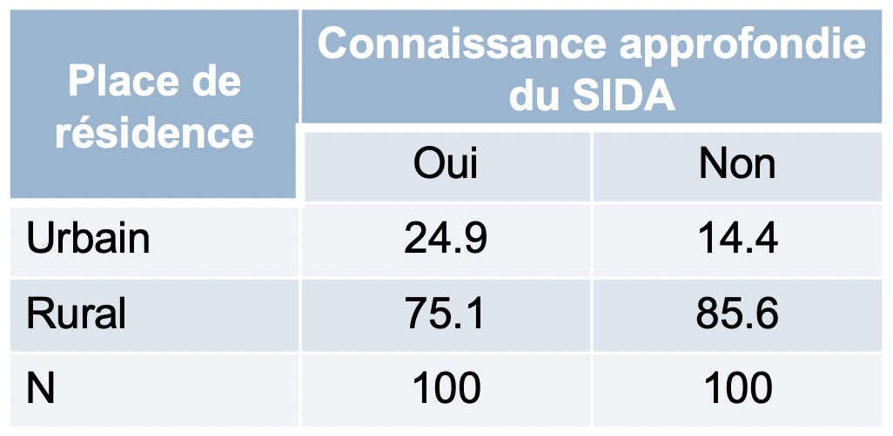
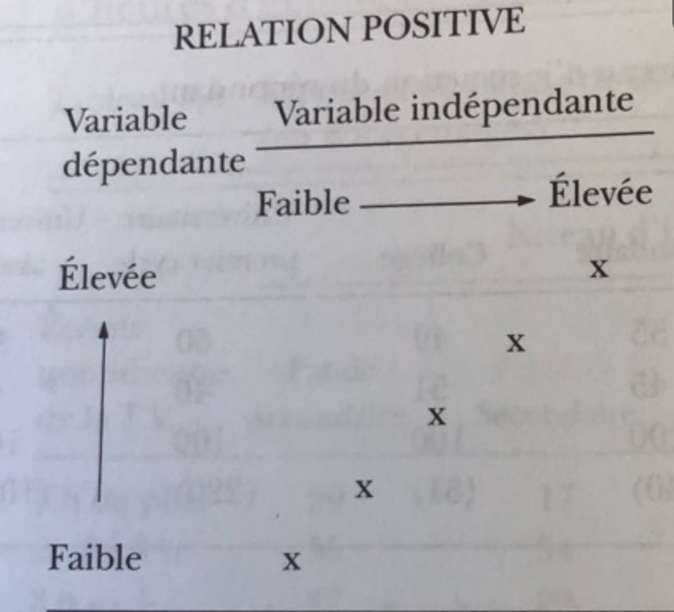

## Au programme aujourd'hui  

1. Association entre deux variables catégorielles : 

  - Tableaux croisés

  - Visualisation de la relation entre deux variables catégorielles
  
2. Direction de la relation
  
3. Intensité de la relation

4. Calcul du chi-carré

5. Logique du test statistique

6. Labo

7. A faire pour la semaine prochaine


Statistiques bivariées
========================================================

## Introduction

- Le cours précédent nous a permis de décrire les caractéristiques d'un échantillon en analysant ses paramètres de position et de dispersion. 

- Mais, en tant que sociologues, nous allons loin que cela. Ce qui nous intéresse, ce sont les relations causales dans lesquelles nous faisons l’hypothèse qu'une variable indépendante a un effet sur une autre variable dite dépendante.

## Introduction 

- Par exemple: 

- Dans le domaine de la santé

    - Est-ce que le vaccin A protège contre la maladie X?
    - Les soins de santé universels amélioreraient-ils la santé et les finances des pauvres?
 
- Dans le domaine éducatif

    - Les classes de petite taille augmentent-elles les résultats des tests standardisés des élèves?
    - L'éducation réduit-elle le nombre d'enfants que les femmes ont ?

## Introduction 

- Par exemple: 

- Dans le domaine économique

    - La rémunération des gens sur Wikipedia augmentera-elle leur productivité?
    - Est-ce que l'augmentation du salaire minimum réduit l'activité économique?

- Dans le domaine sociologique

    - Est-ce le statut marital influe sur le bonheur?
    

## Introduction 
    
 - La réponse à ces questions va au-delà des logiciels statistiques. 
 - Elle commence et finit avec vous.
 - Les logiciels/statistiques ne nous donnent qu'une indication.

## Conditions de la causalité

- L'une des conditions de la causalité est l'existence d'association entre la variable indépendante et la variable dépendante.

- L'analyse de cette association dépend du type des variables indépendantes et dépendantes


## Association entre deux variables

>  1. Deux variables factorielles ou catégorielles (nominale ou ordinale) : Recours aux tableaux bivariés

>  2. Variable dépendante continue (ratio ou d'intervalle) et variable indépendante factorielle : Différences de moyennes ou Analyse de la variance (ANOVA)

>  3. Deux variables continues : Technique de régression
    
> - Les graphiques permettent aussi de mettre en exergue ces relations. 


## Association entre deux variables


## Répondre à 6 questions

 1. Y a-t-il une relation entre les deux variables ?

 2. Quelle est l'intensité de cette relation

 3. Quelles sont la direction et la forme de cette relation?

> 4. Pouvons-nous généraliser la relation à la population de laquelle est tiré l'échantillon?

> 5. La relation est-elle vraiment causale?

> 6. Quelles sont les variables intermédiaires qui relient les variables indépendantes et dépendante?

> - Aujourd'hui, nous allons nous intéresser aux trois premières questions.


1. Mesure de l'association entre deux variables catégorielles
================================================================


## Tableaux bivariés 

> - Évaluer la relation entre les variables dépendantes et les variables indépendantes (ou entre deux variables)

> - Donne une première indication de l'effet d'une variable indépendante sur la variable dépendante

> - Les lignes et les colonnes n'ont pas la même signification

> - Les variables dépendantes sont mises dans la colonne

> - Les variables indépendantes sont mises en ligne

> - Remarque: Dans votre livre de cours, les colonnes et les lignes sont renversées. Ce n'est pas grave du moment où on sait lire les tableaux

> - L'interprétation fait référence à l'utilisation de fréquences marginales


## Tableau croisé, fréquences marginales, pourcentage marginal, pourcentage ligne, pourcentage colonne 


<!--
```{r tc1, echo=FALSE,  out.width = '100%'}
knitr::include_graphics("/Users/visseho/OneDrive - UQAM/Cours/Images_cours/tableau_croise1.jpg")
```
-->

## Fréquences marginales ou pourcentages marginaux

- Les fréquences marginales ne sont pas appropriées pour les comparaisons

 - D'où l'importance des pourcentages marginaux

## Exemple: lutter contre le VIH Sida


Référence: https://journalmetro.com/wp-content/uploads/2014/11/monde-graph_sida.jpg


## Exemple

- Existe-il une relation entre le lieu de résidence et la connaissance sur le VIH/Sida?


<!--

```{r tc2, echo=FALSE,  out.width = '100%'}
knitr::include_graphics("/Users/visseho/OneDrive - UQAM/Cours/Images_cours/tableau_croise2.jpg")
```
-->


## Exemple

- **Bon tableau**


## ... Bonne interprétation

- **Bonne interprétation**: La conclusion selon laquelle le lieu de résidence a un effet sur la connaissance du SIDA doit reposer sur une comparaison entre zones urbaines et rurales. Plus précisément, nous comparons les 54,6% avec les 37,9%. On note que les femmes en zones urbaines sont plus susceptibles que les femmes en zones rurales d’avoir une connaissance approfondie du sida. 

- La comparaison des **sous-groupes** est donc essentielle pour la lecture d'un tableau explicatif à deux variables.


## Règle générale

- La règle générale - et extrêmement importante - lorsque l'on interprète un tableau est donc de **COMPARER LES POURCENTAGES ENTRE LES CATÉGORIES DE LA VARIABLE INDÉPENDANTE**

- Vous devez mémoriser cela.


## Exemple

- **Bon tableau, mais ...**


- **... Mauvaise interprétation**: «Parmi les femmes vivant en zone rurale, seules 37,9% ont une connaissance approfondie du sida et 72,1% non; par conséquent, vivre dans des zones rurales vous rend moins susceptible d'avoir une connaissance complète du SIDA.


## Exemple
- Mauvais tableau de pourcentage




Représentation graphique
=======================================================

## Diagramme de barres empilées


## Code pour le faire avec RStudio

ggplot(base de donnée) +

 geom_bar(aes(x = var1, position = var2))


2. Direction de la relation
========================================================

## Direction de la relation

Il existe au moins trois type de relation entre les variables :

> Relation positive

> Relation négative

> Relation curvilinéaire


## Relation positive



<!--
```{r positive, echo=FALSE,  out.height = '50%', fig.align='center'}
knitr::include_graphics("/Users/visseho/OneDrive - UQAM/Cours/Images_cours/positive.jpg")
```
-->

## Relation positive

1. Relation positive : est une relation dans laquelle les scores les plus élevés d'une variable sont associées aux scores les plus élevés de l'autre variable

  - Exemple?


## Relation négative


<!--
```{r negative, echo=FALSE,  out.height = '60%', fig.align='center'}
knitr::include_graphics("/Users/visseho/OneDrive - UQAM/Cours/Images_cours/negative.jpg")
```
-->

## Relation négative

2. Dans une **relation négative** les scores les plus élevés d'une variable sont liés aux scores les plus faibles de l'autre.

  - Exemple?

  
## Relation curviliéaire


<!--
```{r curvilineaire, echo=FALSE,  out.width = '60%', fig.align='center'}
knitr::include_graphics("/Users/visseho/OneDrive - UQAM/Cours/Images_cours/curvilineaire.png")
```
-->

## Relation curviliéaire

3. Une **relation curvilinéaire** peut prendre différentes formes, mais les plus simples sont les relations dans lesquelles les cas avec des valeurs fortes et faibles pour la variable indépendante ont des valeurs inverse pour la variable dépendante.

  - A souvent la forme d'un **V** ou d'un **V renversé**
  - Exemple?
  
## Problèmes avec les tableaux bivariés

- Si vous avez des effectifs faibles dans les tableaux, essayer de regrouper les modalités
- Effectif faible (moins de 30 par exemple)
- Les deux variables ne sont pas forcement catégorielles. Que faire dans ce cas?
    - Les regrouper en catégories 
    - Problème : perte d'information 


## Comment présenter les tableaux bivariés

1. Numérotes-les tableaux
2. Choisissez un titre clair et directe
  -  VI selon VD
  - Exemple: Connaissance du VIH/Sida selon le lieu de résidence
3. Ajouter une colonne "Total" qui indique la somme des pourcentages à l'intérieur de chacune des rangées (lignes)   
4. Ajouter une colonne (N) indiquant les nombres de cas sur lesquels sont basés les pourcentages
5. Pour les pourcentages, ne conservez que la première décimale
6. Conservez le même nombre de décimales pour tous les pourcentages du tableau
7. N'inscrivez pas dans le tableau, les fréquences des cellules individuelles, les pourcentages suffisent

## Comment présenter les tableaux bivariés

8. Disposez les colonnes de pourcentages à égale distance les unes des autres et justifiez `a gauche les pourcentages
9. N'inscrivez pas les signe % après chaque cellule
10. Ne tracez pas de lignes verticales dans un tableau. 
  - Tracer simplement une double ligne horizontale entre le titre du tableau et les titres des colonnes
  - Une ligne horizontale sous les titres des colonnes
  - Une ligne horizontale au bas du tableau
11. Soyez très soigneux dans la présentation des résultats

**Remarques**: Vous devez respecter ces consignes dans vos devoirs au risque de perdre des points


3. Intensité de la relation
==================================================================

## Intensité de la relation

- Une relation peut-être nulle


## Intensité de la relation

- Une relation peut-être modérée


## Intensité de la relation

- Une relation peut-être forte


## Intensité de la relation

- Nous sommes arrivés à ces différentes conclusions en regardant l'écart entre les pourcentages.
- Mais, que faire si les variables dépendante et indépendantes ont plusieurs modalités?
- On va apprendre des statistiques pour mesurer cette intensité dans le prochain cours

## Mot de fin sur l'association et la causalité

- Exemples de relations associatives et non causales

  - le nombre de cigognes dans certaines régions d'Europe est associé au taux de natalité de ces régions
  
  - Les crues du Gange en Inde sont associées au taux de criminalisation de la ville de New York
  
  - le nombre d'accident de la route est associé aux fêtes


Chi-carré ou chi-deux
===============================

## Introduction

- Nous sommes arrivés à aux différentes conclusions sur l'intensité en regardant l’écart entre les pourcentages.
- Mais, que faire si les variables dépendante et indépendantes ont plusieurs modalités?
- Il serait bien pratique d'avoir un nombre unique qui donnerait une évaluation complète de l'intensité de la relation.
- Il permettrait ainsi de comparer plusieurs études dans des pays différents par exemple.
- Il existe plusieurs mesures d'intensité

## Chi-carré

- Le chi-carré, $\chi^2$, est un nombre qui compare les fréquences observées dans un tableau bivarié aux fréquences auxquelles on devrait s'attendre (les fréquences anticipées) s'il n'y avait pas du tout de relation entre les deux variables dans la population.

## Chi-carré

Voici un tableau observé entre le sexe et le fait de fumer la cigarette

Est-ce que tu fumes?  Oui      Non        Total
--------------------  -------  ---------  -----------
Homme                 570      450        1020
Femme                 215      600        815
Total                 785      1050       1835

- Comment devrait être ce tableau pour ne pas avoir de relation?
- On va utiliser les informations à la marge pour trouver les éléments de ce tableau théorique.

## Chi-carré

- Autrement dit, nous voulons les valeurs de A, B, C, D pour qu'il n'existe pas de relation entre le sexe et le fait de fumer


Est-ce que tu fumes?  Oui      Non        Total  
--------------------  -------  ---------  ------
Homme                 A        B          1020
Femme                 C        D          815
Total                 785      1050       1835
Pourcentage           42.8     57.2       100

- Vous voulez devinez?
- Voici un code simple qui vous donne en temps réel le résultat de votre proposition
- https://docs.google.com/spreadsheets/d/19nNUrw7hBCa4rgBwRh9bMBECO74gqOJzvSWmVx_sIXg/edit?usp=sharing


## Chi-carré

- Il existe une formule simple pour trouver ces valeurs

$$f_a = (\frac{\text{Total de la colonne}}{N})*(\text{Total de la rangée})$$

- fréquence anticipée d'une cellule: $f_a$ ;

## Chi-carré

- On peut ainsi facilement calculer la distance entre ces deux tableaux
- Il s'agit du chi-carré dont la formule est:

$$\chi^2 = \sum\frac{(f_o - f_a)^2}{f_a}$$


- Fréquence observée d'une cellule: $f_o$ et 
- N est le nombre total de cas
- $\sum$ veut dire faire la somme de chaque calcul

## Chi-carré

>- Le Chi-deux n'est qu'une mesure de la distance entre deux tableaux, un tableau observé tiré de l'échantillon, et un tableau théorique

>- Plus cette distance va être grande, plus nous pouvons affirmer qu'il y a de fortes chances que dans la population d'où est tirée cet échantillon, il existe une relation non nulle entre les deux variables

>- Plus cette distance est faible, plus, on ne peut affirmer qu'il existe une relation entre les deux variables au sein de la population

## Réponse à notre exemple

- Tableau observé

Est-ce que tu fumes?  Oui      Non        Total
--------------------  -------  ---------  -----------
Homme                 570      450        1020
Femme                 215      600        815
Total                 785      1050       1835

- Il faut d'abord trouver les valeurs anticipées fa (qui sont les ABCD)
- Comme vous aimer maintenant R, on va utiliser un chunck pour le faire

## Réponse à notre exemple

- Comme vous aimer maintenant R, on va utiliser un chunck pour le faire

```{r}

A <- 785*1020/1835
B <- 1050*1020/1835
C <- 785*815/1835
D <- 1050*815/1835

c(A, B, C, D)

```

## Tableau anticipé

                      

Est-ce que tu fumes?  Oui                  Non          Total
--------------------  -------------------  --------- -----------
Homme                 436.35               583.65    1020
Femme                 348.65               466.35    815
Total                 785                  1050      1835


- Remettez ces valeurs dans le fichier google sheet pour voir si cela fonctionne


## Maintenant calculons le chi-carré

- Tableau anticipé: Pas d'association entre les deux variables

 Est-ce que tu fumes? Oui      Non          Total
--------------------  -------  -----------  -----------
Homme                 436.35   583.65       1020
Femme                 348.65   466.35       815
Total                 785      1050         1835


- Tableau réellement observé : votre échantillon

Est-ce que tu fumes?  Oui      Non        Total
--------------------  -------  ---------  -----------
Homme                 570      450        1020
Femme                 215      600        815
Total                 785      1050       1835


## Maintenant calculons le chi-carré

La formule du chi-carré

$$\chi^2 = \sum\frac{(f_o - f_a)^2}{f_a}$$


```{r, tidy=TRUE}

Ao <- 570
Bo <- 450
Co <- 215
Do <- 600

chi_carre <- (Ao - A)^2/A + (Bo - B)^2/B + (Co - C)^2/C + (Do - D)^2/D  
chi_carre

```

## Maintenant calculons le chi-carré

- Ainsi la valeur du chi-carré vaut 161.09, qui est une très grande valeur. N'est-ce pas?

- Qui sais pourquoi je n'ai pas utilisé directement les chiffres dans ma formule?
- Refaites les mêmes calculs avec les autres exemples cités en haut.
- Que concluons-nous alors sur la relation au sein de la population d'où est tiré l'échantillon?


## Exemple en classe


Degré de liberté
==========================================


## Degré de liberté

- Supposons que je vous demande de trouver 3 chiffres dont la moyenne vaut 11.

>- Quelles sont les réponses possibles?
>- On peut avoir (11, 11, 11), (11, 12, 10), ...
>- Vous vous rendez compte qu'il y a une infinité de solution

## Degré de liberté

- Maintenant, supposez que je vous dise qu'un de ces chiffres vaut 10.

>- Quelles sont les réponses possibles?
>- On peut avoir (10, 11, 12), (10, 13, 10), ...
>- Vous vous rendez compte à nouveau que vous avez une infinité de solutions.

## Degré de liberté

- Finalement, supposez que je vous donne deux chiffres, soit (9 et 12)

>- Quelles sont les réponses possibles?
>- On peut avoir (9, 12, 12), ou ...
>- Vous vous rendez compte que c'est la seule réponse possible
>- Ainsi, à travers cet exemple, on se rend compte que seuls deux chiffres sont "libres". Une fois qu'ils sont fixés, la dernière réponse est déterminée. 
>- Dans cette situation, nous disons qu'il y a 2 degrés de liberté.
>- De manière générale, chaque fois que nous regardons la moyenne de N valeurs, le degré de liberté vaut toujours (N-1)

## Degré de liberté

Les degrés de liberté font référence au nombre maximum de valeurs logiquement indépendantes, qui sont des valeurs qui ont la liberté de varier, dans l’échantillon de données.


## Degré de liberté dans un tableau bivarié

- On peut aussi déterminer le degré de liberté dans un tableau
- Maintenant, supposer que je vous donne ce tableau
- Quelles sont les valeurs possibles de A, B, C, et D?


>- Ici aussi, vous avez plusieurs réponses possibles
>- On peut avoir (100, 100, 200, 0), (110, 90, 190, 10)

## Degré de liberté dans un tableau bivarié

- Maintenant, supposer que je vous donne A = 150
- Quelles sont les autres valeurs possibles?


>- On se rend compte que les valeurs de (B, C, D) sont fixes
>- (B = 50, C = 150, D = 50) est la seule réponse possible
>- Ainsi, nous disons que le tableau a 1 degré de liberté

## Degré de liberté dans un tableau bivarié

- Maintenant, réfléchis à un tableau de deux colonnes et trois rangés 
- Trouve le degré de liberté dans ce tableau si tu connais les informations à la marge?

## Degré de liberté dans un tableau bivarié

>- En règle générale, le degré de liberté dans les tableaux bivariés vaut **(r-1)(c-1)**
>- r étant le nombre de rangées et 
>- et c le nombre de colonnes dans le tableau.


## Distribution du chi-carré 

<!--
```{r chideux, out.width="80%", out.height="80%", echo=FALSE}

library(tidyverse)
ggplot(data = data.frame(x = c(0, 20)), aes(x)) +
  stat_function(fun = dchisq, args = list(df = 5)) +
  stat_function(fun = dchisq, args = list(df = 2), color = "red") +
  stat_function(fun = dchisq, args = list(df = 10), color = "blue") +
  labs(title = "Distribution avec du chi carré avec 2(rouge), 5(noir) et 10(bleu) dégrés de liberté") +
  theme(
    plot.title = element_text(color = "black"))
```
-->


## Pour la semaine prochaine

- Lire les chapitres 6 et 7
- Relire le chapitre 5

