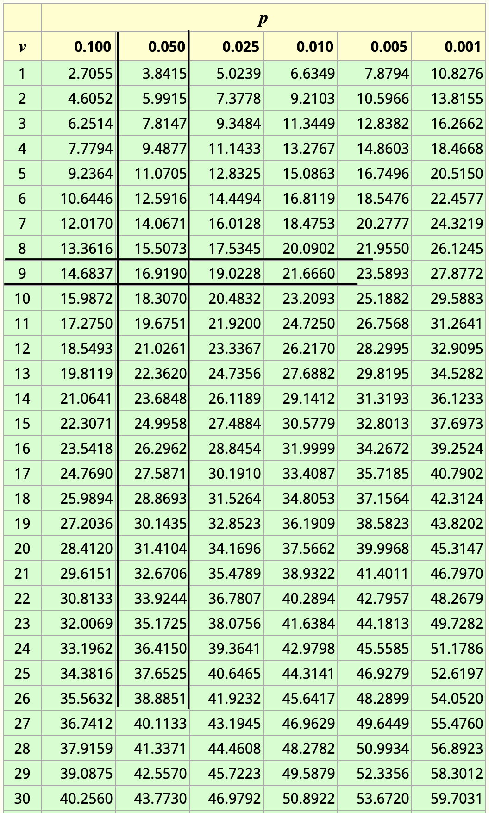

## Au programme aujourd'hui  

1. Rappel
2. Logique du test statistique
3. Test de chi-carré
4. Labo
5. A faire pour la semaine prochaine


## Rappel des objectifs de l'analyse descriptive

1. Y a-t-il une relation entre deux variables ?

2. Quelle est l'intensité de cette relation?

3. Quelles sont la direction et la forme de cette relation?


## Rappel : association entre deux variables


Logique de test statistique
============================

## Question

4. Pouvons-nous **généraliser** la relation à la population de laquelle est tiré l'échantillon?


## Logique de test statistique

{width='80%'}

- Est-ce qu'il existe une relation entre le sexe et la croyance à l'égalité entre homme et femmes?

## Logique de test statistique

On voit que dans cette population, il y a un même pourcentage d'hommes et de femmes qui sont favorables aux droits des femmes. Il n'y a donc pas de relation entre le sexe et l'attitude par rapport à l'égalité.

## Logique de test statistique

- Tirage d'un échantillon aléatoire du quart de cette population.

{width='80%'}

## Logique de test statistique

>- On peut voir clairement que cet échantillon est bien représentatif de la population.

>- Il n'existe pas de relation entre les deux variables. 

>- Cet échantillon nous aurait ainsi permis de tirer une conclusion correcte sur la population. 

>- A travers la logique de l'échantillonnage, nous concluerons qu'il n'y a pas de relation au sein de la population d'où est tiré l'échantillon.

>- Il est évident aussi qu'on ne serait pas toujours tombé sur un échantillon aussi parfait de la population. 

>- Il ne serait pas inhabituel de trouver 2 hommes de plus qui sont favorables aux droits des femmes ou inversement. 

## Logique de test statistique

- Maintenant, regardons un autre échantillon:

{width='80%'}

## Logique de test statistique

>- On voit que cet échantillon n'est pas représentatif de la population précédente.

>- Nous avons 75% des femmes qui sont favorables aux droits des femmes contre 25% des hommes. 

>- Si nous avons tiré un tel échantillon dans une population où il n'y a pas de relation entre les deux variables, nous serions fortement induits en erreur par l'analyse de notre échantillon. 

>- Selon la logique de l'échantillonnage, il est très peu probable que nous tirions un tel échantillon de notre population où il n'y a pas d'association entre les deux variables. 

## Logique de test statistique

- Plus probable que cet échantillon provienne plutôt d'une population comme celle-ci:

{width='75%'}


## Logique de test statistique

- L'échantillon tiré de cette population nous indique aussi une relation forte entre le sexe et l'opinion. 

- Mais, cette fois-ci, cet échantillon est représentatif de la population.

## Logique de test statistique

- Dans les faits: 

>1. Nous ne connaissons pas la distribution dans la population
>2. Nous ne tirons qu'un seul échantillon.

>- Si nous faisons face à une association au sein de notre échantillon alors que nous pensons qu'il n'y en a pas dans la population, nous pouvons dire deux choses:

>i. Soit que notre échantillon n'est pas représentatif ou que 

>ii. Soit qu'il existe bel et bien une association entre les variables dans la population d'où est tirée notre échantillon.

## Logique des tests statistiques

>- Déterminer la probabilité de découvrir une relation dans notre échantillon quand il y en a au sein de la population.

>- Si cette probabilité est petite (1/20 ou 5%, d'òu l'idée du seuil de 5%), et si nous découvrons une relation au sein de l'échantillon, nous pourrons conclure qu'il existe probablement une relation dans la population.
>- Alors il s'agit de tester la supposition qu'il **n'existe pas de relation** dans la population. 
>- On appelle cela l'**hypothèse nulle**, notée $H_0$.
>- Ainsi, rejeter l’hypothèse nulle, revient à dire qu'il existe une relation dans la population. 
>- On parle de relation **statistiquement significative**

## Logique des tests statistiques

>- A l'inverse, si les chances de trouver une relation dans l'échantillon alors qu'il n'y en a pas dans la population sont élevées (supérieures à 1 sur 20), nous NE pouvons croire en toute confiance à l'existence d'une relation dans la population.
>- La relation trouvée au sein de l'échantillon est probablement due au hasard seul.
>- Dans ce cas, nous disons que nous NE rejetons PAS l’hypothèse nulle
>- La relation que nous obtenons dans l'échantillon est probablement factice
>- Remarque: On dit **ne pas rejeter l'hypothèse nulle** et non  **accepter l'hypothèse nulle**.

## Logique des tests statistiques

- **Niveau de significativité** = probabilité de retrouver grâce au hasard une relation au sein d'un échantillon, en dépit de l'absence de relation dans la population. Il est noté $\alpha$.

>- On n'utilisera souvent les niveaux de significativité de 5%, 1% et 0.1%.

>- Le fait que la signification statistique repose sur une probabilité implique que nous ne pouvons jamais être absolument certains de faire le bon choix.

>- Pour le faire, il faut les données de la population directement.

>- Ainsi, on peut commettre deux types d'erreurs.

## Logique des tests statistiques

>- Erreur de type I ou erreur **alpha** : rejet de l'hypothèse nulle alors qu'elle est vraie. La probabilité d'une erreur de type 1 est $\alpha$

>- Erreur de type II ou erreur **bêta** : Non rejet de l'hypothèse nulle alors qu'elle est fausse. 

<!--La probabilité de l'erreur de type II n'est pas par contre (1-$\alpha$)-->

>- Si les chances de l'erreur de type I augmentent, les chances de l'erreur de type II diminuent et vice versa


<!--

## Logique de test statistique

**Que savons-nous sur les échantillons? **

Nous savons que si nous tirons plusieurs fois un échantillon dans une population
- Il y a de forte probabilité que l'échantillon soit représentatif de la population
- et de très faible probabilité que l'échantillon ne soit pas représentatif.

**il existe une forte probabilité d'un faible degré de non-représentativité et une faible probabilité d'un degré élevé de non-représentativité**

## Logique de test statistique

- La signification statistique d'une relation observée dans un ensemble de données d'échantillon est donc toujours exprimée en termes de probabilités. 
- «Significatif au niveau de 0,05» signifie simplement que la probabilité qu'une relation aussi forte que celle observée puisse être attribuée à la seule erreur d'échantillonnage n'est pas supérieure à 5 sur 100. 
- En d'autres termes, si deux variables sont indépendantes l'une de l'autre dans la population, et si 100 échantillons probabilistes étaient sélectionnés dans cette population, pas plus de 5 de ces échantillons fourniraient une relation aussi forte que celle qui a été observée.

## Logique de test statistique

- 0,05 est appelé le niveau de signification. 

- Nous supposons qu'il n'y a pas d'association entre les variables de la population (Hypothèse nulle)

- Puis nous nous demandons quelle proportion des échantillons tirés d'une telle population produirait des associations au moins aussi importantes que celles mesurées dans les données empiriques. 

- Trois niveaux de signification sont fréquemment utilisés dans les rapports de recherche : 0,05, 0,01, 0,001. Cela signifie, respectivement, que les chances d'obtenir l'association mesurée à la suite d'une erreur d'échantillonnage sont de 5/100, 1/100 et 1/1000.

-->

Test de chi-carré
=======================

## Le test du chi-carré 

- Le chi-carré, $\chi^2$, est un nombre qui compare les fréquences observées dans un tableau bivarié aux fréquences auxquelles on devrait s'attendre s'il n'y avait pas du tout de relation entre les deux variables dans la population (les fréquences anticipées).

- Sa formule est:

$$\chi^2 = \sum\frac{(f_o - f_a)^2}{f_a}$$
où :
$$f_a = (\frac{\text{Total de la colonne}}{N})*(\text{Total de la rangée})$$

- fréquence anticipée d'une cellule: $f_a$ ;
- fréquence observée d'une cellule: $f_o$ et 
- N est le nombre total de cas.


## Tests de signification statistique de chi-carré

>- La distribution d'échantillonnage et la méthode pour déterminer la signification statistique dépendent de la nature des données que nous analysons. 

>- Pour les données disposées en tableau, le test du **chi-carré** est utilisé. 

>- Il repose sur la distribution d'échantillonnage du chi-carré.


## Distribution du chi-carré 

<!--
```{r chideux, out.width="80%", out.height="80%", echo=FALSE}

library(tidyverse)
ggplot(data = data.frame(x = c(0, 20)), aes(x)) +
  stat_function(fun = dchisq, args = list(df = 5)) +
  stat_function(fun = dchisq, args = list(df = 2), color = "red") +
  stat_function(fun = dchisq, args = list(df = 10), color = "blue") +
  labs(title = "Distribution avec du chi carré avec 2(rouge), 5(noir) et 10(bleu) dégrés de liberté") +
  theme(
    plot.title = element_text(color = "black"))
```
-->


Test de signification de chi-carré
========================================================

## Le test de chi-carré

>- Il existe une table de la distribution d'échantillonnage du $\chi^2$, c'est-à-dire une table qui donne les probabilités d'obtenir un $\chi^2$ au moins aussi grand qu'une certaine valeur si, dans la population de laquelle fut tiré l'échantillon, il n'y a pas de relation entre les deux variables.

>- Cette probabilité dépend de ce qu'on appelle les **degrés de liberté (dl ou ddl)**.


## Degré de liberté

- Supposons que je vous demande de trouver 3 chiffres dont la moyenne vaut 11.

>- Quelles sont les réponses possibles?
>- On peut avoir (11, 11, 11), (11, 12, 10), ...
>- Vous vous rendez compte qu'il y a une infinité de solution

## Degré de liberté

- Maintenant, supposez que je vous dise qu'un de ces chiffres vaut 10.

>- Quelles sont les réponses possibles?
>- On peut avoir (10, 11, 12), (10, 13, 10), ...
>- Vous vous rendez compte à nouveau que vous avez une infinité de solutions.

## Degré de liberté

- Finalement, supposez que je vous donne deux chiffres, soit (9 et 12)

>- Quelles sont les réponses possibles?
>- On peut avoir (9, 12, 12), ou ...
>- Vous vous rendez compte que c'est la seule réponse possible
>- Ainsi, à travers cet exemple, on se rend compte que seuls deux chiffres sont "libres". Une fois qu'ils sont fixés, la dernière réponse est déterminée. 
>- Dans cette situation, nous disons qu'il y a 2 degrés de liberté.
>- De manière générale, chaque fois que nous regardons la moyenne de N valeurs, le degré de liberté vaut toujours (N-1)

## Degré de liberté

Les degrés de liberté font référence au nombre maximum de valeurs logiquement indépendantes, qui sont des valeurs qui ont la liberté de varier, dans l’échantillon de données.


## Degré de liberté dans un tableau bivarié

- On peut aussi déterminer le degré de liberté dans un tableau
- Maintenant, supposer que je vous donne ce tableau
- Quelles sont les valeurs possibles de A, B, C, et D?


>- Ici aussi, vous avez plusieurs réponses possibles
>- On peut avoir (100, 100, 200, 0), (110, 90, 190, 10)

## Degré de liberté dans un tableau bivarié

- Maintenant, supposer que je vous donne A = 150
- Quelles sont les autres valeurs possibles?


>- On se rend compte que les valeurs de (B, C, D) sont fixes
>- (B = 50, C = 150, D = 50) est la seule réponse possible
>- Ainsi, nous disons que le tableau a 1 degré de liberté

## Degré de liberté dans un tableau bivarié

- Maintenant, réfléchis à un tableau de deux colonnes et trois rangés 
- Trouve le degré de liberté dans ce tableau si tu connais les informations à la marge?

## Degré de liberté dans un tableau bivarié

>- En règle générale, le degré de liberté dans les tableaux bivariés vaut **(r-1)(c-1)**
>- r étant le nombre de rangées et 
>- et c le nombre de colonnes dans le tableau.

>- A partir de cette valeur, on peut lire dans le tableau de distribution du chi-carré :

>- la valeur minimale du chi-carré nécessaire pour obtenir un résultat statistiquement significatif au seuil (ou niveau de significativité) voulu (0.05, 0.02, 0.01 ou 0.001).


## Tableau de distribution du chi-deux

- page 343 de votre livre de cours




## Tableau de distribution du chi-deux 

Ce tableau nous donne :

>- Sur la première ligne le niveau de significativité souhaité (par exemple 5%)
>- Sur la première colonne le degré de liberté calculé (par exemple 9)
>- L'intersection de la ligne et de cette colonne vous donne la **valeur minimale** du chi-deux pour obtenir un résultat significatif au seuil voulu. 
>- Dans l'exemple ici, la valeur du chi-deux vaut : 16.9190
>- Cela signifie que que si nous devons prendre 100 échantillons (aléatoires) différents dans une population où il n'y a pas d'association entre les deux variables, dans 5% des cas, nous obtiendrons une valeur égale ou superieure à 16.9190.
>- Au seuil de 1%, on trouve la valeur du chi-carré égale à 21.66.

## En conclusion

- Je me donne 5% de chance de me tromper (niveau de significativité ou erreur alpha)

>- Avec ce niveau et le degré de liberté, je lis la valeur du chi-carré qui leur est associée

>- Si le chi-carré que je calcule avec mon échantillon est **supérieur** à cette valeur, je suis bien en phase avec le risque que je me suis donné: je dis qu'il y a une association au sein de la population

>- Autrement dit, il est peu probable que mon échantillon provienne d'une population dans laquelle il n'y a pas d'association

## Décision

>- Si votre **chi-deux calculé** est supérieur ou égal au **chi-deux lu** ==> Rejeter l'hypothèse nulle. Cela revient à dire qu'il existe une association significative (n'est pas du au hasard) entre vos deux variables (catégorielles)

>- Si votre **chi-deux calculé** est inférieur au **chi-deux lu** ==> Vous ne pouvez pas rejeter l'hypothèse nulle. Vous ne pouvez pas conclure à l'existence d'une association non nulle entre vos deux variables.


## En résumé

Pour faire un test d'association entre deux variables (catégorielles):

1. Posez votre hypothèse nulle (et alternative)
  - $H_0$ : Il **n'existe pas** d'association entre les deux variables
  - $H_1$ : Il **existe** une association non nulle entre les deux variables 
  
>2. Choisissez votre niveau de significativité (5%)

>3. Trouvez votre degré de liberté

>4. Trouvez la valeur du **chi-deux** pour rejeter l'hypothèse nulle

>5. Calculez votre chi-deux à partir de votre échantillon

>6. Prendre une décision:
  - **chi-deux calculé** >= **chi-deux lu** ==> Rejeter l'hypothèse nulle. ==>Relation est **statistiquement significative au seuil retenu**
  - **chi-deux calculé** < **chi-deux lu** ==> Vous ne pouvez pas rejeter l'hypothèse nulle


## Remarques

1. Une relation qui est significative au seuil de 5% est **aussi significative** à tous les seuils supérieurs à 5%.

>2. Une relation qui est significative au seuil de 5% n'est pas automatiquement significative au seuil plus faible (par exemple 1%)

>3. Plus grande est la valeur du chi-carré calculée, peu probable est que cette valeur soit attribuée à une erreur d'échantillonnage

>4. Une relation statistiquement significative n'est pas toujours une **signification substantielle**. Avec une grande taille d'échantillon, les très petites différences peuvent être significatives

>5. Le test de chi-deux est basé sur un échantillon issu d'une procédure d'échantillonnage probabilistique.

## Remarques

6. Pour les autres tests que nous serons amenés à faire (test de Student de comparaison des moyennes, test de Fisher pour l'analyse de la variance), la seule différence serait le changement de la distribution de la statistique à consider. 

- Pour tous les autres tests, on suivra la même logique
- Étapes 1 à 3 sont pareilles
- Étape 4, trouver la valeur de la statistique appropriée
- Étape 5, calculer votre statistique
- Étape 6: prendre une décision


Labo
==================================


## Pour la semaine prochaine

- Lire les chapitres 6 (à nouveau) et le chapitre 7
- Refaire le labo chez vous.

