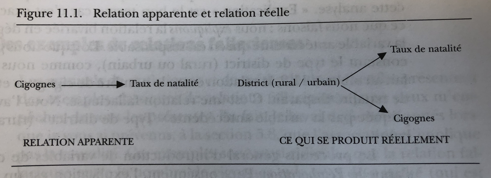
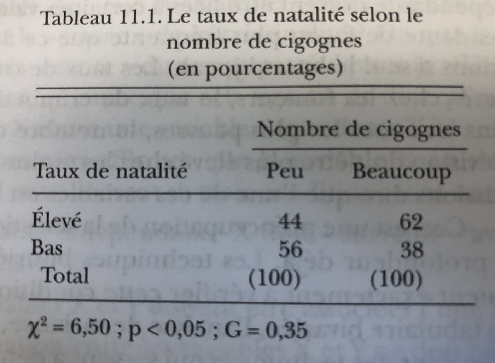
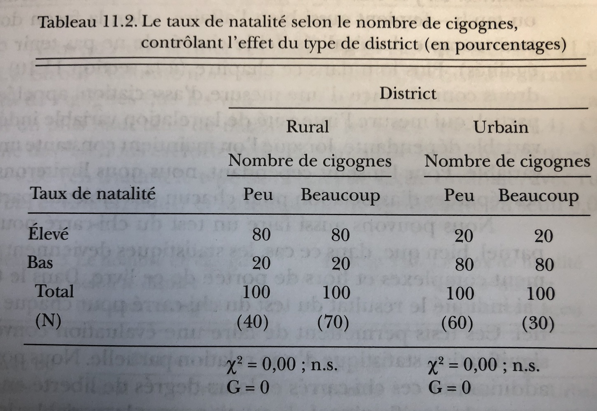
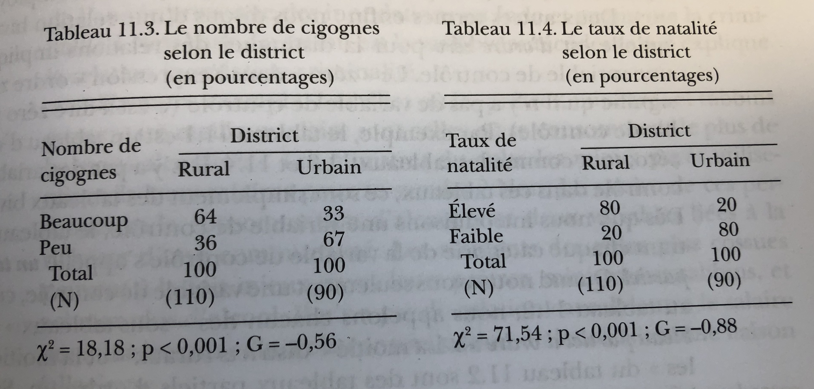
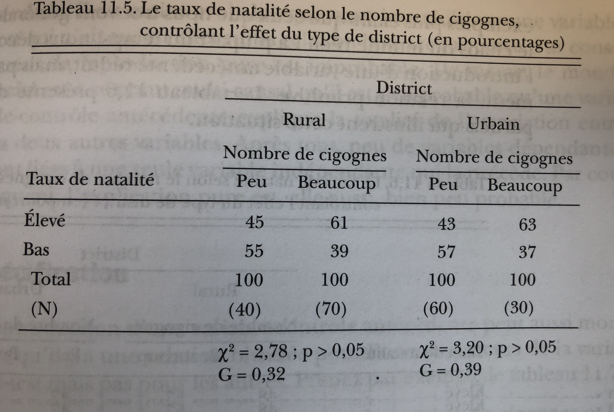
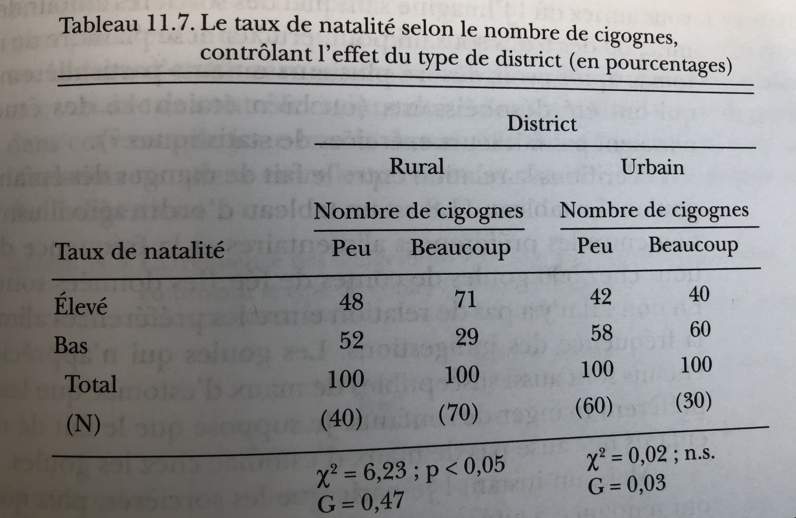
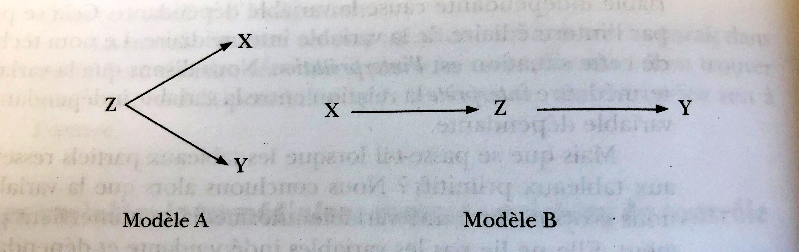

## Plan de présentation

1. Questions causales en sciences sociales et terminologie

2. Effets causaux et contrefactuel

3. Essais contrôlés randomisés (*Randomized controlled trials*) et causalité

4. Causalité à partir des données observationnelles 


Introduction
========================================================

## Introduction
- Dans ce chapitre, nous considérons la causalité, l’un des concepts les plus centraux des sciences sociales quantitatives. 
- Une grande partie de la recherche en sciences sociales s'intéresse aux effets causaux de diverses politiques et autres facteurs sociétaux. 

## Questions de recherche

- Une question de recherche est au cœur d'un projet de recherche, d'une étude ou d'une revue de littérature. 
- Il concentre l'étude, détermine la méthodologie et guide toutes les étapes de la recherche, de l'analyse et de la production de rapports.
- Peut être **associatif** ou **causal**


## Exemple 1

1. Le salaire minimum augmente-t-il le taux de chômage?
    - Le taux de chômage a augmenté après l'augmentation du salaire minimum.
    - Le taux de chômage aurait-il augmenté si l'augmentation du salaire minimum n'avait pas eu lieu?


## Exemple 2

2. La race/l'ethnie a-t-elle une incidence sur les perspectives d'emploi?
    - Mohamed a postulé pour un emploi mais ne l'a pas obtenu.
    - Mohamed aurait-il trouvé un travail s'il était blanc (avait un nom européen)?


## Exemple 3

3. Est-ce que fumer cause une maladie coronarienne?
    - Jean, fumeur, a eu une maladie coronarienne.
    - Est-ce que Jean aurait eu la même maladie s'il n'était pas fumeur?

## Exemple 4
  
4. Quelle est l'importance des questions souverainistes dans la victoire de François Legault?
    - Au cours de ces élections, la question souverainiste a été laissé de côté et François Legault a gagné.
    - François Legault aurait-il gagné les élections si ces questions étaient présentes?

## Terminologie

1. **Réponse ou variable dépendante**, *outcome*
  - C'est ce que nous voulons expliquer.
  - *Exemples*:
      - Taux de chômage
      - Perspective d'emploi
      - Maladie coronarienne
      - Victoire de François Legault

## Terminologie
    
2. **Variable indépendante, facteur de risque**
  - Tout facteur pouvant influencer la variable de réponse
  - Peut être de différents niveaux
  - Leur choix dépend de la théorie
  - *Exemples*:
    - Salaire minimum
    - Ethnie / Race
    - Fumer
    - Questions souverainistes

3. **Variables de contrôle**

Type de relation
========================================================

## Association 

- On dit que deux variables A et B sont **associées** quand l’une se trouve plus communément en présence de l’autre.

- Se détecte souvent à partir d'un tableau dit de **contingence** ou **tableau croisé** ou d'un graphique

## Association 

- Exemple  - Existe-il une association entre le degré d'ouverture d'un pays et l'attitude face a la violence contre les femmes?

Pierotti, Rachel. (2013). "[Increasing Rejection of Intimate Partner Violence: Evidence of Global Cultural Diffusion](http://dx.doi.org/10.1177/0003122413480363)." *American Sociological Review*, 78: 240-265. 

Nous utilisons les données des enquêtes démographiques et de santé (EDS), qui représentent un ensemble de plus de 300 enquêtes représentatives à l'échelle nationale, régionale et résidentielle menées dans des pays en développement du monde entier depuis 1992.

## Association 

Name                Description
---------------     ---------------------------------------------------------
`beat_burnfood`     Pourcentage de femmes dans chaque pays qui 
                    pensent qu'un mari a le droit de battre sa femme 
                    si elle brûle la nourriture (quantitative)
`beat_burnfood_cat` Variable beat_bunfood en 4 catégories (qualitative)
`no_media`          Pourcentage de femmes dans chaque pays qui ont 
                    rarement accès un journal, une radio ou une
                    télévision (quantitative)
`no_media_cat`      Variable no_media en 3 catégories (qualitative)
`country`           pays


## Association 

```{r, echo=FALSE, echo=FALSE, warning=FALSE, message=FALSE}

#install.packages("devtools") 
#library("devtools")
#install_github("kosukeimai/qss-package", build_vignettes = TRUE)

getwd()
library(tidyverse)
library(summarytools)
library(qss)

dhs_ipv <- read_csv("dhs_ipv.csv")

dhs_ipv <-
  dhs_ipv %>% 
 # select(beat_burnfood!= "NA") %>% 
  mutate(beat_burnfood_cat = factor(ntile(beat_burnfood, 4), labels = c('Très faible', 'Faible', 'Élevé', 'Très élevé')),
         beat_goesout_cat = factor(ntile(beat_goesout, 4), labels = c('Très faible', 'Faible', 'Élevé', 'Très élevé')),
         no_media_cat = factor(ntile(no_media, 3), labels = c('Riche', 'Moyen', 'Pauvre'))) 

```  


## Association

- Résumé de l'information contenue dans la base de donnée

```{r, out.width = '65%', echo=FALSE}

summary(dhs_ipv)

```

## Association 

- Association entre deux variables qualitatives

```{r, echo=FALSE,  warning=FALSE, message=FALSE, out.width = '75%'}

ggplot(na.omit(dhs_ipv)) +
  geom_bar(aes(x = no_media_cat, fill = beat_burnfood_cat), position = "fill") +
  ggtitle("Association entre ouverture aux médias et acceptation de la violence conjugale") +
  xlab("Type de pays selon l'ouverture aux médias") +
  ylab("Effectif") +
  theme_bw()

```  

## Association 

  - Représentation graphique (boxplot) dans le cas d'une variable qualitative et d'une variable quantitative
  
```{r, out.width = '75%', message = FALSE, echo=FALSE, warning=FALSE}

ggplot(na.omit(dhs_ipv)) +
  geom_boxplot(aes(x = no_media_cat, y = beat_burnfood, color = no_media_cat)) +
  ggtitle("Association entre ouverture aux médias et acceptation de la violence conjugale") +
  xlab("Type de pays selon l'ouverture aux médias") +
  ylab("% qui estime qu'une femme doit être battue (beat_burnfood)") 

```  


## Association 

  - Représentation linéaire (scatterplot) et de calcul d'indicateurs (corrélation de Pearson): dans le cas de deux variables quantitatives.

```{r, out.width = '70%', message = FALSE, warning=FALSE, echo=FALSE}

ggplot(dhs_ipv, aes(x = no_media, y = beat_burnfood)) +
  geom_point() 

```


## Association 

```{r, out.width = '75%', message = FALSE, warning=FALSE, echo=FALSE}

ggplot(dhs_ipv, aes(x = no_media, y = beat_burnfood)) +
  geom_point(aes(color = region)) +
  geom_smooth(aes(color = region), method = lm, se = FALSE,  formula = y ~ x)

```


## Relation associative

- Une association (linéaire) peut être 
  - **positive** si les deux variables vont dans le même sens (une augmentation de l'un est associée à une augmentation de l'autre);
    - *Exemple* : éducation et revenu, durée de résidence et emploi
  - **négative** si les deux variables vont dans des sens opposés (une augmentation de l'un est associée à une diminution de l'autre);
    - *Exemple* : scolarisation et racisme, revenu et obésité, niveau de développement d'un pays et niveau de mortalité infantile
  - **nulle** (Absence d'association).
    - *Exemple*:  


## Relation causale

- L'association est une **condition nécessaire** à la causalité (Mais elle **n'est pas suffisante**).
- Toutes les associations ne sont pas causales. L'association peut arriver par hasard.
- **L'analyse statistique à elle seule ne peut constituer une preuve d'un lien de causalité**
- Comparaison entre **$\color{red}{factuel}$** et **$\color{red}{contrefactuel}$**
- Problème fondamental de l'inférence causale: 
  - Il faut déduire des résultats contrefactuels
  - Il n'y a pas de causalité sans manipulation: caractéristiques immuables


## Relation causale


- La clé pour comprendre la causalité est de penser au contrefactuel. L'inférence causale est une comparaison entre le factuel (ce qui s'est réellement passé) et le contrefactuel (ce qui se serait passé si une condition était différente).

- Contrefactuels ne sont pas observés, sauf dans les films.
- https://www.youtube.com/watch?v=BvUbv4iwbDs&rel=0&modestbranding=1&autohide=1&showinfo=0


Essais contrôlés randomisés (Expérimentation)
========================================================

## Essais contrôlés randomisés

>- Idée clé: la **randomisation** du traitement rend les groupes de **traitement** et de **contrôle** en moyenne «identiques»

>- Les deux groupes sont similaires en termes de toutes les caractéristiques (**observées et non observées**)

>- Peut attribuer les différences moyennes de résultats à la différence de traitement

>- Effet du Traitement Moyen (Sample Average Treatment Effect, SATE)


```{r SATE, echo=FALSE,  out.width = '70%'}

knitr::include_graphics("SATE1.jpg")

```

- Essais contrôlés randomisés comme **norme d'excellence** (*Gold standard*)

<!--
## Essais contrôlés randomisés

- La SATE n'est pas directement observable. 
- Pour le groupe de traitement qui a reçu le traitement, nous avons observé le résultat moyen sous le traitement, mais nous ne savons pas quel aurait été leur résultat moyen sans le traitement. 
- Le même problème existe pour le groupe témoin car ce groupe ne reçoit pas le traitement et, par conséquent, nous n'observons pas le résultat moyen qui se produirait dans les conditions de traitement. 
- Pour estimer le résultat contrefactuel moyen du traitement, nous pouvons utiliser le résultat moyen observé du groupe témoin. 
- De même, nous pouvons utiliser le résultat moyen observé du groupe de traitement comme une estimation du résultat contrefactuel moyen pour le groupe de contrôle. 
- La SATE peut être estimée en calculant la différence entre le résultat moyen entre les groupes de traitement et témoin
- En clair, la grande question de la causalité n'est qu'une question de soustraction :)
-->


## Essais contrôlés randomisés

- Dans un essai contrôlé randomisé (ECR), chaque unité est assignée de manière aléatoire au groupe de traitement ou au groupe de contrôle. 

- La randomisation de l'assignation de traitement garantit que la différence moyenne de résultats entre les groupes de traitement et de contrôle peut être attribuée uniquement au traitement, car les deux groupes sont en moyenne identiques pour toutes les caractéristiques de prétraitement (observées et non observées).


## Essais contrôlés randomisés

1.  **Forces**  
  - **Validité interne** - mesure dans laquelle les hypothèses de causalité sont satisfaites dans l'étude


## Essais contrôlés randomisés

2. **Limites**
  - **Validité externe** - mesure dans laquelle les conclusions peuvent être généralisées au-delà d'une étude particulière
  - Explication causale faible
  - Considérations éthiques
  - Possibilité de contamination


Applications
========================================================

## Exemple 1 discrimination raciale sur le marché du travail

1. **Question de recherche**
  - La discrimination raciale existe-t-elle sur le marché du travail?
  - Ou bien les disparités raciales dans le taux de chômage devraient-elles être attribuées à d'autres facteurs tels que les écarts raciaux dans le niveau d'instruction?

## Exemple 1 discrimination raciale sur le marché du travail

2. **Expérimentation**
  - En réponse aux annonces dans les journaux, les chercheurs ont envoyé les CV de candidats fictifs à des employeurs potentiels.
  - Changé seulement le nom du demandeur d'emploi
    - Noms afro-américains
    - Noms à consonance caucasienne
  - Les autres informations sont inchangées

3. **Variable dépendante**
  - Taux de rappel

## Exemple 1 discrimination raciale sur le marché du travail

>- **Unité d'analyse**: Individus

>- **Variable de traitement** (variable d’intérêt causal) **T**: Nom à consonance afro-américain

>- **Groupe de traitement** (unités traitées): Afro-américains

>- **Groupe de contrôle** (unités non traitées): Caucasiens

>- **Réponse** (variable de réponse) **Y**: si un rappel a été effectué

>  - Que signifie **"T cause Y"**? 
>  - Contrefactuels, **"Quoi si"** : Les Afro-Américains auraient-ils été rappelés s'ils n'avaient pas de noms afro-américains?

## Exemple 1 discrimination raciale sur le marché du travail

- **Deux résultats possibles**: Y(1) et Y(0)

- **Effet causal**: `Y(1) - Y(0)`

- **Problème fondamental d'inférence causale**: un seul des deux résultats potentiels est observable


## Exemple 1 discrimination raciale sur le marché du travail

- Comment pouvons-nous comprendre les contrefactuels?
  - L'association n'est pas un lien de causalité
  - Trouvez une unité similaire! ==> **Matching**
  - Est-ce-que Jamal n'a été rappelé à cause de sa race?
  - Trouver une personne blanche qui ressemble à Jamal 

- Le problème: on ne peut pas correspondre sur tout
- Facteurs de **confusion non observés**: variables associées au traitement et au résultat ==> **biais de sélection**


## Exemple 1 discrimination raciale sur le marché du travail

- La clé pour comprendre la causalité est de penser au contrefactuel. L'inférence causale est une comparaison entre le factuel (ce qui s'est réellement passé) et le contrefactuel (ce qui se serait passé si une condition était différente).


```{r pressure, echo=FALSE, fig.cap="A caption", out.width = '100%'}
knitr::include_graphics("factuel_contrafactuel.jpg")
```


- La toute première observation des données de l’expérience de résumé montre qu’un employeur potentiel a reçu un CV avec un nom stéréotypé afro-américain et a décidé de rappeler.

- Avec quoi remplaçons-nous les **?** dans le tableau?

## Exemple 1 discrimination raciale sur le marché du travail

```{r, echo=FALSE}

data("resume", package = "qss")
# resume <- read_csv("resume.csv")        # What you will do to import the data (remember your directory)
head(resume) 

write.csv(resume, file = "resume.csv")

```

## Exemple 1 discrimination raciale sur le marché du travail

```{r}

freq(resume$sex)

```

## Exemple 1 discrimination raciale sur le marché du travail

```{r}

freq(resume$race)

```

## Exemple 1 discrimination raciale sur le marché du travail

```{r}

freq(resume$call)

```

## Y'a-t-il discrimination ou pas?

```{r}

#ctable(resume$race, resume$call)
tab <- table(resume$race, resume$call)

round(prop.table(tab, 1)*100, 2)

```

- SATE = 9,65 - 6,45 = 3,2%

## Est-ce que les deux groupes étaient similaires au début?

```{r}

ctable(resume$race, resume$sex)

```


Causalité à partir des données observationnelles
========================================================

## Données observationnelles

- Souvent, nous ne pouvons pas randomiser le traitement pour des raisons éthiques et logistiques:
- par exemple, tabagisme et cancer du poumon

- Études observationnelles: traitement naturellement attribué
- Plans d'observation passifs ou plans corrélationnels
- Pas d'assignation aléatoire, pas de groupe de contrôle…

## Données observationnelles

- Meilleure validité externe pour la généralisation au-delà de l'expérience

- Validité interne plus faible:
    - les variables pré-traitement peuvent différer entre les groupes (traitement et contrôle)

>    1. **biais de confusion (Confounding bias)** dû à ces différences : Une variable de prétraitement associée aux variables de traitement et de résultat s'appelle un facteur de confusion et constitue une source de biais de confusion dans l'estimation de l'effet du traitement.
    
>    2. **biais de confusion non observée (Unobserved confounding)** constitue la ménace la plus importante car il est inobservé.

## Données observationnelles

3. **biais de sélection (selection bias)** de l'auto-sélection au traitement: Le biais de confusion dû à l'auto-sélection dans le groupe de traitement s'appelle un biais de sélection. Un biais de sélection apparaît souvent dans les études d'observation car les chercheurs n'ont aucun contrôle sur le destinataire du traitement.

>- Exemple: 103 084 Parisiens se sont exprimés et 89,03 % d'entre eux ont voté pour la fin des trottinettes en libre-service à Paris. (https://www.paris.fr/pages/pour-ou-contre-les-trottinettes-en-libre-service-23231#:~:text=103%20084%20Parisiens%20se%20sont,au%20long%20de%20la%20journ%C3%A9e.)

>- Contrôle statistique devient alors nécessaire


## Données observationnelles

```{r endogeneite, echo=FALSE, fig.cap="", out.width = '100%'}
knitr::include_graphics("endogeneite.jpg")
```

## Conditions de la causalité

1. La variable indépendante X doit "survenir" avant la variable dépendante Y

2. Les variables X et Y doivent être associées l'une à l'autre

3. L'association entre les valeurs X et Y ne doivent pas être due à un troisième facteur, une variable antécédente.

## Explications

1. X vient avant Y

- Est-ce que fumer cause une maladie coronarienne?
- Mais, est-ce que cette seule condition suffit? 
- Non, X peut venir avant Y et il n'y a pas causalité. Méfiez-vous des cas d'anticipation
- Sortir avec un parapluie vient avant la pluie. Est-ce que le parapluie cause la pluie?
- D'où la vérification de la deuxième condition


## Explications

2. X et Y sont correlées

- les maladies coronariennes sont plus fréquentes chez les fumeurs
- le jour où il pleut, il y a beaucoup de gens qui sortent leur parapluie
- Les élèves des classes de petite taille réussissent mieux que les élèves des classes de grande taille
- Nous avons appris une méthode particulière pour établir cette association quand les deux variables sont catégorielles
    - Avec deux variables ratio ou intervalle: nuage de point et test de corrélation
    - Avec une VD ratio ou intervalle et une VI catégorielle: Boxplot et analyse de la variance


## Explications

3. Il n'y a pas une explication alternative de la relation entre X et Y

- Un troisième facteur ne vient pas expliquer la relation entre X et Y: c'est la condition la plus difficile à établir avec les données observationnelles.
- Une variable antécédente est une variable qui agit avant la variable indépendante dans une chaîne causale.
- Si c'est une telle variable qui fait que X et Y sont associées, alors X et Y ne sont pas reliées de façon causale


## Explications

3. Il n'y a pas une explication alternative de la relation entre X et Y


```{r , echo=FALSE, fig.cap="", out.width = '100%'}

```


## Processus d'élaboration

1. Relation initiale

- les deux premières conditions sont réunies

```{r , echo=FALSE, fig.cap="", out.width = '80%'}

```


## Processus d'élaboration

2. Explication alternative: explication

```{r , echo=FALSE, fig.cap="", out.width = '80%'}

```

- Refuter la relation: **explication**


## Processus d'élaboration

2. Explication alternative

```{r , echo=FALSE, fig.cap="", out.width = '90%'}

```

- On voit clairement qu'il y a une association entre le nombre de cigognes et le district


## Processus d'élaboration

3. Explication alternative : reproduction

- Mais le processus d'élaboration peut conduire à soutenir l'hypothèse de base

```{r , echo=FALSE, fig.cap="", out.width = '80%'}

```


- On parle de reproduction

## Processus d'élaboration

Remarque: la reproduction n'est pas une preuve qu'il n'y a pas d'explications alternatives

- Vous n'avez juste pas mis la main sur la bonne variable antécédente
- Sachez que vous ne pouvez pas mettre la main sur l'ensemble des variables antécédentes
    - la plupart vous sont données par la théorie
    - Plusieurs ne sont pas directement mésurables
  

## Processus d'élaboration

4. Explication alternative : spécification

```{r , echo=FALSE, fig.cap="", out.width = '80%'}

```

## Variables dissimulatrices

- Les variables antécédentes qui révèlent une association entre deux variables X et Y qui n'existaient pas sans l'introduction de cette variable


## Variables intermédiaires


VI (X) ---> Variable intermédiaire (Z) ---> VD (Y)

3 résultats peuvent arriver:

> 1. La relation entre X et Y disparait: Z relie vraiment X et Y --> processus d'interprétation

> 2. La relation entre X et Y demeure pour les catégories de la variable Z: Z n'intervient pas vraiment dans la relation entre X et Y. Z ne fait pas partie de la châine causale.

> 3. Z interprète une partie seulement de la relation entre X et Y

## Remarque sur les variables antécédentes et intermédiares

- L'analyse statistique ne peut distinguer entre les deux: seule la théorie et le raisonnement sociologique peuvent vous guider

```{r , echo=FALSE, fig.cap="", out.width = '100%'}

```

## Calcul de Gamma 

- Gamma partiel est l'extension de Gamma aux tableaux multivariés

$$G_p = \frac{\sum{Semblables} - \sum{Opposées}}{\sum{Semblables} + \sum{Opposées}}$$


## Conclusion

- L'établissement de la causalité entre une variable indépendante X et une variable dépendante Y à partir des données observationnelles ressemble au travail du limier.

- Le sociologue est un "inspecteur" des données pour :
    - lui faire révéler la vérité 
    - ou pour valider ces théories
    
## Conclusion

- Où aller à partir de maintenant?
    
>    - Relire et refaire les devoirs
>    - Continuer l'apprentissage du logiciel
>    - Prendre un boulot d'été dans un département où vous pouvez analyser les données
>    - Prendre un boulot pro-bono avec moi pour travailler sur de vraies données au Labo du département.

