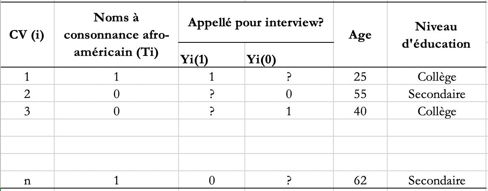
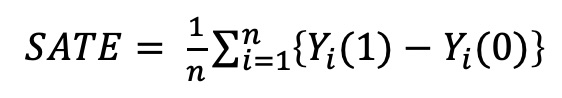
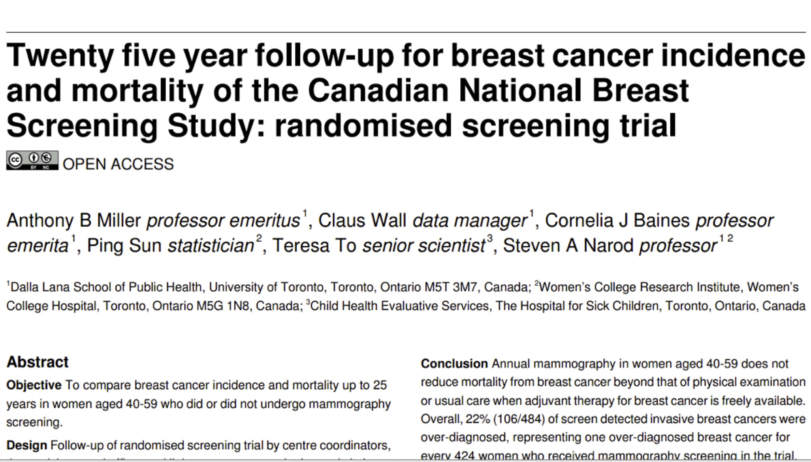
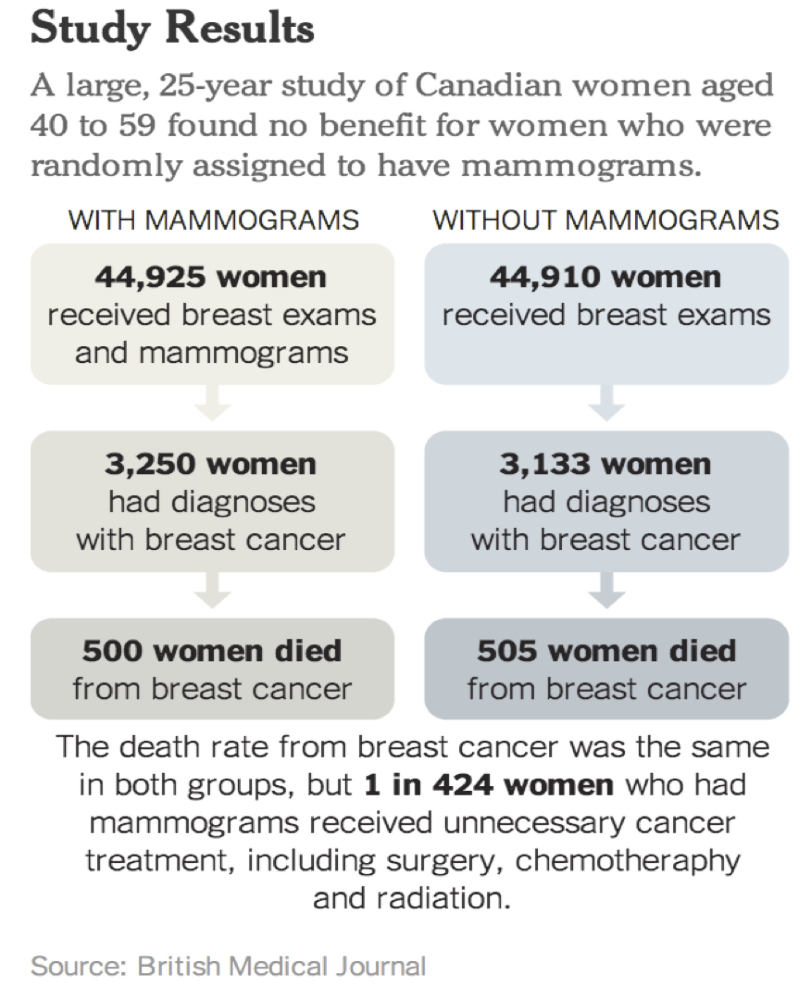

Seance 5: Causalité à partir de données expérimentales
========================================================
author: Vissého Adjiwanou, Ph.D
title: Département de Sociologie, UQAM
date: 04 Octobre 2018
autosize: true
width: 1600
height: 900
transition: fade
font-family: helvetica

Plan du jour
========================================================

1. Travaux pratiques - Rappels statistiques et visualisations (90 minutes)

2. Cours sur la causalité (90 minutes)

1. **Ressouces**
  - https://www.rstudio.com/resources/cheatsheets/
  - https://juba.github.io/tidyverse/04-bivarie.html 
  - http://r4ds.had.co.nz/
  - http://r-statistics.co/Top50-Ggplot2-Visualizations-MasterList-R-Code.html

TRAVAUX PRATIQUES
========================================================
type: section

Plan de présentation
========================================================

1. Questions causales en sciences sociales et terminologie
2. Effets causaux et contrefactuel
3. Essais contrôlés randomisés (*Randomized controlled trials*) et causalité
4. Application
5. Causalité à partir des données observationnelles (semaine prochaine)
6. Lectures:
  * https://www.bitbybitbook.com/fr/1st-ed/running-experiments/
    * Sections 4.1, 4.2 et 4.3
  * https://juba.github.io/tidyverse/04-bivarie.html 

Introduction
========================================================
incremental: true

* Dans ce chapitre, nous considérons la causalité, l’un des concepts les plus centraux des sciences sociales quantitatives. 
* Une grande partie de la recherche en sciences sociales s'intéresse aux effets causaux de diverses politiques et autres facteurs sociétaux. 
* Par exemple: 
  * les classes de petite taille augmentent-elles les résultats des tests standardisés des élèves? 
  * Les soins de santé universels amélioreraient-ils la santé et les finances des pauvres?
  * L'éducation réduit-elle le nombre d'enfants?
  
Questions de recherche
========================================================

* Une question de recherche est au cœur d'un projet de recherche, d'une étude ou d'une revue de littérature. 
* Il concentre l'étude, détermine la méthodologie et guide toutes les étapes de la recherche, de l'analyse et de la production de rapports.
* Peut être **associatif** ou **causal**

Questions de recherche
========================================================
incremental: true

1. Le salaire minimum augmente-t-il le taux de chômage?
  * Le taux de chômage a augmenté après l'augmentation du salaire minimum
  * Le taux de chômage aurait-il augmenté si l'augmentation du salaire minimum n'avait pas eu lieu?

2. La race/l'ethnie a-t-elle une incidence sur les perspectives d'emploi?
  * Mohamed a postulé pour un emploi mais ne l'a pas obtenu
  * Mohamed aurait-il trouvé un travail s'il était blanc (avait un nom européen)?

3. Est-ce que fumer cause une maladie coronarienne?
  * Jean, fumeur, a eu une maladie coronarienne 
  * Est-ce que Jean aurait eu la même maladie s'il nétait pas fumeur?
  
4. Quelle est l'importance des questiones souverainistes dans la victoire de François Legault?
  * Au cours de ces éléctions, la question souverainiste a été laissé de côté et François Legault a gagné.
  * Francçois Legault aurait-il gagné les élections si ces questions étaient présentes?

5. Maintenant, encore une fois, parler moi de vos questions de recherche.

Questions de recherche: Terminologie
========================================================
incremental: true 

1. **Réponse ou variable dépendante**, *outcome*
  * C'est ce que nous voulons expliquer.
  * *Exemples*:
    * Taux de chômage
    * Perspective d'emploi
    * Maladie coronarienne
    * Victoire de François Legault
    
2. **Variable indépendante, facteurs de risque**
  * Tout facteur pouvant influencer la variable de réponse
  * Peut être de différents niveaux
  * Leur choix dépend de la théorie
  * *Exemples*:
    * Salaire minimum
    * Ethnie / Race
    * Fumer
    * Questions souverainistes

Type de relation: Association
========================================================
incremental: true

* On dit que deux variables A et B sont **associées** quand l’une se trouve plus communément en présence de l’autre.
* Se détecte souvent à partir d'un-e :
  * tableau dit de **contingence** ou **tableau croisé** : dans le cas de deux variables qualitatives
  * représentation graphique (boxplot) et de calcul d'indicateurs : dans le cas d'une variable qualitative et d'une variable quantitative
  * représentation linéaire (scatterplot) et de calcul d'indicateurs (corrélation de Pearson): dans le cas de deux variables quantitatives.
  
* Une association (linéaire) peut être 
  * **positive** si les deux variables vont dans le même sens (une augmentation de l'un est associée à une augmentation de l'autre);
  * *Exemple* : éducation et revenu, durée de résidence et emploi
  * **négative** si les deux variables vont dans des sens opposés (une augmentation de l'un est associée à une diminution de l'autre);
  * *Exemple* : scolarisation et racisme, revenu et obésité, niveau de développement d'un pays et niveau de mortalité infantile
  * **nulle** (Absence d'association).
  * *Exemple*:  
  
* Nous reviendrons sur les associations plus tard dans le cours.  

Type de relation: Causalité
========================================================
incremental: true

* L'association est une **condition nécessaire** de la causalité (Mais elle **n'est pas suffisante**).
* Toutes les associations ne sont pas causales. L'association peut arriver par hasard.
* **L'analyse statistique à elle seule ne peut constituer une preuve d'un lien de causalité**
* Comparaison entre **factuel** et **contrefactuel**
* Problème fondamental de l'inférence causale: 
  * il faut déduire des résultats contrefactuels
  * Il n'y a pas de causalité sans manipulation: caractéristiques immuables

Type de relation: Causalité
========================================================
incremental: true

* Contrefactuels ne sont pas observés, sauf dans les films.
* https://www.youtube.com/watch?v=BvUbv4iwbDs&rel=0&modestbranding=1&autohide=1&showinfo=0

Effets causaux et contrefactuel: exemples
========================================================
type: section

Exemple 1 discrimination raciale sur le marché du travail
========================================================
incremental: true

* **Question de recherche**
  * La discrimination raciale existe-t-elle sur le marché du travail?
  * Ou bien les disparités raciales dans le taux de chômage devraient-elles être attribuées à d'autres facteurs tels que les écarts raciaux dans le niveau d'instruction?

* **Expérimentation**
  * En réponse aux annonces dans les journaux, les chercheurs ont envoyé les CV de candidats fictifs à des employeurs potentiels.
  * Changé seulement le nom du demandeur d'emploi
    * Noms afro-américains
    * Noms à consonnance caucasienne
  * Les autres informations sont inchangées

* **Variable dépendante**
  * Taux de rappel

Exemple 1 discrimination raciale sur le marché du travail
========================================================
incremental: true

**Unité d'analyse**: Indivudus

**Variable de traitement** (variable d’intérêt causal) **T**: Nom à consonnance afro-américain

**Groupe de traitement** (unités traitées): Afro-américains

**Groupe de contrôle** (unités non traitées): Caucasiens

**Réponse** (variable de réponse) **Y**: si un rappel a été effectué

  * Que signifie **"T cause Y"**? 
  * Contrefactuels, **"Quoi si"** : Les Afro-Américains auraient-ils été rappelés s'ils n'avaient pas de noms afro-américains?

**Deux résultats possibles**: Y(1) et Y(0)

**Effet causal**: `Y(1) - Y(0)`

**Problème fondamental d'inférence causale**: un seul des deux résultats potentiels est observable

Importance du groupe de contrôle

Exemple 1 discrimination raciale sur le marché du travail
========================================================
incremental: true

* Comment pouvons-nous comprendre les contrefactuels?
  * L'association n'est pas un lien de causalité
  * Trouvez une unité similaire! ==> **Matching**
  * Es-ce-que Jamal n'a été rappelé à cause de sa race?
  * Trouver une personne blanche qui ressemble à Jamal 

* Le problème: on ne peut pas correspondre sur tout
* Facteurs de **confusion non observés**: variables associées au traitement et au résultat ==> **biais de sélection**

Exemple 1 discrimination raciale sur le marché du travail
========================================================

* La clé pour comprendre la causalité est de penser au contrefactuel. L'inférence causale est une comparaison entre le factuel (ce qui s'est réellement passé) et le contrefactuel (ce qui se serait passé si une condition était différente).

* La toute première observation des données de l’expérience de résumé montre qu’un employeur potentiel a reçu un cv avec un nom stéréotypé afro-américain et a décidé de rappeler.

* Avec quoi remplaçons-nous les **?** dans le tableau?

Essais contrôlés randomisés (Expérimentation) - Randomized Controlled Trials (RCT)
========================================================
type: section

Essais contrôlés randomisés (Expérimentation)
========================================================
incremental: false

* Idée clé: la **randomisation** du traitement rend les groupes de **traitement** et de **contrôle** en moyenne «identiques»
* Les deux groupes sont similaires en termes de toutes les caractéristiques (**observées et non observées**)
* Peut attribuer les différences moyennes de résultats à la différence de traitement
* Effet du Traitement Moyen (Sample Average Treatment Effect, SATE)

* Essais contrôlés randomisés comme **norme d'excellence** (*Gold standard*)
*  Expériences en double aveugle:
  * Effets **placebo** et effets **Hawthorne**

[//]: # (Le SATE n'est pas directement observable. Pour le groupe de traitement qui a reçu le traitement, nous avons observé le résultat moyen sous le traitement, mais nous ne savons pas quel aurait été leur résultat moyen sans le traitement. Le même problème existe pour le groupe témoin car ce groupe ne reçoit pas le traitement et, par conséquent, nous n'observons pas le résultat moyen qui se produirait dans les conditions de traitement. Pour estimer le résultat contrefactuel moyen du traitement, nous pouvons utiliser le résultat moyen observé du groupe témoin. De même, nous pouvons utiliser le résultat moyen observé du groupe de traitement comme une estimation du résultat contrefactuel moyen pour le groupe de contrôle. L'état peut être estimé en calculant la différence entre le résultat moyen entre les groupes de traitement et témoin et l'estimateur de différence de moyenne.)

Essais contrôlés randomisés (Expérimentation) 
========================================================
incremental: false

Dans un essai contrôlé randomisé (ECR), chaque unité est assignée de manière aléatoire au groupe de traitement ou au groupe de contrôle. La randomisation de l'assignation de traitement garantit que la différence moyenne de résultats entre les groupes de traitement et de contrôle peut être attribuée uniquement au traitement, car les deux groupes sont en moyenne identiques pour toutes les caractéristiques de prétraitement (observées et non observées).

Essais contrôlés randomisés (Expérimentation) 
========================================================
incremental: true

*  **Forces**  
  * **Validité interne** - mesure dans laquelle les hypothèses de causalité sont satisfaites dans l'étude

* **Limites**
  * **Validité externe** - mesure dans laquelle les conclusions peuvent être généralisées au-delà d'une étude particulière
  * Explication causale faible
  * Considérations éthiques
  * Possibilité de contamination

Essais contrôlés randomisés (Expérimentation) : Exemple
========================================================
incremental: true

Essais contrôlés randomisés (Expérimentation) : Exemple
========================================================
incremental: true

Pour la semaine prochaine
========================================================

* Travaux Pratiques : Causalité : Pression sociale (sur Moodle demain) 
* https://www.bitbybitbook.com/fr/1st-ed/asking-questions/
  * Sections 3.1, 3.2 et 3.3
* https://juba.github.io/tidyverse/04-bivarie.html 
