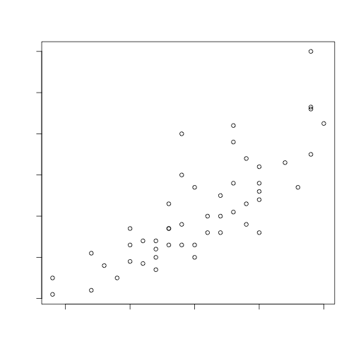

Seance 6: Causalité à partir de données observationnelles
========================================================
author: Vissého Adjiwanou, Ph.D
title: Département de Sociologie, UQAM
date: 04 Octobre 2018
autosize: true
width: 1600
height: 900
transition: fade
font-family: helvetica

Plan de présentation
========================================================

1. Rppels
2. Causalité à partir des données observationnelles
  * Exemples
  * Problèmes
  * Solutions
6. Lectures:
  * https://www.bitbybitbook.com/fr/1st-ed/running-experiments/
    * Sections 4.1, 4.2 et 4.3
  * https://juba.github.io/tidyverse/04-bivarie.html 

Ressources
========================================================

- https://www.rstudio.com/resources/cheatsheets/
- https://juba.github.io/tidyverse/04-bivarie.html 
- http://r4ds.had.co.nz/
- http://r-statistics.co/Top50-Ggplot2-Visualizations-MasterList-R-Code.html

Introduction
========================================================
incremental: true

* Dans ce chapitre, nous considérons la causalité, l’un des concepts les plus centraux des sciences sociales quantitatives. 
* Une grande partie de la recherche en sciences sociales s'intéresse aux effets causaux de diverses politiques et autres facteurs sociétaux. 
* Par exemple: 
  * les classes de petite taille augmentent-elles les résultats des tests standardisés des élèves? 
  * Les soins de santé universels amélioreraient-ils la santé et les finances des pauvres?
  * L'éducation réduit-elle le nombre d'enfants?
  
Slide With Plot
========================================================

