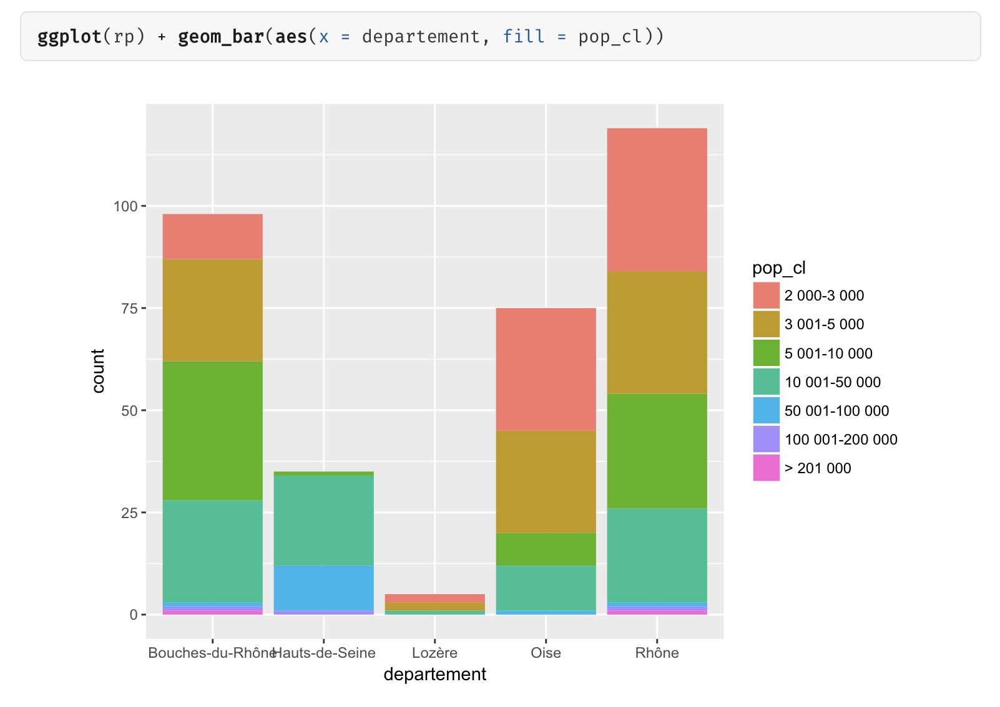
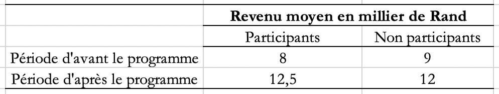

## Exercice 1 : Type de variables

Parmi les exemples suivants, identifier les variables et dire si elles constituent dans le contexte une variable dépendante ou indépendante.

1. Une démographe analyse l'évolution du taux de fertilité des femmes depuis 1960 selon l'origine ethnique et le degré de scolarité.

2. Dans une expérience sur le temps de reeaction visuelle, on mesure le temps nécessaire pour percevoir des mots à connotation sexuelle par rapport à  des mots non sexuels. Pour cette expérience, les chercheurs prennent bien soin de s'assurer que la vision des sujets leur permet de voir adéquatemment les diaspositives.

3. Un criminologue recherche des données sur la nature des infractions au Code criminel selon le sexe des accusés.

4. Lors d'une série d'expérience en psychologie sportive, on s'est rendu compte que chez les athlètes masculins, en situation de compétition relativement à celle de non compétition, il y a une augmentation du nombre de comportements complexes émis, mais qu'il y a une augmentation du nombre de comportements complexes émis, mais qu'il y a une baisse de la qualité de ceux-ci.

5. Des élèves du cours de psychologie expérimentale veulent étudier les sentiments de culbabilité des individus selon le type de délit qu'ils ont commis.

6. Un journaliste fait l'examen du pourcentage des intentions de vote des différents partis politiques québecois selon la langue parlée à la maison, le groupe d'âge et le degré de scolarité des électeurs.

## Exercice 2 : Analyse univariée

On a demandé à 4 ménages le revenu des deux conjoints, et le nombre de personnes du ménage :

- conjoint1 <- c(1200, 1180, 1750, 2100)

- conjoint2 <- c(1450, 1870, 1690, 0)

- nb_personnes <- c(4, 2, 3, 2)

Utiliser une calculatrice, ou R pour calculer:

1. Le revenu total de chaque ménage

2. Le revenu moyen de chaque ménage

3. Le revenu par personne de chaque ménage

4. Quel indicateur vous semble le plus approprié pour exprimer le revenu du ménage?


## Exercice 3 : Analyse bivariée

Dans ce qui suit on utilisera la base de données issue du recensement de la population de 2012. Ces données contiennent les résultats partiels concernant les communes de plus de 2000 habitants de France métropolitaine et limitées aux données de 5 départements ("Oise", "Rhône", "Hauts-de-Seine", "Lozère","Bouches-du-Rhône").
Le graphique suivant présente un résultat issu de ces données.

```{r pressure, echo=FALSE, fig.cap="Figure 1", out.width = '100%'}

```

1. Que tente de faire ce graphique?

2. Interprétez les résultats de ce graphique.


## Exercice 4 : Analyse bivariée

Une équipe d'étudiants choisit d'étudier, à l'intérieur d'un cours de psychologie, le comportement des automobilistes hommes et femmes. Étant donné la variété de comportements étudiables, l'équipe décide d'en retenir quelques-uns qui puissent être observés aisément dans un temps limité. Ils s'installent donc à une intersection où les automobilistes doivent faire un arrêt. Ils notent le sexe de l'automobiliste et sa réaction face au signal d'arrêt: il s'arrête complètement, il ne fait que ralentir plus ou moins fermement ou bien, il ne fait pas d'arrêt et passe tout droit.

Le tableau ci-dessous présente les résultats obtenus par l'équipe lors d'un après-midi d'observation.

1. Trouver la valeur des lettres A, B et C

2. Quelle est la population étudiée

3. Pour chaque variable, quel est le type d'échelle de mesure utilisé? Est-il toujours aisé de les appliquer dans le contexte de l'étude? Sinon, préciser quel type de difficultés est à envisager et comment il est possible d'y remédier.

4. Globalement, quelles proportions des automobilistes adoptent l'un des trois comportements observés?

5. Étant donné que c'est le comportement des hommes et femmes au volant que l'équipe veut étudier, laquelle des transformations en fréquences relatives l'équipe doit-elle appliquer sur le tableau de contingence qui a été dressé? L'appliquer et interpréter le résultat.

6. Comment présenterez-vous ce résultat dans un graphique? (Présenter le à partir de R, ne fera pas partie de l'examen)

Tableau 1:Types de comportements enrégistrés aux signaux d'arrêt selon le sexe des automobilistes


|**Sexe**    |   Arrêt complet |  Ralentissement | Pas d'arrêt |  **Total**|
|-------------|:----------------:|  -----------:|   ----------:|-------------:|
|  Masculin    |    41           |   39         |     15       |     95       |
|  Féminin     |    48           |   29         |     8       |      85       |
|  **Total**   |    A            |   B          |     C        |     180      |
 

 
## Exercice 5: Échantillonnage

L'insomnie est un problème très répandu. Diverse études épidémiologiques démontrent qu'entre 15% et 30% de la population souffre d'insomnie. Ces recherches indiquent également que l'insomnie augmente avec l'âge et qu'elle est plus fréquene chez femmes. Compte tenu de ces informations, vous désirez procéder à une enquête auprès d'un échantillon de la population québécoise adulte afin de connaître les habitudes de sommeil de cette population.

1. Quelle serait votre population cible?

2. Quelle serait la meilleure méthode d'échantillonnage?

3. Discuter.

## Exercice 6: Échantillonnage

1. Vous désirez tirer un échantillon de taille 3 dans une population de taille 7. Combien de possibilité vous avez?

2. Voici une population U = {A, B, C, D}
- Énumérer l'ensemble des échantillons de tailles 2 que vous pouvez tirer de cette population
- Choisissez un échantillon parmi ceux-ci et calculer sa moyenne si A = 1, B = 3, C = 5 et D = 2.
- Est-ce que cette moyenne est semblable à la moyenne de la population?


## Exercice 7: Échantillonnage 

De nombreuses études utilisent des mesures autodéclarées de l'utilisation du téléphone mobile. C'est un cadre intéressant dans lequel les chercheurs peuvent comparer le comportement autodéclaré avec le comportement journalisé. Deux comportements communs à poser sont l'appel et le texto, et deux trames communes sont "hier" et "la semaine dernière".

- Q1: "Combien de fois avez-vous utilisé votre téléphone portable pour appeler les autres hier?"
- Q2: "Combien de SMS avez-vous envoyé hier?"
- Q3: "Combien de fois avez-vous utilisé votre téléphone portable pour appeler les autres au cours des sept derniers jours?"
- Q4: "Combien de fois avez-vous utilisé votre téléphone mobile pour envoyer ou recevoir des SMS / SMS au cours des sept derniers jours?"

1. Laquelle des mesures d'auto-évaluation est la plus exacte? Pourquoi?
2. Quelle meilleure approche utiliserez-vous pour recueillir ces informations? Quelles sont les limites de chaque approche?


## Exercice 8: Causalité

Le tableau suivant vous donne le revenu moyen d'avant et d'après l'introduction d'un programme de microfinance en Afrique du Sud entre les participants (**groupe d'intervention**) et les non-participants (**groupe de contrôle**) au programme :


```{r global_options, echo=FALSE, fig.cap="Tableau 1", out.width = '90%', fig.pos = "H"}

```

1. Quelle est la différence moyenne de revenu mensuel du ménage entre le groupe d’intervention et le groupe de contrôle à la période d'après le programme? Cette différence est appelée comparaison transversale.

2. Quelle est la différence moyenne entre le revenu mensuel du ménage avant et après l’intervention du groupe d’intervention ? Cette différence est appelée différence avant-après.

3. Quelles approches vous semble la plus appropriée pour mesurer l'effet du programme de microfinance?

4. Quelles sont les limites de chaque approche?

5. Comment pensez-vous combiner les deux approches pour une meilleure estimation de l'effet du programme?


## Exercice 9: Régression lineaire

Voir exercice en classe
